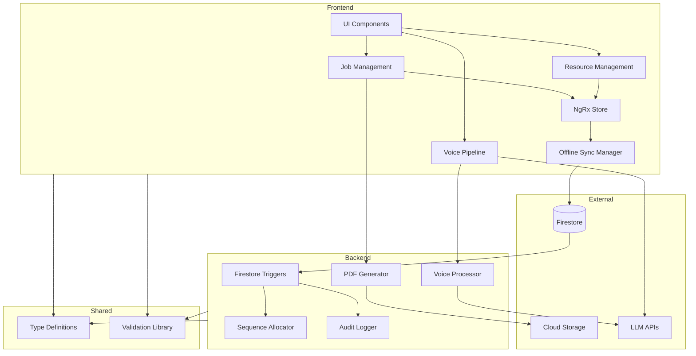

[Back to Index](./index.md) | [Previous: API Specification](./api-specification.md) | [Next: Project Structure](./project-structure.md)

# Components

The FinDogAI system is organized into logical components that span both frontend and backend, with clear boundaries and well-defined interfaces.

## Frontend Components

### Voice Pipeline Component

**Responsibility:** Orchestrate the complete voice interaction flow from speech input to audio response

**Key Interfaces:**
- `startListening(): Promise<void>` - Activate microphone and begin STT
- `processCommand(transcript: string): Promise<VoiceResponse>` - Send to LLM for intent processing
- `speak(text: string): Promise<void>` - Convert response to speech via TTS

**Dependencies:** Web Speech API, OpenAI/Anthropic SDK, Audio Context API

**Technology Stack:** Angular service with RxJS streams, Web Workers for audio processing

### Offline Sync Manager

**Responsibility:** Manage offline data persistence, conflict resolution, and sync queue

**Key Interfaces:**
- `enableOfflineMode(): void` - Enable Firestore persistence
- `getSyncStatus(): Observable<SyncStatus>` - Monitor sync state
- `resolveConflict(conflict: SyncConflict): Promise<void>` - Handle merge conflicts
- `forceSyncNow(): Promise<void>` - Trigger immediate sync attempt

**Dependencies:** Firestore SDK, IndexedDB, Network Information API

**Technology Stack:** Angular service, Firestore offline persistence, RxJS observables

### Job Management Component

**Responsibility:** Handle all job-related operations including CRUD, status transitions, and cost aggregation

**Key Interfaces:**
- `createJob(job: CreateJobDto): Promise<string>` - Create new job
- `setActiveJob(jobId: string): void` - Set context for voice commands
- `getJobCostSummary(jobId: string): Observable<CostSummary>` - Real-time cost totals
- `completeJob(jobId: string): Promise<void>` - Transition job status

**Dependencies:** Firestore service, Offline Sync Manager, State Store (NgRx)

**Technology Stack:** Angular smart components, NgRx state management, Firestore SDK

### Resource Management Component

**Responsibility:** Manage vehicles, team members, and machines with availability tracking

**Key Interfaces:**
- `listAvailableResources(type: ResourceType): Observable<Resource[]>` - Get active resources
- `createResource(resource: CreateResourceDto): Promise<string>` - Add new resource
- `toggleResourceAvailability(id: string): Promise<void>` - Active/inactive toggle
- `getResourceUtilization(id: string, period: DateRange): Promise<UtilizationReport>`

**Dependencies:** Firestore service, Offline Sync Manager, Business Profile Service

**Technology Stack:** Angular components with Ionic UI, reactive forms

### Business Profile Service

**Responsibility:** Provide business configuration and control conditional UI rendering based on resource type usage

**Key Interfaces:**
- `getBusinessProfile(): Observable<BusinessProfile>` - Stream business profile changes
- `updateBusinessProfile(updates: Partial<BusinessProfile>): Promise<void>` - Update configuration
- `shouldShowResourceType(type: 'machines' | 'vehicles' | 'otherExpenses'): Observable<boolean>` - UI visibility control
- `getDefaultJobSettings(): Observable<JobDefaults>` - Get defaults for new jobs

**Dependencies:** Firestore service, Offline Sync Manager

**Technology Stack:** Angular service with RxJS, Firestore SDK

**Conditional UI Rendering Logic:**
- Service maintains reactive stream of `BusinessProfile.usesMachines`, `usesVehicles`, `usesOtherExpenses`
- UI components subscribe to visibility observables using async pipe
- When flag is `false`, corresponding UI elements are hidden:
  - **Machines (usesMachines: false):** Hide "Add Machine" button, machine resource tab, machine cost entry, machine cost type filter
  - **Vehicles (usesVehicles: false):** Hide "Add Vehicle" button, vehicle resource tab, transport/journey cost entry, vehicle cost type filter
  - **Other Expenses (usesOtherExpenses: false):** Hide "Add Expense" button, expense cost entry, expense cost type filter
- Team member UI is NEVER hidden (business owner always exists)
- Auto-selection logic still applies when exactly one resource exists, regardless of visibility settings

## Backend Components

### Sequence Allocator Service

**Responsibility:** Atomically assign sequential numbers to entities ensuring uniqueness per tenant

**Key Interfaces:**
- `allocateJobNumber(tenantId: string): Promise<number>`
- `allocateCostOrdinal(jobId: string): Promise<number>`
- `allocateResourceNumber(tenantId: string, type: ResourceType): Promise<number>`

**Dependencies:** Firestore Admin SDK, Cloud Functions framework

**Technology Stack:** TypeScript Cloud Function with Firestore transactions

### Audit Logger Service

**Responsibility:** Create immutable audit trail for all data modifications

**Key Interfaces:**
- `logCreate(entity: AuditableEntity): Promise<void>`
- `logUpdate(before: any, after: any, metadata: AuditMetadata): Promise<void>`
- `logDelete(entity: AuditableEntity): Promise<void>`
- `cleanupOldLogs(): Promise<number>` // Scheduled function

**Dependencies:** Firestore Admin SDK, Cloud Scheduler

**Technology Stack:** Firestore triggers, TypeScript, Cloud Functions

### PDF Generator Service (Phase 2)

**Responsibility:** Generate formatted PDF documents for invoices and reports

**Key Interfaces:**
- `generateInvoice(jobId: string, template: InvoiceTemplate): Promise<PDFResult>`
- `generateReport(jobId: string, options: ReportOptions): Promise<PDFResult>`
- `uploadToStorage(pdf: Buffer, metadata: PDFMetadata): Promise<string>`

**Dependencies:** PDFMake library, Cloud Storage SDK, Firestore Admin SDK

**Technology Stack:** Node.js Cloud Function, PDFMake, Cloud Storage

### Voice Command Processor

**Responsibility:** Interpret voice commands using LLM and map to system actions

**Key Interfaces:**
- `parseIntent(transcript: string, context: CommandContext): Promise<Intent>`
- `executeAction(intent: Intent): Promise<ActionResult>`
- `generateResponse(result: ActionResult, language: string): Promise<string>`

**Dependencies:** OpenAI/Anthropic API, Firestore Admin SDK

**Technology Stack:** Cloud Function, LLM API integration, TypeScript

## Shared Components

### Type Definitions Package

**Responsibility:** Single source of truth for all TypeScript interfaces and types

**Key Interfaces:**
- All entity interfaces (Job, Cost, Member, etc.)
- API request/response types
- Validation schemas
- Enum definitions

**Dependencies:** None (leaf package)

**Technology Stack:** Pure TypeScript definitions, no runtime code

### Validation Library

**Responsibility:** Shared validation logic for both frontend and backend

**Key Interfaces:**
- `validateJob(job: Partial<Job>): ValidationResult`
- `validateCost(cost: Partial<Cost>): ValidationResult`
- `sanitizeInput(input: string): string`

**Dependencies:** Type definitions package

**Technology Stack:** TypeScript with Zod or Joi for schema validation

## Component Interaction Diagram

## Component Deployment

**Frontend Components:**
- Bundled as single Angular application
- Deployed to Firebase Hosting (CDN)
- Lazy-loaded modules for optimization

**Backend Components:**
- Deployed as individual Cloud Functions
- Grouped by trigger type (HTTP, Firestore, Scheduled)
- Shared code via layers

**Shared Components:**
- Published as npm packages in monorepo
- Version-locked dependencies
- Built before dependent packages

---

*Next: [Project Structure](./project-structure.md)*
