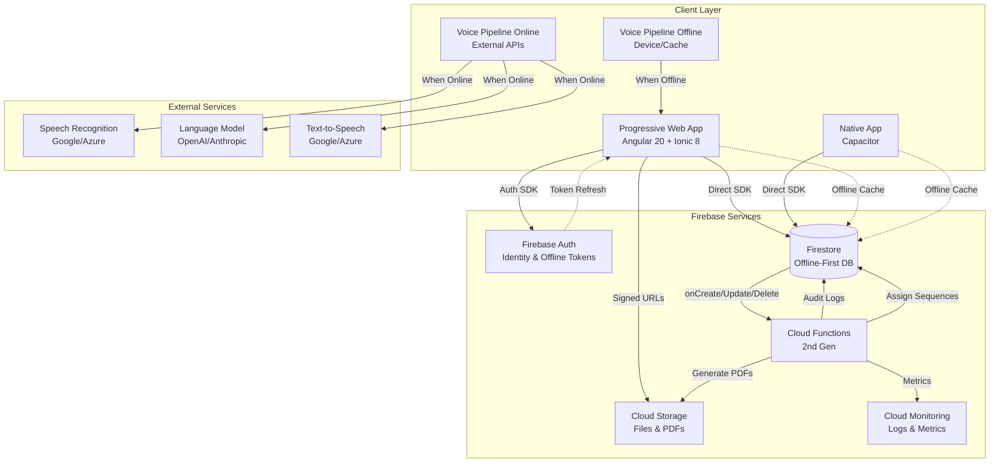

[Back to Index](./index.md) | [Parent Document](../architecture.md)

# High-Level Architecture Overview

## Technical Summary

FinDogAI employs a **hybrid client-heavy architecture with serverless backend**, deployed as a Progressive Web App with native mobile capabilities via Capacitor. The Angular 20+/Ionic 8+ frontend directly interfaces with Firestore for offline-first data persistence, while Cloud Functions handle server-side operations like audit logging, sequence generation, and PDF creation. The voice pipeline orchestration runs client-side with **configurable online/offline modes** - online mode uses external STT/LLM/TTS services for best quality, while offline mode falls back to device capabilities or cached responses. The application is **internationalization-ready** with ngx-translate providing offline-capable multi-language support (MVP: English and Czech, designed for Phase 2 expansion). Infrastructure leverages Firebase's managed services in europe-west1 for GDPR compliance, with automatic scaling from 0 to thousands of concurrent users. This architecture achieves the PRD goals through strategic online/offline trade-offs while maintaining cost efficiency.

## Platform and Infrastructure Choice

**Platform:** Firebase (Google Cloud Platform)
**Key Services:**
- Authentication (Identity management with offline token caching)
- Firestore (NoSQL database with offline sync and conflict resolution)
- Cloud Functions 2nd Gen (Serverless compute for server-only operations)
- Cloud Storage (File/PDF storage with signed URL access)
- Hosting (PWA delivery via global CDN)
- Cloud Monitoring & Logging (Observability stack)

**Deployment Host and Regions:**
- **Primary**: europe-west1 (Frankfurt) for GDPR compliance
- **CDN**: Global edge locations for static assets
- **Backup**: europe-west3 (Frankfurt) for disaster recovery

## Repository Structure

**Structure:** Monorepo with clear dependency graph
**Monorepo Tool:** Nx (v19+) with explicit project boundaries
**Package Organization:**
```
/packages
  /mobile-app       - Angular/Ionic/Capacitor PWA
                     Dependencies: shared-types, @angular/fire
  /functions        - Cloud Functions (Node.js 20)
                     Dependencies: shared-types, firebase-admin
  /shared-types     - TypeScript interfaces & constants
                     Dependencies: none (leaf package)
  /e2e-tests        - Playwright end-to-end tests
                     Dependencies: all packages (test only)
```

## High Level Architecture Diagram



## Architectural Patterns

- **Offline-First Pattern:** Client-side data persistence with automatic sync - *Dependencies: Firestore SDK, IndexedDB*
- **Graceful Degradation:** Voice features degrade from cloud → device → disabled - *Dependencies: Feature detection APIs*
- **Event-Driven Backend:** Firestore triggers for side effects - *Dependencies: Cloud Functions framework*
- **Component-Based UI:** Reusable Ionic components - *Dependencies: Angular component architecture*
- **Repository Pattern:** Abstract data access - *Dependencies: TypeScript interfaces from shared-types*
- **Signed URL Pattern:** Secure file access without permanent links - *Dependencies: Cloud Storage SDK*
- **Optimistic UI Updates:** Immediate UI feedback with eventual consistency - *Dependencies: Firestore latency compensation*
- **Circuit Breaker Pattern:** Fallback for external service failures - *Dependencies: Resilience libraries*
- **Internationalization Pattern:** Lazy-loaded translations with offline caching - *Dependencies: ngx-translate, Service Worker*

## Dependency Management Strategy

1. **Shared Types Package**: Single source of truth for all data models
2. **Explicit Nx Boundaries**: Enforce dependency rules at build time
3. **Version Locking**: Exact versions in package.json for reproducible builds
4. **Peer Dependencies**: Carefully managed for Angular/Ionic compatibility

## Key Architectural Decisions

### Why Firebase?
- **Offline-First**: Built-in offline persistence with automatic sync
- **Real-Time**: WebSocket-based listeners for live UI updates
- **Scalable**: Automatic scaling from 0 to millions of users
- **GDPR Compliant**: EU region hosting (europe-west1)
- **Cost Effective**: Generous free tier, pay-as-you-grow pricing

### Why Hybrid Architecture?
- **Client-Heavy**: Minimizes Cloud Functions costs, maximizes offline capability
- **Direct Firestore Access**: Eliminates API layer complexity, provides real-time sync
- **Serverless Backend**: Only for operations requiring secure server-side processing
- **Event-Driven**: Transparent server processing via Firestore triggers

### Why Monorepo?
- **Type Safety**: Shared TypeScript definitions across frontend and backend
- **Atomic Changes**: Update models and all consumers in single commit
- **Dependency Management**: Centralized version control
- **Code Reuse**: Shared validation and utility functions

---

*Next: [Tech Stack](./tech-stack.md)*