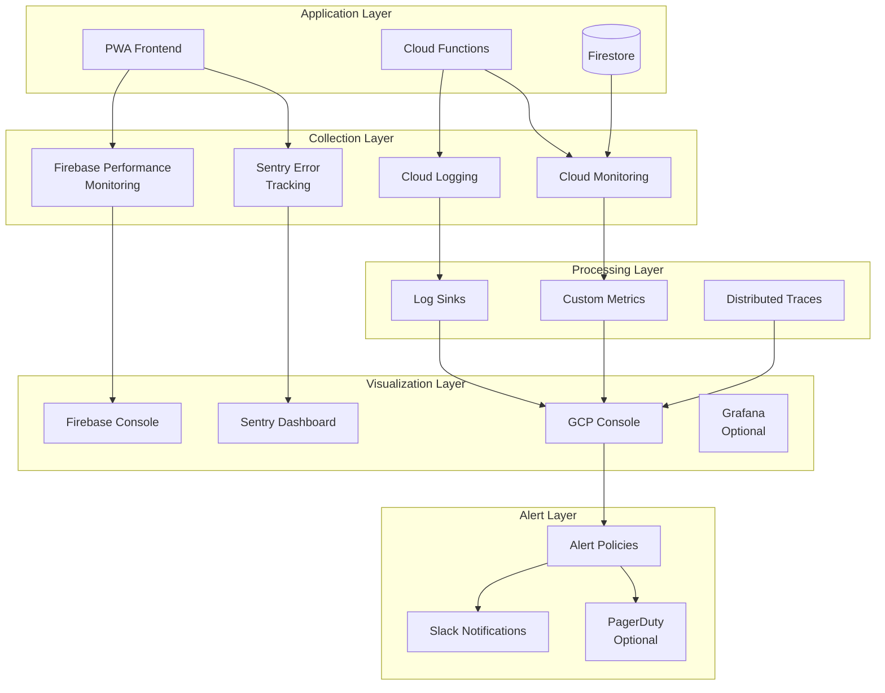

[Back to Index](./index.md) | [Previous: Voice Architecture](./voice-architecture.md)

# Monitoring and Observability

This document defines the comprehensive monitoring, logging, and observability strategy for the FinDogAI system, covering metrics, alerts, dashboards, and incident response.

## Monitoring Stack Overview

### Architecture Diagram



## Technology Components

### Primary Monitoring Tools

| Tool | Purpose | Scope | Cost Model |
|------|---------|-------|------------|
| **Firebase Performance Monitoring** | Frontend performance metrics | Web vitals, network requests | Free tier: 100K sessions/day |
| **Sentry** | Error tracking and APM | Frontend & backend errors | Free tier: 5K errors/month |
| **Cloud Logging** | Centralized log aggregation | All services | $0.50/GB after 50GB free |
| **Cloud Monitoring** | Infrastructure metrics | GCP resources | Free for basic metrics |
| **Firebase Crashlytics** | Mobile crash reporting | Native app crashes | Free |

### Optional Advanced Tools

- **Grafana Cloud**: Custom dashboards (if needed)
- **PagerDuty**: Incident management (for production)
- **Datadog**: Full APM solution (enterprise option)

## Performance Monitoring

### Frontend Performance Metrics

```typescript
// Firebase Performance Monitoring Setup
import { getPerformance, trace } from 'firebase/performance';

class PerformanceMonitor {
  private perf = getPerformance();

  // Automatic monitoring
  initialize() {
    // Automatically collects:
    // - Page load time
    // - Network request duration
    // - First contentful paint
    // - First input delay
  }

  // Custom traces for voice operations
  traceVoiceCommand() {
    const voiceTrace = trace(this.perf, 'voice_command');

    voiceTrace.putMetric('transcription_time', 0);
    voiceTrace.putMetric('processing_time', 0);
    voiceTrace.putMetric('response_time', 0);

    return {
      start: () => voiceTrace.start(),
      recordTranscription: (duration: number) => {
        voiceTrace.putMetric('transcription_time', duration);
      },
      recordProcessing: (duration: number) => {
        voiceTrace.putMetric('processing_time', duration);
      },
      recordResponse: (duration: number) => {
        voiceTrace.putMetric('response_time', duration);
      },
      stop: () => voiceTrace.stop()
    };
  }

  // Track custom metrics
  trackMetric(name: string, value: number, attributes?: Record<string, string>) {
    const customTrace = trace(this.perf, name);

    if (attributes) {
      Object.entries(attributes).forEach(([key, val]) => {
        customTrace.putAttribute(key, val);
      });
    }

    customTrace.putMetric('value', value);
    customTrace.start();
    customTrace.stop();
  }
}
```

### Core Web Vitals Monitoring

```typescript
interface WebVitalsThresholds {
  LCP: { good: 2500, poor: 4000 };  // Largest Contentful Paint
  FID: { good: 100, poor: 300 };     // First Input Delay
  CLS: { good: 0.1, poor: 0.25 };    // Cumulative Layout Shift
  FCP: { good: 1800, poor: 3000 };   // First Contentful Paint
  TTFB: { good: 800, poor: 1800 };   // Time to First Byte
}

class WebVitalsMonitor {
  monitor() {
    // Using web-vitals library
    import('web-vitals').then(({ getCLS, getFID, getLCP, getFCP, getTTFB }) => {
      getCLS(this.sendToAnalytics);
      getFID(this.sendToAnalytics);
      getLCP(this.sendToAnalytics);
      getFCP(this.sendToAnalytics);
      getTTFB(this.sendToAnalytics);
    });
  }

  private sendToAnalytics(metric: any) {
    // Send to Firebase Performance
    const perf = getPerformance();
    const trace = trace(perf, `web_vital_${metric.name}`);
    trace.putMetric('value', Math.round(metric.value));
    trace.start();
    trace.stop();

    // Also send to custom metrics
    this.logMetric({
      name: `web_vital_${metric.name}`,
      value: metric.value,
      rating: metric.rating, // 'good' | 'needs-improvement' | 'poor'
      timestamp: Date.now()
    });
  }
}
```

## Error Tracking

### Sentry Configuration

```typescript
// Sentry initialization
import * as Sentry from '@sentry/angular';
import { ErrorHandler } from '@angular/core';

Sentry.init({
  dsn: environment.sentryDsn,
  environment: environment.production ? 'production' : 'development',
  integrations: [
    new Sentry.BrowserTracing({
      routingInstrumentation: Sentry.routingInstrumentation,
      tracePropagationTargets: [
        'localhost',
        'https://findogai.app',
        /^\//
      ],
    }),
    new Sentry.Replay({
      maskAllText: true,
      maskAllInputs: true,
      blockAllMedia: false,
    }),
  ],
  tracesSampleRate: environment.production ? 0.1 : 1.0,
  replaysSessionSampleRate: 0.1,
  replaysOnErrorSampleRate: 1.0,

  beforeSend(event, hint) {
    // Filter out sensitive data
    if (event.request?.cookies) {
      delete event.request.cookies;
    }

    // Don't send events in development unless explicitly enabled
    if (!environment.production && !environment.sentryDebug) {
      return null;
    }

    return event;
  },

  // Ignore certain errors
  ignoreErrors: [
    'ResizeObserver loop limit exceeded',
    'Non-Error promise rejection captured',
    /Failed to fetch/,
  ],
});

@Injectable()
export class SentryErrorHandler implements ErrorHandler {
  handleError(error: Error): void {
    // Add context
    Sentry.withScope(scope => {
      scope.setContext('app', {
        version: environment.version,
        tenant: this.tenantService.currentTenantId,
        user: this.authService.currentUser?.uid
      });

      scope.setTag('error.type', error.constructor.name);

      // Add breadcrumbs for voice operations
      if (this.voiceService.lastCommand) {
        scope.addBreadcrumb({
          category: 'voice',
          message: `Last command: ${this.voiceService.lastCommand}`,
          level: 'info'
        });
      }

      Sentry.captureException(error);
    });

    // Also log to console in development
    if (!environment.production) {
      console.error(error);
    }
  }
}
```

### Cloud Functions Error Tracking

```typescript
// Cloud Functions error handling
import * as Sentry from '@sentry/node';

Sentry.init({
  dsn: process.env.SENTRY_DSN,
  environment: process.env.FUNCTIONS_ENVIRONMENT || 'development',
  tracesSampleRate: 0.1,
});

export const wrapFunction = (fn: Function) => {
  return Sentry.wrap(async (...args: any[]) => {
    try {
      return await fn(...args);
    } catch (error) {
      Sentry.withScope(scope => {
        // Add function context
        scope.setTag('function.name', fn.name);
        scope.setContext('function.args', args);

        Sentry.captureException(error);
      });

      throw error;
    }
  });
};

// Usage
export const processVoiceCommand = wrapFunction(
  async (data: any, context: any) => {
    // Function logic
  }
);
```

## Logging Strategy

### Structured Logging

```typescript
// Centralized logger
class Logger {
  private readonly context: string;

  constructor(context: string) {
    this.context = context;
  }

  private formatLog(level: string, message: string, data?: any): LogEntry {
    return {
      timestamp: new Date().toISOString(),
      level,
      context: this.context,
      message,
      data: this.sanitizeData(data),
      environment: environment.production ? 'production' : 'development',
      version: environment.version,
      tenantId: this.tenantService.currentTenantId,
      userId: this.authService.currentUser?.uid
    };
  }

  private sanitizeData(data: any): any {
    // Remove sensitive fields
    const sensitive = ['password', 'token', 'apiKey', 'email'];

    if (!data) return data;

    const sanitized = { ...data };
    sensitive.forEach(field => {
      if (field in sanitized) {
        sanitized[field] = '[REDACTED]';
      }
    });

    return sanitized;
  }

  info(message: string, data?: any) {
    const log = this.formatLog('INFO', message, data);

    if (environment.production) {
      // Send to Cloud Logging
      this.sendToCloudLogging(log);
    } else {
      console.log(log);
    }
  }

  error(message: string, error?: Error, data?: any) {
    const log = this.formatLog('ERROR', message, {
      ...data,
      error: {
        message: error?.message,
        stack: error?.stack,
        name: error?.name
      }
    });

    if (environment.production) {
      this.sendToCloudLogging(log);
    } else {
      console.error(log);
    }

    // Also send to Sentry
    if (error) {
      Sentry.captureException(error);
    }
  }

  metric(name: string, value: number, tags?: Record<string, string>) {
    const log = this.formatLog('METRIC', name, {
      value,
      tags
    });

    // Send to metrics collection
    this.sendToMetrics(name, value, tags);
  }
}
```

### Log Aggregation

```yaml
# Cloud Logging configuration
apiVersion: logging.cnrm.cloud.google.com/v1beta1
kind: LogSink
metadata:
  name: findogai-logs-sink
spec:
  destination: bigquery.googleapis.com/projects/findogai/datasets/logs
  filter: |
    resource.type="cloud_function"
    OR resource.type="firebase_app"
    severity >= "INFO"
  includeChildren: true
```

## Metrics and KPIs

### Business Metrics

```typescript
class BusinessMetrics {
  private metrics = {
    // User engagement
    daily_active_users: 0,
    voice_commands_per_user: 0,
    jobs_created_per_day: 0,
    costs_added_per_job: 0,

    // Performance
    voice_success_rate: 0,
    offline_sync_success_rate: 0,
    average_response_time: 0,

    // System health
    error_rate: 0,
    api_latency_p99: 0,
    database_read_latency: 0,
    database_write_latency: 0,

    // Business
    tenant_growth_rate: 0,
    feature_adoption_rate: 0,
    user_retention_7d: 0,
    user_retention_30d: 0
  };

  track(metricName: string, value: number, dimensions?: Record<string, string>) {
    // Update local metrics
    this.metrics[metricName] = value;

    // Send to Cloud Monitoring
    const timeSeries = {
      metric: {
        type: `custom.googleapis.com/findogai/${metricName}`,
        labels: dimensions || {}
      },
      resource: {
        type: 'global',
        labels: {
          project_id: 'findogai'
        }
      },
      points: [{
        interval: {
          endTime: new Date().toISOString()
        },
        value: {
          doubleValue: value
        }
      }]
    };

    this.cloudMonitoring.createTimeSeries({ timeSeries: [timeSeries] });
  }

  // Computed metrics
  calculateVoiceSuccessRate() {
    const successful = this.getMetric('voice_commands_successful');
    const total = this.getMetric('voice_commands_total');

    return total > 0 ? (successful / total) * 100 : 0;
  }
}
```

### Technical Metrics

```typescript
interface TechnicalMetrics {
  // Frontend metrics
  pageLoadTime: number;
  firstContentfulPaint: number;
  timeToInteractive: number;
  bundleSize: number;
  cacheHitRate: number;

  // Backend metrics
  functionExecutionTime: number;
  functionColdStartTime: number;
  functionMemoryUsage: number;
  functionErrorRate: number;

  // Database metrics
  firestoreReads: number;
  firestoreWrites: number;
  firestoreDeletes: number;
  firestoreCacheHitRate: number;

  // Voice pipeline metrics
  sttLatency: number;
  llmLatency: number;
  ttsLatency: number;
  voiceEndToEndLatency: number;

  // Infrastructure metrics
  hostingBandwidth: number;
  storageBandwidth: number;
  functionInvocations: number;
  monthlyActiveUsers: number;
}
```

## Alerting Strategy

### Alert Configuration

```typescript
// Alert policy definitions
const alertPolicies = [
  {
    name: 'High Error Rate',
    condition: 'error_rate > 5%',
    duration: '5 minutes',
    severity: 'critical',
    channels: ['pagerduty', 'slack']
  },
  {
    name: 'Voice Pipeline Failure',
    condition: 'voice_success_rate < 80%',
    duration: '10 minutes',
    severity: 'warning',
    channels: ['slack']
  },
  {
    name: 'High Latency',
    condition: 'p99_latency > 3000ms',
    duration: '5 minutes',
    severity: 'warning',
    channels: ['slack']
  },
  {
    name: 'Database Quota Warning',
    condition: 'firestore_reads > 40000/day',
    duration: 'instant',
    severity: 'info',
    channels: ['email']
  },
  {
    name: 'Offline Sync Failures',
    condition: 'sync_failure_rate > 10%',
    duration: '15 minutes',
    severity: 'warning',
    channels: ['slack']
  }
];

// Slack integration
class SlackAlerter {
  async sendAlert(alert: Alert) {
    const webhook = process.env.SLACK_WEBHOOK_URL;

    const message = {
      text: `🚨 Alert: ${alert.name}`,
      attachments: [{
        color: alert.severity === 'critical' ? 'danger' : 'warning',
        fields: [
          { title: 'Severity', value: alert.severity, short: true },
          { title: 'Duration', value: alert.duration, short: true },
          { title: 'Condition', value: alert.condition, short: false },
          { title: 'Current Value', value: alert.currentValue, short: false },
          { title: 'Dashboard', value: alert.dashboardUrl, short: false }
        ],
        footer: 'FinDogAI Monitoring',
        ts: Date.now() / 1000
      }]
    };

    await fetch(webhook, {
      method: 'POST',
      headers: { 'Content-Type': 'application/json' },
      body: JSON.stringify(message)
    });
  }
}
```

## Dashboards

### Firebase Console Dashboard

Default metrics available:
- Performance metrics (automatically collected)
- Crash-free users rate
- Network request performance
- Custom traces
- User engagement metrics

### Custom Grafana Dashboard

```json
{
  "dashboard": {
    "title": "FinDogAI Operations",
    "panels": [
      {
        "title": "Voice Command Success Rate",
        "type": "graph",
        "targets": [{
          "expr": "rate(voice_commands_successful[5m]) / rate(voice_commands_total[5m]) * 100"
        }]
      },
      {
        "title": "Active Users",
        "type": "stat",
        "targets": [{
          "expr": "count(distinct(user_id))"
        }]
      },
      {
        "title": "Error Rate by Service",
        "type": "graph",
        "targets": [{
          "expr": "sum(rate(errors_total[5m])) by (service)"
        }]
      },
      {
        "title": "P99 Latency",
        "type": "graph",
        "targets": [{
          "expr": "histogram_quantile(0.99, rate(http_request_duration_seconds_bucket[5m]))"
        }]
      },
      {
        "title": "Firestore Operations",
        "type": "graph",
        "targets": [{
          "expr": "sum(rate(firestore_operations_total[5m])) by (operation)"
        }]
      },
      {
        "title": "Cost Projection",
        "type": "stat",
        "targets": [{
          "expr": "predict_linear(monthly_cost[7d], 30*24*3600)"
        }]
      }
    ]
  }
}
```

## Health Checks

### Application Health Endpoints

```typescript
// Health check implementation
export const healthCheck = functions.https.onRequest(async (req, res) => {
  const checks = {
    firestore: 'unknown',
    storage: 'unknown',
    auth: 'unknown',
    functions: 'healthy'
  };

  try {
    // Check Firestore
    await admin.firestore().collection('_health').doc('check').get();
    checks.firestore = 'healthy';
  } catch {
    checks.firestore = 'unhealthy';
  }

  try {
    // Check Storage
    await admin.storage().bucket().file('_health/check.txt').exists();
    checks.storage = 'healthy';
  } catch {
    checks.storage = 'unhealthy';
  }

  try {
    // Check Auth
    await admin.auth().getUser('health-check-user-id').catch(() => null);
    checks.auth = 'healthy';
  } catch {
    checks.auth = 'unhealthy';
  }

  const allHealthy = Object.values(checks).every(status => status === 'healthy');

  res.status(allHealthy ? 200 : 503).json({
    status: allHealthy ? 'healthy' : 'degraded',
    timestamp: new Date().toISOString(),
    checks
  });
});
```

### Synthetic Monitoring

```typescript
// Synthetic transaction monitoring
class SyntheticMonitor {
  async runSyntheticTests() {
    const tests = [
      this.testVoiceCommand(),
      this.testJobCreation(),
      this.testOfflineSync(),
      this.testAuthentication()
    ];

    const results = await Promise.allSettled(tests);

    results.forEach((result, index) => {
      const testName = tests[index].name;

      if (result.status === 'fulfilled') {
        this.recordSuccess(testName, result.value.duration);
      } else {
        this.recordFailure(testName, result.reason);
      }
    });
  }

  private async testVoiceCommand() {
    const start = Date.now();

    // Simulate voice command
    const response = await this.voiceService.processCommand('Test command');

    if (!response.success) {
      throw new Error('Voice command failed');
    }

    return {
      duration: Date.now() - start
    };
  }
}

// Schedule synthetic tests
export const syntheticMonitoring = functions.pubsub
  .schedule('every 5 minutes')
  .onRun(async () => {
    const monitor = new SyntheticMonitor();
    await monitor.runSyntheticTests();
  });
```

## Incident Response

### Runbook Template

```markdown
# Incident: [TITLE]

## Detection
- Alert triggered: [ALERT_NAME]
- Time: [TIMESTAMP]
- Severity: [CRITICAL|WARNING|INFO]

## Impact
- Affected users: [COUNT]
- Affected features: [LIST]
- Business impact: [DESCRIPTION]

## Investigation Steps
1. Check dashboard: [DASHBOARD_URL]
2. Review recent deployments
3. Check error logs: [LOG_QUERY]
4. Verify external dependencies

## Mitigation Steps
1. [IMMEDIATE_ACTION]
2. [SECONDARY_ACTION]
3. [VERIFICATION]

## Resolution
- Root cause: [DESCRIPTION]
- Fix applied: [DESCRIPTION]
- Time to resolution: [DURATION]

## Follow-up
- [ ] Post-mortem scheduled
- [ ] Monitoring improved
- [ ] Documentation updated
```

### On-Call Rotation

```typescript
interface OnCallSchedule {
  primary: string;
  secondary: string;
  schedule: 'weekly' | 'biweekly';
  escalation: {
    level1: { delay: 5, contact: 'slack' };
    level2: { delay: 15, contact: 'phone' };
    level3: { delay: 30, contact: 'all' };
  };
}
```

## Cost Monitoring

### Firebase Usage Monitoring

```typescript
class CostMonitor {
  async checkUsage() {
    const usage = {
      firestoreReads: await this.getFirestoreReads(),
      firestoreWrites: await this.getFirestoreWrites(),
      functionInvocations: await this.getFunctionInvocations(),
      bandwidth: await this.getBandwidthUsage(),
      storage: await this.getStorageUsage()
    };

    const costs = this.calculateCosts(usage);
    const projection = this.projectMonthlyCost(costs);

    if (projection > BUDGET_THRESHOLD) {
      await this.sendCostAlert(projection);
    }

    return { usage, costs, projection };
  }

  private calculateCosts(usage: Usage): Costs {
    return {
      firestore: (usage.firestoreReads * 0.06 + usage.firestoreWrites * 0.18) / 100000,
      functions: usage.functionInvocations * 0.0000004,
      bandwidth: usage.bandwidth * 0.12, // per GB
      storage: usage.storage * 0.026, // per GB/month
      total: 0 // sum of above
    };
  }
}
```

---

*[Back to Index](./index.md)*