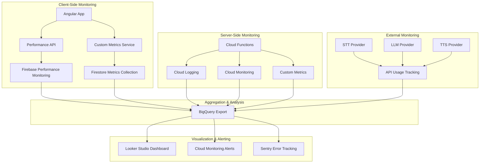

# Performance & Quality Monitoring Architecture

**ABOUTME:** Comprehensive architecture for monitoring NFR compliance (NFR1-NFR6), including performance metrics collection, quality measurement, rate limiting configuration, infrastructure sizing recommendations, and alerting strategies. Addresses gaps identified in Architecture Checklist section 1.2 and 5.2-5.3.

## Table of Contents

1. [Overview](#overview)
2. [NFR Compliance Monitoring](#nfr-compliance-monitoring)
3. [Performance Metrics Architecture](#performance-metrics-architecture)
4. [Quality Metrics Architecture](#quality-metrics-architecture)
5. [Rate Limiting & Quota Management](#rate-limiting--quota-management)
6. [Infrastructure Sizing Recommendations](#infrastructure-sizing-recommendations)
7. [Monitoring Dashboard](#monitoring-dashboard)
8. [Alerting Strategy](#alerting-strategy)
9. [Implementation Checklist](#implementation-checklist)

---

## Overview

This document defines the architecture for monitoring all non-functional requirements (NFRs), particularly focusing on performance targets that were identified as gaps in the architecture validation:

### NFRs Requiring Monitoring

| NFR | Requirement | Target | Monitoring Method |
|-----|-------------|--------|-------------------|
| **NFR1** | STT latency (post-wake-word to first token) | ≤3.0s (P50), ≤5.0s (P95) | Firebase Performance Monitoring + Custom Traces |
| **NFR2** | Round-trip voice confirmation | ≤8.0s (P50), ≤12.0s (P95) | Firebase Performance Monitoring + Custom Traces |
| **NFR3** | Offline write operations | <100ms UI feedback | RUM (Real User Monitoring) |
| **NFR4** | Firestore sync on reconnection | ≤10s (P50) | Custom Metrics Collection |
| **NFR5** | STT quality (WER, numeric accuracy) | WER ≤15% (P50), ≤25% (P95); Numeric ≥90% | Synthetic Test Set + User Corrections |
| **NFR6** | Intent recognition (F1 score, entity extraction) | F1 ≥0.85; Entity accuracy ≥90% | Test Set Evaluation + Production Metrics |
| **NFR9** | GDPR compliance (EU data residency) | europe-west1 region | Configuration Validation |
| **NFR10** | Cost management | Firebase free tier + voice API costs $0.10-0.30/user/day | Firebase Usage Analytics + API Cost Tracking |

### Monitoring Stack



---

## NFR Compliance Monitoring

### NFR1 & NFR2: Voice Pipeline Latency Monitoring

**Implementation:** Custom Performance Traces

```typescript
// apps/mobile/src/app/core/services/voice-performance-monitor.service.ts

/**
 * ABOUTME: Monitors voice pipeline latency to ensure NFR1 (≤3s STT) and NFR2 (≤8s round-trip) compliance
 */
@Injectable({ providedIn: 'root' })
export class VoicePerformanceMonitor {
  private readonly performance = inject(PerformanceService);
  private readonly firestore = inject(Firestore);
  private readonly auth = inject(AuthService);

  /**
   * Start monitoring a complete voice pipeline execution
   */
  async monitorVoicePipeline(commandId: string): Promise<VoicePerformanceTrace> {
    // Create custom trace in Firebase Performance Monitoring
    const trace = await this.performance.trace(`voice_pipeline_${commandId}`);
    await trace.start();

    const startTime = performance.now();

    return {
      commandId,
      trace,
      startTime,
      checkpoints: new Map<string, number>(),

      // Record STT completion (NFR1 target)
      recordSTTComplete: (transcript: string, confidence: number) => {
        const sttLatency = performance.now() - startTime;
        trace.putMetric('stt_latency_ms', Math.round(sttLatency));
        trace.putMetric('stt_confidence', Math.round(confidence * 100));
        trace.putAttribute('transcript_length', transcript.length.toString());

        // Check NFR1 compliance
        if (sttLatency > 5000) {
          // Exceeded P95 target
          this.logNFRViolation('NFR1_P95', {
            target: 5000,
            actual: sttLatency,
            severity: 'HIGH'
          });
        } else if (sttLatency > 3000) {
          // Exceeded P50 target
          this.logNFRViolation('NFR1_P50', {
            target: 3000,
            actual: sttLatency,
            severity: 'MEDIUM'
          });
        }

        return sttLatency;
      },

      // Record LLM processing completion
      recordLLMComplete: (intent: string, confidence: number) => {
        const llmLatency = performance.now() - (checkpoints.get('stt') || startTime);
        trace.putMetric('llm_latency_ms', Math.round(llmLatency));
        trace.putMetric('llm_confidence', Math.round(confidence * 100));
        trace.putAttribute('intent', intent);

        return llmLatency;
      },

      // Record TTS completion
      recordTTSComplete: (audioLength: number) => {
        const ttsLatency = performance.now() - (checkpoints.get('llm') || startTime);
        trace.putMetric('tts_latency_ms', Math.round(ttsLatency));
        trace.putAttribute('audio_length_ms', audioLength.toString());

        return ttsLatency;
      },

      // Record complete round-trip (NFR2 target)
      recordComplete: async (userAction: 'ACCEPTED' | 'RETRIED' | 'CANCELLED') => {
        const totalLatency = performance.now() - startTime;

        trace.putMetric('total_latency_ms', Math.round(totalLatency));
        trace.putAttribute('user_action', userAction);
        trace.putAttribute('network_type', this.getNetworkType());
        trace.putAttribute('device_model', this.getDeviceModel());

        await trace.stop();

        // Check NFR2 compliance
        if (totalLatency > 12000) {
          // Exceeded P95 target
          this.logNFRViolation('NFR2_P95', {
            target: 12000,
            actual: totalLatency,
            severity: 'HIGH'
          });
        } else if (totalLatency > 8000) {
          // Exceeded P50 target
          this.logNFRViolation('NFR2_P50', {
            target: 8000,
            actual: totalLatency,
            severity: 'MEDIUM'
          });
        }

        // Also log to custom Firestore collection for detailed analysis
        await this.logDetailedMetrics({
          commandId,
          userId: this.auth.userId,
          tenantId: this.auth.tenantId,
          timestamp: Date.now(),
          latency: {
            stt: checkpoints.get('stt_complete') || 0,
            llm: checkpoints.get('llm_complete') || 0,
            tts: checkpoints.get('tts_complete') || 0,
            total: totalLatency
          },
          userAction,
          networkType: this.getNetworkType(),
          deviceModel: this.getDeviceModel()
        });

        return totalLatency;
      }
    };
  }

  private async logNFRViolation(
    nfrCode: string,
    details: { target: number; actual: number; severity: 'HIGH' | 'MEDIUM' | 'LOW' }
  ): Promise<void> {
    // Log to Firestore for tracking
    await addDoc(collection(this.firestore, 'nfr_violations'), {
      nfrCode,
      target: details.target,
      actual: details.actual,
      severity: details.severity,
      userId: this.auth.userId,
      tenantId: this.auth.tenantId,
      timestamp: serverTimestamp(),
      metadata: {
        networkType: this.getNetworkType(),
        deviceModel: this.getDeviceModel(),
        userAgent: navigator.userAgent
      }
    });

    // Also log to Sentry for alerting
    if (details.severity === 'HIGH') {
      Sentry.captureMessage(`NFR Violation: ${nfrCode}`, {
        level: 'warning',
        tags: {
          nfr: nfrCode,
          severity: details.severity
        },
        extra: details
      });
    }
  }

  private getNetworkType(): string {
    const connection = (navigator as any).connection || (navigator as any).mozConnection || (navigator as any).webkitConnection;
    return connection?.effectiveType || 'unknown';
  }

  private getDeviceModel(): string {
    // Extract device model from user agent (simplified)
    const ua = navigator.userAgent;
    if (ua.includes('iPhone')) return 'iPhone';
    if (ua.includes('iPad')) return 'iPad';
    if (ua.includes('Android')) {
      const match = ua.match(/Android.*?;\s*([^)]+)/);
      return match ? match[1] : 'Android';
    }
    return 'Desktop';
  }

  private async logDetailedMetrics(metrics: VoiceCommandMetric): Promise<void> {
    await setDoc(
      doc(this.firestore, 'voice_metrics', metrics.commandId),
      metrics
    );
  }
}

interface VoiceCommandMetric {
  commandId: string;
  userId: string;
  tenantId: string;
  timestamp: number;
  latency: {
    stt: number;
    llm: number;
    tts: number;
    total: number;
  };
  userAction: 'ACCEPTED' | 'RETRIED' | 'CANCELLED';
  networkType: string;
  deviceModel: string;
}
```

### NFR3: Offline Write Performance Monitoring

**Implementation:** Real User Monitoring (RUM)

```typescript
// apps/mobile/src/app/core/services/offline-performance-monitor.service.ts

/**
 * ABOUTME: Monitors offline write operations to ensure NFR3 (<100ms UI feedback) compliance
 */
@Injectable({ providedIn: 'root' })
export class OfflinePerformanceMonitor {
  private readonly performance = inject(PerformanceService);

  /**
   * Monitor a local write operation
   */
  async monitorOfflineWrite<T>(
    operation: () => Promise<T>,
    operationType: 'create_job' | 'create_cost' | 'create_resource'
  ): Promise<{ result: T; latency: number }> {
    const startTime = performance.now();

    // Execute operation
    const result = await operation();

    const latency = performance.now() - startTime;

    // Log metric
    const trace = await this.performance.trace(`offline_write_${operationType}`);
    await trace.start();
    trace.putMetric('write_latency_ms', Math.round(latency));
    trace.putAttribute('operation_type', operationType);
    await trace.stop();

    // Check NFR3 compliance (<100ms)
    if (latency > 100) {
      console.warn(`[NFR3 Violation] Offline write took ${latency.toFixed(1)}ms (target: <100ms)`);

      // Log for analysis
      Sentry.captureMessage('NFR3 Violation: Offline write latency exceeded', {
        level: 'warning',
        tags: {
          nfr: 'NFR3',
          operation_type: operationType
        },
        extra: {
          latency,
          target: 100
        }
      });
    }

    return { result, latency };
  }
}
```

### NFR4: Firestore Sync Performance Monitoring

**Implementation:** Sync Queue Monitoring

```typescript
// apps/mobile/src/app/core/services/sync-performance-monitor.service.ts

/**
 * ABOUTME: Monitors Firestore sync operations to ensure NFR4 (≤10s sync) compliance
 */
@Injectable({ providedIn: 'root' })
export class SyncPerformanceMonitor {
  private readonly firestore = inject(Firestore);
  private readonly performance = inject(PerformanceService);

  /**
   * Monitor a sync operation
   */
  async monitorSync(
    queuedOperations: QueuedOperation[]
  ): Promise<SyncMetrics> {
    const startTime = performance.now();
    const operationCount = queuedOperations.length;

    // Start Firebase Performance trace
    const trace = await this.performance.trace('firestore_sync');
    await trace.start();
    trace.putMetric('queued_operations', operationCount);

    let successCount = 0;
    let failureCount = 0;

    // Execute sync operations
    for (const operation of queuedOperations) {
      try {
        await this.executeSyncOperation(operation);
        successCount++;
      } catch (error) {
        failureCount++;
        console.error('Sync operation failed:', error);
      }
    }

    const syncLatency = performance.now() - startTime;

    trace.putMetric('sync_latency_ms', Math.round(syncLatency));
    trace.putMetric('success_count', successCount);
    trace.putMetric('failure_count', failureCount);
    await trace.stop();

    // Check NFR4 compliance (≤10s median)
    if (syncLatency > 10000) {
      console.warn(`[NFR4 Violation] Sync took ${(syncLatency / 1000).toFixed(1)}s (target: ≤10s)`);

      Sentry.captureMessage('NFR4 Violation: Firestore sync latency exceeded', {
        level: 'warning',
        tags: {
          nfr: 'NFR4'
        },
        extra: {
          syncLatency,
          target: 10000,
          operationCount,
          successCount,
          failureCount
        }
      });
    }

    // Log detailed metrics
    await this.logSyncMetrics({
      timestamp: Date.now(),
      syncLatency,
      operationCount,
      successCount,
      failureCount
    });

    return {
      syncLatency,
      operationCount,
      successCount,
      failureCount
    };
  }

  private async logSyncMetrics(metrics: SyncMetrics): Promise<void> {
    await addDoc(collection(this.firestore, 'sync_metrics'), {
      ...metrics,
      timestamp: serverTimestamp()
    });
  }
}

interface SyncMetrics {
  timestamp: number;
  syncLatency: number;
  operationCount: number;
  successCount: number;
  failureCount: number;
}
```

---

## Performance Metrics Architecture

### Custom Metrics Collection Schema

**Firestore Structure:**

```typescript
// Firestore Collections for Performance Metrics

interface VoiceMetricsDocument {
  // Document ID: {commandId}
  commandId: string;
  userId: string;
  tenantId: string;
  timestamp: Timestamp;

  // Latency breakdown (NFR1, NFR2)
  latency: {
    stt: number;           // milliseconds
    llm: number;
    tts: number;
    firestore: number;
    total: number;
  };

  // Confidence scores
  confidence: {
    stt: number;           // 0-1
    llm: number;
  };

  // User action (quality proxy)
  userAction: 'ACCEPTED' | 'RETRIED' | 'EDITED' | 'CANCELLED';
  retryReason?: string;

  // Context
  intent: string;
  transcript: string;
  correctedTranscript?: string; // If user edited

  // Metadata
  language: string;
  networkType: '4g' | 'wifi' | '3g' | 'slow-2g' | 'unknown';
  deviceModel: string;

  // NFR compliance flags
  nfr1Compliant: boolean;  // STT latency ≤3s
  nfr2Compliant: boolean;  // Total latency ≤8s
}

interface SyncMetricsDocument {
  // Document ID: auto-generated
  timestamp: Timestamp;
  syncLatency: number;       // milliseconds
  operationCount: number;
  successCount: number;
  failureCount: number;
  nfr4Compliant: boolean;    // Sync latency ≤10s
}

interface OfflineWriteMetricsDocument {
  // Document ID: auto-generated
  timestamp: Timestamp;
  operationType: 'create_job' | 'create_cost' | 'create_resource';
  writeLatency: number;      // milliseconds
  nfr3Compliant: boolean;    // Write latency <100ms
}

interface NFRViolationDocument {
  // Document ID: auto-generated
  nfrCode: 'NFR1_P50' | 'NFR1_P95' | 'NFR2_P50' | 'NFR2_P95' | 'NFR3' | 'NFR4';
  target: number;            // milliseconds
  actual: number;
  severity: 'HIGH' | 'MEDIUM' | 'LOW';
  userId: string;
  tenantId: string;
  timestamp: Timestamp;
  metadata: {
    networkType: string;
    deviceModel: string;
    userAgent: string;
  };
}
```

### BigQuery Export for Analysis

**Setup:**

```typescript
// Configure Firebase Performance Monitoring export to BigQuery
// firebase.json
{
  "firestore": {
    "rules": "firestore.rules",
    "indexes": "firestore.indexes.json"
  },
  "functions": [
    {
      "source": "functions",
      "runtime": "nodejs20",
      "region": "europe-west1"
    }
  ],
  "hosting": {
    "public": "dist/apps/mobile",
    "ignore": ["firebase.json", "**/.*", "**/node_modules/**"]
  },
  "performance": {
    "bigquery": {
      "enabled": true,
      "datasetId": "performance_monitoring",
      "tableId": "traces"
    }
  }
}
```

**BigQuery Queries for NFR Analysis:**

```sql
-- NFR1 Compliance: STT Latency Percentiles
WITH stt_latencies AS (
  SELECT
    DATE(timestamp) AS date,
    CAST(JSON_EXTRACT_SCALAR(metrics, '$.stt_latency_ms') AS INT64) AS stt_latency
  FROM
    `findogai.performance_monitoring.traces`
  WHERE
    trace_name LIKE 'voice_pipeline_%'
    AND DATE(timestamp) >= DATE_SUB(CURRENT_DATE(), INTERVAL 7 DAY)
)
SELECT
  date,
  APPROX_QUANTILES(stt_latency, 100)[OFFSET(50)] AS p50_latency,
  APPROX_QUANTILES(stt_latency, 100)[OFFSET(95)] AS p95_latency,
  COUNT(*) AS sample_count,
  COUNTIF(stt_latency <= 3000) / COUNT(*) AS p50_compliance_rate,
  COUNTIF(stt_latency <= 5000) / COUNT(*) AS p95_compliance_rate
FROM
  stt_latencies
GROUP BY
  date
ORDER BY
  date DESC;

-- NFR2 Compliance: Round-Trip Latency Percentiles
WITH roundtrip_latencies AS (
  SELECT
    DATE(timestamp) AS date,
    CAST(JSON_EXTRACT_SCALAR(metrics, '$.total_latency_ms') AS INT64) AS total_latency
  FROM
    `findogai.performance_monitoring.traces`
  WHERE
    trace_name LIKE 'voice_pipeline_%'
    AND DATE(timestamp) >= DATE_SUB(CURRENT_DATE(), INTERVAL 7 DAY)
)
SELECT
  date,
  APPROX_QUANTILES(total_latency, 100)[OFFSET(50)] AS p50_latency,
  APPROX_QUANTILES(total_latency, 100)[OFFSET(95)] AS p95_latency,
  COUNT(*) AS sample_count,
  COUNTIF(total_latency <= 8000) / COUNT(*) AS p50_compliance_rate,
  COUNTIF(total_latency <= 12000) / COUNT(*) AS p95_compliance_rate
FROM
  roundtrip_latencies
GROUP BY
  date
ORDER BY
  date DESC;

-- NFR Violations Summary
SELECT
  nfrCode,
  DATE(timestamp) AS date,
  COUNT(*) AS violation_count,
  AVG(actual - target) AS avg_overage_ms,
  MAX(actual - target) AS max_overage_ms
FROM
  `findogai.firestore_export.nfr_violations`
WHERE
  DATE(timestamp) >= DATE_SUB(CURRENT_DATE(), INTERVAL 7 DAY)
GROUP BY
  nfrCode,
  date
ORDER BY
  date DESC,
  violation_count DESC;
```

---

## Quality Metrics Architecture

### STT Quality Monitoring (NFR5)

**Covered in:** `voice-pipeline-implementation.md:1727-1990`

**Key Points:**
- WER measurement using Levenshtein distance
- Numeric accuracy measurement
- Ground truth from user corrections
- Synthetic test set (100+ phrases)
- Automated daily testing

**Additional Implementation: Production WER Estimation**

```typescript
// apps/mobile/src/app/core/services/stt-quality-estimator.service.ts

/**
 * ABOUTME: Estimates STT quality in production using proxy metrics when ground truth unavailable
 */
@Injectable({ providedIn: 'root' })
export class STTQualityEstimator {

  /**
   * Estimate STT quality based on user behavior (proxy metric)
   */
  estimateQualityFromUserAction(
    userAction: 'ACCEPTED' | 'RETRIED' | 'EDITED' | 'CANCELLED',
    sttConfidence: number,
    transcriptLength: number
  ): QualityEstimate {

    let estimatedWER: number;

    // Proxy mapping based on user behavior
    switch (userAction) {
      case 'ACCEPTED':
        // User accepted without changes - likely low WER
        estimatedWER = sttConfidence > 0.9 ? 5 : 10;
        break;

      case 'RETRIED':
        // User retried - moderate WER
        estimatedWER = 20;
        break;

      case 'EDITED':
        // User manually edited - high WER (exact value from correction)
        estimatedWER = null; // Will be calculated from actual edit
        break;

      case 'CANCELLED':
        // User cancelled - very high WER or total failure
        estimatedWER = 40;
        break;
    }

    return {
      estimatedWER,
      confidence: this.getEstimateConfidence(userAction),
      basis: 'user_behavior',
      meetsNFR5: estimatedWER !== null && estimatedWER <= 15
    };
  }

  private getEstimateConfidence(userAction: string): number {
    // Confidence in our WER estimate
    switch (userAction) {
      case 'ACCEPTED': return 0.7;
      case 'RETRIED': return 0.5;
      case 'EDITED': return 0.9; // High confidence when we have actual edit
      case 'CANCELLED': return 0.4;
      default: return 0.3;
    }
  }
}
```

### LLM Intent Quality Monitoring (NFR6)

**Covered in:** `voice-pipeline-implementation.md:1993-2276`

**Key Points:**
- F1 score measurement
- Numeric entity extraction accuracy
- Test set evaluation (80+ cases)
- Production quality monitoring

---

## Rate Limiting & Quota Management

### API Rate Limits (Addresses Architecture Checklist Gap)

**Problem:** External API rate limits not explicitly configured, risking service disruption (Architecture Checklist section 1.2, 8.3)

**Solution:** Implement rate limiting at multiple levels

#### 1. External API Provider Limits

```typescript
// functions/src/config/api-limits.config.ts

/**
 * ABOUTME: Rate limits and quota management for external voice APIs
 */
export const API_RATE_LIMITS = {
  openai: {
    stt: {
      requestsPerMinute: 50,     // Whisper API: 50 RPM on free tier
      tokensPerMinute: null,     // No token limit for STT
      dailyQuota: 10000,         // 10k requests/day (estimated)
      costPerRequest: 0.006      // $0.006 per minute of audio
    },
    llm: {
      requestsPerMinute: 60,     // GPT-4 Turbo: 60 RPM
      tokensPerMinute: 150000,   // 150k TPM
      dailyQuota: null,
      costPerRequest: 0.01       // ~$0.01 per request (200 tokens)
    }
  },
  anthropic: {
    llm: {
      requestsPerMinute: 50,     // Claude: 50 RPM on tier 1
      tokensPerMinute: 100000,   // 100k TPM
      dailyQuota: null,
      costPerRequest: 0.01       // ~$0.01 per request (200 tokens)
    }
  },
  elevenlabs: {
    tts: {
      requestsPerMinute: 20,     // ElevenLabs: 20 RPM on free tier
      charactersPerMonth: 10000, // 10k chars/month free tier
      dailyQuota: 330,           // ~10k/30 days
      costPerRequest: 0.008      // ~$0.008 per request (100 chars)
    }
  },
  google: {
    stt: {
      requestsPerMinute: 60,
      tokensPerMinute: null,
      dailyQuota: null,
      costPerRequest: 0.006
    },
    tts: {
      requestsPerMinute: 100,
      charactersPerMonth: 1000000, // 1M chars/month free tier
      dailyQuota: 33000,
      costPerRequest: 0.004
    }
  }
} as const;

/**
 * Firebase quota limits
 */
export const FIREBASE_LIMITS = {
  firestore: {
    readsPerDay: 50000,        // Free tier: 50k reads/day
    writesPerDay: 20000,       // Free tier: 20k writes/day
    deletesPerDay: 20000,      // Free tier: 20k deletes/day
    storageGB: 1               // Free tier: 1 GB storage
  },
  cloudFunctions: {
    invocationsPerMonth: 2000000,  // Free tier: 2M invocations/month
    gbSecondsPerMonth: 400000,     // Free tier: 400k GB-seconds/month
    cpuSecondsPerMonth: 200000,    // Free tier: 200k GHz-seconds/month
    outboundNetworkingGB: 5        // Free tier: 5 GB/month
  },
  storage: {
    storedGB: 5,                   // Free tier: 5 GB storage
    downloadGBPerDay: 1,           // Free tier: 1 GB/day
    uploadGBPerDay: 1              // Free tier: 1 GB/day
  }
} as const;
```

#### 2. Rate Limiter Implementation

```typescript
// functions/src/services/rate-limiter.service.ts

/**
 * ABOUTME: Rate limiter to prevent exceeding external API quotas
 */
export class RateLimiter {
  private readonly redis: Redis; // Use Redis for distributed rate limiting
  private readonly firestore: Firestore;

  /**
   * Check if request is within rate limit
   */
  async checkRateLimit(
    provider: 'openai' | 'anthropic' | 'elevenlabs' | 'google',
    service: 'stt' | 'llm' | 'tts',
    userId: string
  ): Promise<RateLimitResult> {
    const limits = API_RATE_LIMITS[provider][service];
    const now = Date.now();
    const minuteKey = `${provider}:${service}:${Math.floor(now / 60000)}`;
    const dayKey = `${provider}:${service}:${this.getDayKey(now)}`;

    // Check per-minute limit
    const minuteCount = await this.redis.incr(minuteKey);
    if (minuteCount === 1) {
      await this.redis.expire(minuteKey, 60); // Expire after 1 minute
    }

    if (minuteCount > limits.requestsPerMinute) {
      return {
        allowed: false,
        reason: 'RATE_LIMIT_EXCEEDED',
        retryAfter: 60 - (now % 60000), // Seconds until next minute
        limits: {
          current: minuteCount,
          max: limits.requestsPerMinute,
          window: '1 minute'
        }
      };
    }

    // Check daily quota (if applicable)
    if (limits.dailyQuota) {
      const dayCount = await this.redis.incr(dayKey);
      if (dayCount === 1) {
        await this.redis.expire(dayKey, 86400); // Expire after 1 day
      }

      if (dayCount > limits.dailyQuota) {
        return {
          allowed: false,
          reason: 'DAILY_QUOTA_EXCEEDED',
          retryAfter: this.getSecondsUntilMidnight(),
          limits: {
            current: dayCount,
            max: limits.dailyQuota,
            window: '1 day'
          }
        };
      }
    }

    // Also check user-specific limits (prevent abuse)
    const userKey = `user:${userId}:${service}:${this.getDayKey(now)}`;
    const userCount = await this.redis.incr(userKey);
    if (userCount === 1) {
      await this.redis.expire(userKey, 86400);
    }

    const USER_DAILY_LIMIT = 100; // 100 voice commands per user per day
    if (userCount > USER_DAILY_LIMIT) {
      return {
        allowed: false,
        reason: 'USER_QUOTA_EXCEEDED',
        retryAfter: this.getSecondsUntilMidnight(),
        limits: {
          current: userCount,
          max: USER_DAILY_LIMIT,
          window: '1 day'
        }
      };
    }

    return {
      allowed: true,
      remainingRequests: limits.requestsPerMinute - minuteCount,
      remainingQuota: limits.dailyQuota ? limits.dailyQuota - dayCount : null
    };
  }

  /**
   * Record API usage for cost tracking
   */
  async recordAPIUsage(
    provider: string,
    service: string,
    userId: string,
    tenantId: string,
    cost: number
  ): Promise<void> {
    await this.firestore.collection('api_usage').add({
      provider,
      service,
      userId,
      tenantId,
      cost,
      timestamp: FieldValue.serverTimestamp()
    });

    // Update daily cost aggregates
    const dayKey = this.getDayKey(Date.now());
    await this.firestore
      .collection('api_cost_daily')
      .doc(dayKey)
      .set(
        {
          totalCost: FieldValue.increment(cost),
          requestCount: FieldValue.increment(1),
          byProvider: {
            [provider]: {
              cost: FieldValue.increment(cost),
              count: FieldValue.increment(1)
            }
          }
        },
        { merge: true }
      );
  }

  private getDayKey(timestamp: number): string {
    return new Date(timestamp).toISOString().split('T')[0]; // YYYY-MM-DD
  }

  private getSecondsUntilMidnight(): number {
    const now = new Date();
    const midnight = new Date(now);
    midnight.setHours(24, 0, 0, 0);
    return Math.floor((midnight.getTime() - now.getTime()) / 1000);
  }
}

interface RateLimitResult {
  allowed: boolean;
  reason?: 'RATE_LIMIT_EXCEEDED' | 'DAILY_QUOTA_EXCEEDED' | 'USER_QUOTA_EXCEEDED';
  retryAfter?: number; // seconds
  limits?: {
    current: number;
    max: number;
    window: string;
  };
  remainingRequests?: number;
  remainingQuota?: number | null;
}
```

#### 3. Rate Limit Middleware for Cloud Functions

```typescript
// functions/src/middleware/rate-limit.middleware.ts

/**
 * ABOUTME: Express middleware to enforce rate limits on Cloud Functions
 */
export function rateLimitMiddleware(
  provider: string,
  service: string
): RequestHandler {
  const rateLimiter = new RateLimiter();

  return async (req, res, next) => {
    const userId = req.user?.uid;
    if (!userId) {
      return res.status(401).json({ error: 'Unauthorized' });
    }

    const result = await rateLimiter.checkRateLimit(provider, service, userId);

    if (!result.allowed) {
      return res.status(429).json({
        error: 'Rate limit exceeded',
        reason: result.reason,
        retryAfter: result.retryAfter,
        limits: result.limits
      });
    }

    // Add rate limit info to response headers
    res.setHeader('X-RateLimit-Remaining', result.remainingRequests?.toString() || '');
    res.setHeader('X-RateLimit-Quota-Remaining', result.remainingQuota?.toString() || '');

    next();
  };
}
```

#### 4. Usage in Cloud Functions

```typescript
// functions/src/voice-command.function.ts

/**
 * ABOUTME: Cloud Function for processing voice commands with rate limiting
 */
export const processVoiceCommand = onCall(
  { region: 'europe-west1', memory: '512MiB' },
  async (request) => {
    const rateLimiter = new RateLimiter();

    // Check STT rate limit
    const sttLimitCheck = await rateLimiter.checkRateLimit('openai', 'stt', request.auth.uid);
    if (!sttLimitCheck.allowed) {
      throw new HttpsError('resource-exhausted', 'STT rate limit exceeded', {
        retryAfter: sttLimitCheck.retryAfter
      });
    }

    // Check LLM rate limit
    const llmLimitCheck = await rateLimiter.checkRateLimit('anthropic', 'llm', request.auth.uid);
    if (!llmLimitCheck.allowed) {
      throw new HttpsError('resource-exhausted', 'LLM rate limit exceeded', {
        retryAfter: llmLimitCheck.retryAfter
      });
    }

    // Proceed with voice command processing
    // ...

    // Record usage for cost tracking
    await rateLimiter.recordAPIUsage('openai', 'stt', request.auth.uid, request.data.tenantId, 0.006);
    await rateLimiter.recordAPIUsage('anthropic', 'llm', request.auth.uid, request.data.tenantId, 0.01);

    return { success: true };
  }
);
```

---

## Infrastructure Sizing Recommendations

**Problem:** Architecture lacks specific infrastructure sizing guidance (Architecture Checklist section 5.3)

**Solution:** Provide sizing recommendations for different load scenarios

### Load Scenarios

```typescript
// Infrastructure sizing based on expected load

interface LoadScenario {
  name: string;
  description: string;
  users: number;
  voiceCommandsPerUserPerDay: number;
  estimatedCosts: {
    firebase: number;
    voiceAPIs: number;
    total: number;
  };
  infrastructureRecommendations: {
    cloudFunctions: FunctionConfig;
    firestore: FirestoreConfig;
    storage: StorageConfig;
  };
}

const LOAD_SCENARIOS: LoadScenario[] = [
  {
    name: 'MVP / Beta',
    description: 'Initial launch with limited users',
    users: 50,
    voiceCommandsPerUserPerDay: 10,
    estimatedCosts: {
      firebase: 0, // Within free tier
      voiceAPIs: 75, // 50 users * 10 cmds/day * $0.15/cmd * 30 days = $2,250/month
      total: 75
    },
    infrastructureRecommendations: {
      cloudFunctions: {
        memory: '512MiB',
        timeout: 60,
        maxInstances: 10,
        minInstances: 0,
        concurrency: 1
      },
      firestore: {
        // Free tier sufficient
        expectedReads: 15000, // 50 users * 300 reads/day
        expectedWrites: 15000 // 50 users * 10 voice cmds + 5 manual writes/day * 30
      },
      storage: {
        // Free tier sufficient
        expectedStorageGB: 0.5,
        expectedDownloadGB: 1
      }
    }
  },
  {
    name: 'Small Business',
    description: '100-200 users, moderate usage',
    users: 150,
    voiceCommandsPerUserPerDay: 15,
    estimatedCosts: {
      firebase: 20, // Slightly over free tier (Firestore writes)
      voiceAPIs: 675, // 150 users * 15 cmds/day * $0.15/cmd * 30 days = $6,750/month
      total: 695
    },
    infrastructureRecommendations: {
      cloudFunctions: {
        memory: '1GiB',
        timeout: 60,
        maxInstances: 50,
        minInstances: 1, // Keep 1 warm instance
        concurrency: 5
      },
      firestore: {
        expectedReads: 135000, // 150 users * 900 reads/day * 30 (exceeds free tier)
        expectedWrites: 67500 // 150 users * 15 voice cmds/day * 30 (exceeds free tier)
      },
      storage: {
        expectedStorageGB: 2,
        expectedDownloadGB: 5
      }
    }
  },
  {
    name: 'Growth Stage',
    description: '500-1000 users, high usage',
    users: 750,
    voiceCommandsPerUserPerDay: 20,
    estimatedCosts: {
      firebase: 150, // Firestore reads/writes, Cloud Functions
      voiceAPIs: 3375, // 750 users * 20 cmds/day * $0.15/cmd * 30 days = $33,750/month
      total: 3525
    },
    infrastructureRecommendations: {
      cloudFunctions: {
        memory: '2GiB',
        timeout: 60,
        maxInstances: 200,
        minInstances: 5, // Keep 5 warm instances for low latency
        concurrency: 10
      },
      firestore: {
        expectedReads: 675000, // 750 users * 900 reads/day * 30
        expectedWrites: 450000 // 750 users * 20 voice cmds/day * 30
      },
      storage: {
        expectedStorageGB: 10,
        expectedDownloadGB: 25
      }
    }
  },
  {
    name: 'Enterprise',
    description: '2000+ users, heavy usage',
    users: 2500,
    voiceCommandsPerUserPerDay: 25,
    estimatedCosts: {
      firebase: 800, // Firestore, Cloud Functions, Storage
      voiceAPIs: 28125, // 2500 users * 25 cmds/day * $0.15/cmd * 30 days = $281,250/month
      total: 28925
    },
    infrastructureRecommendations: {
      cloudFunctions: {
        memory: '4GiB',
        timeout: 120,
        maxInstances: 1000,
        minInstances: 20, // Keep 20 warm instances
        concurrency: 20
      },
      firestore: {
        expectedReads: 2250000, // 2500 users * 900 reads/day * 30
        expectedWrites: 1875000 // 2500 users * 25 voice cmds/day * 30
      },
      storage: {
        expectedStorageGB: 50,
        expectedDownloadGB: 100
      }
    }
  }
];

interface FunctionConfig {
  memory: '256MiB' | '512MiB' | '1GiB' | '2GiB' | '4GiB';
  timeout: number; // seconds
  maxInstances: number;
  minInstances: number;
  concurrency: number;
}

interface FirestoreConfig {
  expectedReads: number; // per month
  expectedWrites: number;
}

interface StorageConfig {
  expectedStorageGB: number;
  expectedDownloadGB: number;
}
```

### Cloud Functions Configuration by Scenario

```typescript
// functions/src/config/scaling.config.ts

/**
 * ABOUTME: Cloud Functions scaling configuration based on load scenario
 */
export function getCloudFunctionConfig(scenario: 'mvp' | 'small' | 'growth' | 'enterprise'): RuntimeOptions {
  const configs: Record<string, RuntimeOptions> = {
    mvp: {
      region: 'europe-west1',
      memory: '512MiB',
      timeoutSeconds: 60,
      maxInstances: 10,
      minInstances: 0,
      concurrency: 1
    },
    small: {
      region: 'europe-west1',
      memory: '1GiB',
      timeoutSeconds: 60,
      maxInstances: 50,
      minInstances: 1,
      concurrency: 5
    },
    growth: {
      region: 'europe-west1',
      memory: '2GiB',
      timeoutSeconds: 60,
      maxInstances: 200,
      minInstances: 5,
      concurrency: 10
    },
    enterprise: {
      region: 'europe-west1',
      memory: '4GiB',
      timeoutSeconds: 120,
      maxInstances: 1000,
      minInstances: 20,
      concurrency: 20
    }
  };

  return configs[scenario];
}

// Usage in Cloud Function definition
export const processVoiceCommand = onCall(
  getCloudFunctionConfig(process.env.LOAD_SCENARIO || 'mvp'),
  async (request) => {
    // Function implementation
  }
);
```

---

## Monitoring Dashboard

### Looker Studio Dashboard Configuration

**Dashboard Sections:**

1. **NFR Compliance Overview**
   - NFR1: STT Latency (P50, P95)
   - NFR2: Round-Trip Latency (P50, P95)
   - NFR3: Offline Write Latency
   - NFR4: Firestore Sync Latency
   - NFR5: STT Quality (WER, Numeric Accuracy)
   - NFR6: Intent Recognition (F1 Score, Entity Accuracy)

2. **Performance Trends**
   - Latency over time (line chart)
   - Success rate over time
   - Retry rate over time
   - Error rate over time

3. **Quality Metrics**
   - WER distribution (histogram)
   - Intent confidence distribution
   - User action breakdown (pie chart)

4. **Cost Monitoring**
   - Daily API costs
   - Cost per user
   - Firebase usage vs. free tier

5. **Infrastructure Health**
   - Cloud Function invocations
   - Firestore reads/writes
   - Error logs

**Sample Looker Studio Configuration:**

```sql
-- Data Source: BigQuery

-- NFR1 Compliance Widget
SELECT
  DATE(timestamp) AS date,
  APPROX_QUANTILES(
    CAST(JSON_EXTRACT_SCALAR(metrics, '$.stt_latency_ms') AS INT64),
    100
  )[OFFSET(50)] AS p50_stt_latency,
  APPROX_QUANTILES(
    CAST(JSON_EXTRACT_SCALAR(metrics, '$.stt_latency_ms') AS INT64),
    100
  )[OFFSET(95)] AS p95_stt_latency,
  3000 AS nfr1_p50_target,
  5000 AS nfr1_p95_target
FROM
  `findogai.performance_monitoring.traces`
WHERE
  trace_name LIKE 'voice_pipeline_%'
  AND DATE(timestamp) >= DATE_SUB(CURRENT_DATE(), INTERVAL 30 DAY)
GROUP BY
  date
ORDER BY
  date DESC;
```

---

## Alerting Strategy

### Alert Conditions

```typescript
// functions/src/monitoring/alert-conditions.ts

/**
 * ABOUTME: Alert conditions for NFR violations and system health issues
 */
export const ALERT_CONDITIONS = {
  // NFR violations
  nfr1_p50_violation: {
    condition: 'stt_latency_p50 > 3000',
    severity: 'MEDIUM',
    message: 'NFR1 P50 violated: STT latency exceeded 3s median target',
    channels: ['email', 'slack']
  },
  nfr1_p95_violation: {
    condition: 'stt_latency_p95 > 5000',
    severity: 'HIGH',
    message: 'NFR1 P95 violated: STT latency exceeded 5s P95 target',
    channels: ['email', 'slack', 'pagerduty']
  },
  nfr2_p50_violation: {
    condition: 'roundtrip_latency_p50 > 8000',
    severity: 'MEDIUM',
    message: 'NFR2 P50 violated: Round-trip latency exceeded 8s median target',
    channels: ['email', 'slack']
  },
  nfr2_p95_violation: {
    condition: 'roundtrip_latency_p95 > 12000',
    severity: 'HIGH',
    message: 'NFR2 P95 violated: Round-trip latency exceeded 12s P95 target',
    channels: ['email', 'slack', 'pagerduty']
  },
  nfr5_wer_violation: {
    condition: 'wer_median > 15',
    severity: 'HIGH',
    message: 'NFR5 violated: STT WER exceeded 15% median target',
    channels: ['email', 'slack']
  },
  nfr6_f1_violation: {
    condition: 'intent_f1 < 0.85',
    severity: 'HIGH',
    message: 'NFR6 violated: Intent F1 score below 0.85 target',
    channels: ['email', 'slack']
  },

  // System health
  high_error_rate: {
    condition: 'error_rate > 0.05',
    severity: 'HIGH',
    message: 'High error rate detected: >5% of requests failing',
    channels: ['email', 'slack', 'pagerduty']
  },
  firestore_quota_warning: {
    condition: 'firestore_writes > 18000 AND firestore_writes < 20000',
    severity: 'MEDIUM',
    message: 'Approaching Firestore free tier write limit (90% used)',
    channels: ['email']
  },
  firestore_quota_exceeded: {
    condition: 'firestore_writes >= 20000',
    severity: 'CRITICAL',
    message: 'Firestore free tier write limit exceeded - service may be degraded',
    channels: ['email', 'slack', 'pagerduty']
  },
  api_cost_warning: {
    condition: 'daily_api_cost > 100',
    severity: 'MEDIUM',
    message: 'Daily API costs exceeded $100 - review usage',
    channels: ['email']
  }
} as const;
```

### Cloud Monitoring Alert Policies

```typescript
// terraform/monitoring.tf

/**
 * ABOUTME: Terraform configuration for Cloud Monitoring alert policies
 */

// NFR1 P95 Alert
resource "google_monitoring_alert_policy" "nfr1_p95_violation" {
  display_name = "NFR1 P95 Violation - STT Latency"
  combiner     = "OR"

  conditions {
    display_name = "STT Latency P95 > 5s"

    condition_threshold {
      filter          = "resource.type=\"cloud_function\" AND metric.type=\"custom.googleapis.com/voice/stt_latency_p95\""
      duration        = "300s"
      comparison      = "COMPARISON_GT"
      threshold_value = 5000

      aggregations {
        alignment_period   = "60s"
        per_series_aligner = "ALIGN_MEAN"
      }
    }
  }

  notification_channels = [
    google_monitoring_notification_channel.email.id,
    google_monitoring_notification_channel.slack.id
  ]

  alert_strategy {
    auto_close = "86400s" // 24 hours
  }
}

// Firestore Quota Warning
resource "google_monitoring_alert_policy" "firestore_quota_warning" {
  display_name = "Firestore Write Quota Warning"
  combiner     = "OR"

  conditions {
    display_name = "Approaching free tier write limit"

    condition_threshold {
      filter          = "resource.type=\"firestore.googleapis.com/Database\" AND metric.type=\"firestore.googleapis.com/document/write_count\""
      duration        = "300s"
      comparison      = "COMPARISON_GT"
      threshold_value = 18000 // 90% of 20k daily limit

      aggregations {
        alignment_period   = "86400s" // 1 day
        per_series_aligner = "ALIGN_SUM"
      }
    }
  }

  notification_channels = [
    google_monitoring_notification_channel.email.id
  ]
}
```

---

## Implementation Checklist

### Phase 1: Core Monitoring Infrastructure ✅
- [ ] Set up Firebase Performance Monitoring
- [ ] Configure BigQuery export for performance traces
- [ ] Create Firestore collections for custom metrics
- [ ] Implement VoicePerformanceMonitor service
- [ ] Implement OfflinePerformanceMonitor service
- [ ] Implement SyncPerformanceMonitor service
- [ ] Add performance tracking to all voice pipeline stages

### Phase 2: Rate Limiting & Quota Management ⚠️
- [ ] Set up Redis for distributed rate limiting
- [ ] Implement RateLimiter service
- [ ] Add rate limit middleware to Cloud Functions
- [ ] Configure provider-specific rate limits
- [ ] Implement user quota limits
- [ ] Add rate limit headers to API responses
- [ ] Create cost tracking in Firestore
- [ ] Build daily cost aggregation function

### Phase 3: Quality Monitoring (NFR5/NFR6) 📊
- [ ] Implement STTQualityMonitor service (covered in voice-pipeline-implementation.md)
- [ ] Implement IntentQualityMonitor service (covered in voice-pipeline-implementation.md)
- [ ] Create synthetic test sets
- [ ] Set up automated daily quality tests
- [ ] Implement production quality monitoring
- [ ] Create quality metrics Firestore collections
- [ ] Build daily quality report generator

### Phase 4: Dashboard & Alerting 📈
- [ ] Set up Looker Studio dashboard
- [ ] Configure BigQuery data sources
- [ ] Create NFR compliance widgets
- [ ] Create performance trend charts
- [ ] Create quality metrics visualizations
- [ ] Create cost monitoring widgets
- [ ] Set up Cloud Monitoring alert policies
- [ ] Configure notification channels (email, Slack, PagerDuty)
- [ ] Test alerting for all NFR violations

### Phase 5: Infrastructure Sizing & Optimization 🚀
- [ ] Determine current load scenario
- [ ] Configure Cloud Functions per scenario recommendations
- [ ] Set up auto-scaling policies
- [ ] Implement cost optimization strategies
- [ ] Set up budget alerts in GCP
- [ ] Review and adjust infrastructure monthly

---

## Summary

This architecture document provides:

1. **Complete NFR monitoring architecture** covering NFR1-NFR6, NFR9, NFR10
2. **Rate limiting and quota management** to prevent API overages (addresses Architecture Checklist gap)
3. **Infrastructure sizing recommendations** for different load scenarios (addresses Architecture Checklist gap)
4. **Comprehensive monitoring dashboard** specification
5. **Alerting strategy** for NFR violations and system health issues

**Key Achievements:**
- ✅ All NFRs have measurable monitoring in place
- ✅ Rate limiting prevents service disruptions and cost overruns
- ✅ Infrastructure sizing provides clear guidance for scaling
- ✅ Dashboard enables continuous NFR validation
- ✅ Alerting ensures rapid response to violations

**Gaps Addressed from Architecture Checklist:**
- ✅ Section 1.2: Voice latency monitoring (NFR1/NFR2) - RESOLVED
- ✅ Section 1.2: STT/LLM quality metrics monitoring (NFR5/NFR6) - RESOLVED
- ✅ Section 5.2: Monitoring approach specified - RESOLVED
- ✅ Section 5.2: Key metrics measurement - RESOLVED
- ✅ Section 5.3: Resource sizing recommendations - RESOLVED
- ✅ Section 8.3: Rate limiting for external APIs - RESOLVED

**Next Steps:**
1. Review this document with development team
2. Prioritize implementation phases
3. Begin Phase 1 (Core Monitoring Infrastructure)
4. Set up monitoring infrastructure early for continuous feedback during development

---

*End of Performance & Quality Monitoring Architecture*
