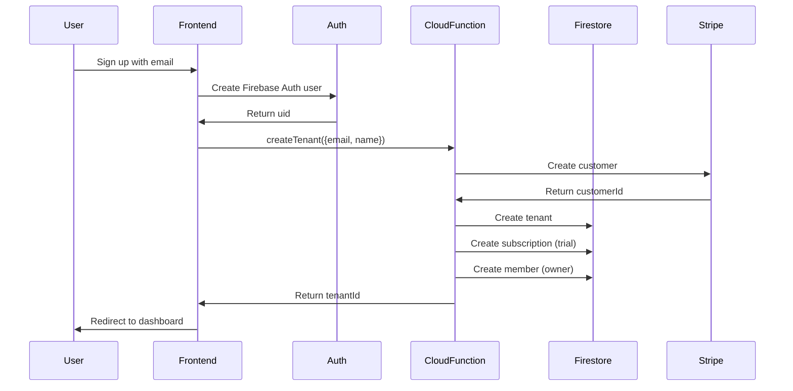
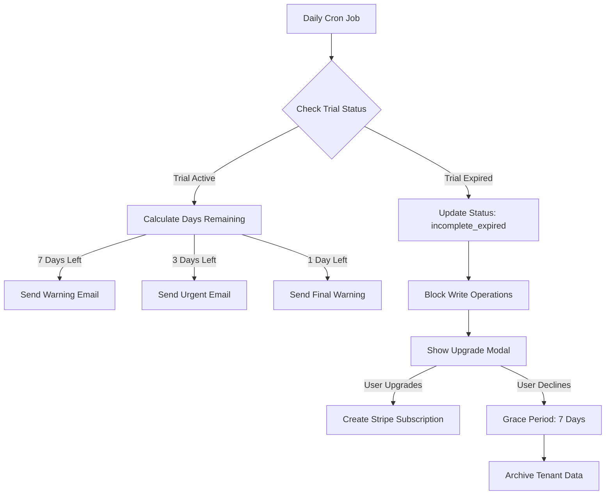
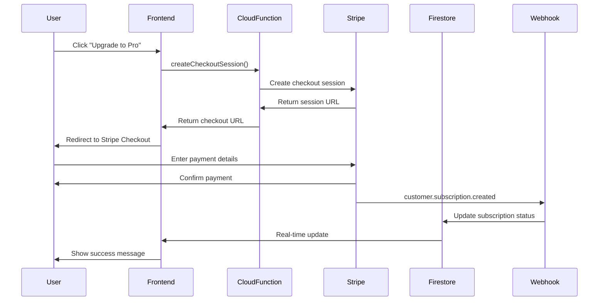
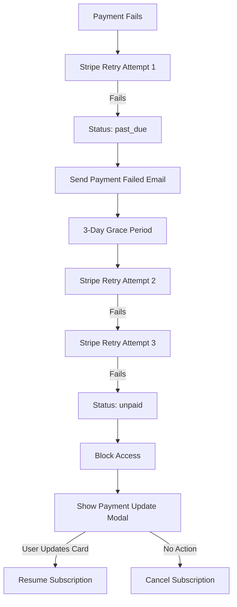
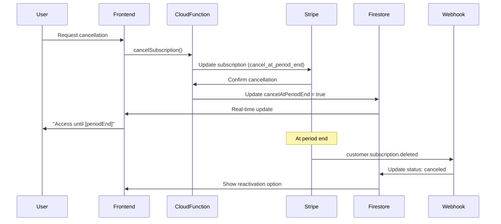

[Back to Index](./index.md) | [Previous: Monitoring](./monitoring.md) | [Next: Stripe Integration](./stripe-integration.md)

# Subscription Billing Architecture

## Overview

FinDogAI implements a subscription-based business model with trial periods, tiered plans, and usage limits. This document defines the complete subscription billing architecture, including data models, lifecycle management, trial handling, and usage enforcement.

## Business Model

### Revenue Model
- **Primary**: Monthly recurring subscriptions (SaaS)
- **Currency**: EUR (European market focus, Czech Republic)
- **Payment Processor**: Stripe
- **Target Market**: B2B (small craftsmen businesses)

### Subscription Tiers

| Plan | Price | Trial | Max Jobs | Max Team | Voice Minutes | PDF Export |
|------|-------|-------|----------|----------|---------------|------------|
| **Free** | €0/month | N/A | 5 | 1 | 0 | No |
| **Pro** | €29/month | 14 days | Unlimited | Unlimited | 1,000/month | Yes |
| **Enterprise** | Custom | Custom | Unlimited | Unlimited | Unlimited | Yes |

## Data Models

### Tenant Subscription Model

**Location**: `/tenants/{tenantId}/subscription/default`

```typescript
interface TenantSubscription {
  // Identity
  tenantId: string;                    // Reference to parent tenant

  // Stripe Integration
  stripeCustomerId: string;            // cus_xxxxxxxxxxxxx
  stripeSubscriptionId: string | null; // sub_xxxxxxxxxxxxx (null for free plan)
  stripePriceId: string | null;        // price_xxxxxxxxxxxxx

  // Plan & Status
  plan: SubscriptionPlan;
  status: SubscriptionStatus;

  // Trial Management
  trialStart: Timestamp | null;        // When trial started
  trialEnd: Timestamp | null;          // When trial expires

  // Billing Period
  currentPeriodStart: Timestamp;       // Current billing period start
  currentPeriodEnd: Timestamp;         // Current billing period end

  // Plan Limits (copied from plan definition for performance)
  limits: {
    maxJobs: number;                   // -1 = unlimited
    maxTeamMembers: number;            // -1 = unlimited
    maxVoiceMinutesPerMonth: number;   // -1 = unlimited
    pdfExport: boolean;
  };

  // Current Usage (reset monthly)
  usage: {
    jobsCreated: number;               // Total jobs created in current period
    activeTeamMembers: number;         // Current active team member count
    voiceMinutesThisMonth: number;     // Voice minutes used this billing cycle
    lastVoiceUsageReset: Timestamp;    // When voice usage was last reset
  };

  // Lifecycle Flags
  cancelAtPeriodEnd: boolean;          // User requested cancellation
  canceledAt: Timestamp | null;        // When subscription was canceled

  // Metadata
  createdAt: Timestamp;
  updatedAt: Timestamp;
}

type SubscriptionPlan = 'free' | 'trial' | 'pro' | 'enterprise';

type SubscriptionStatus =
  | 'active'                // Paid subscription, full access
  | 'trialing'              // In trial period, full access
  | 'past_due'              // Payment failed, grace period (3 days)
  | 'canceled'              // User canceled, access until period end
  | 'incomplete'            // Initial payment pending
  | 'incomplete_expired'    // Trial expired without payment
  | 'unpaid';               // Payment failed, no access
```

### Payment Record Model

**Location**: `/tenants/{tenantId}/payments/{paymentId}`

```typescript
interface PaymentRecord {
  // Identity
  tenantId: string;
  paymentId: string;                   // Auto-generated Firestore ID

  // Stripe References
  stripeInvoiceId: string;             // in_xxxxxxxxxxxxx
  stripePaymentIntentId: string;       // pi_xxxxxxxxxxxxx
  stripeChargeId: string | null;       // ch_xxxxxxxxxxxxx

  // Payment Details
  amount: number;                      // Amount in cents (2900 = €29.00)
  currency: string;                    // 'eur'
  status: PaymentStatus;

  // Invoice
  invoicePdfUrl: string | null;        // Stripe-hosted invoice PDF
  invoiceNumber: string | null;        // Invoice number for records

  // Period Covered
  periodStart: Timestamp;
  periodEnd: Timestamp;

  // Failure Information (if applicable)
  failureReason: string | null;        // e.g., 'card_declined'
  failureMessage: string | null;       // User-friendly message

  // Metadata
  createdAt: Timestamp;
  paidAt: Timestamp | null;
}

type PaymentStatus =
  | 'paid'           // Successfully paid
  | 'open'           // Awaiting payment
  | 'void'           // Voided/canceled
  | 'uncollectible'; // Failed collection attempts
```

### Plan Definition Model

**Location**: Server-side constant (not in Firestore)

```typescript
interface PlanDefinition {
  id: SubscriptionPlan;
  name: string;
  displayName: string;
  price: number | null;                // null = custom pricing
  currency: string;
  interval: 'month' | 'year' | null;   // null = free/custom
  stripePriceId: string | null;        // Stripe Price ID
  trialDays: number;                   // 0 = no trial

  features: string[];                  // Marketing feature list

  limits: {
    maxJobs: number;                   // -1 = unlimited
    maxTeamMembers: number;
    maxVoiceMinutesPerMonth: number;
    pdfExport: boolean;
  };
}

export const SUBSCRIPTION_PLANS: Record<SubscriptionPlan, PlanDefinition> = {
  free: {
    id: 'free',
    name: 'free',
    displayName: 'Free',
    price: 0,
    currency: 'EUR',
    interval: null,
    stripePriceId: null,
    trialDays: 0,
    features: [
      'Up to 5 jobs',
      '1 team member (owner only)',
      'Manual cost entry',
      'Basic reporting'
    ],
    limits: {
      maxJobs: 5,
      maxTeamMembers: 1,
      maxVoiceMinutesPerMonth: 0,
      pdfExport: false
    }
  },

  trial: {
    id: 'trial',
    name: 'trial',
    displayName: 'Pro Trial',
    price: 0,
    currency: 'EUR',
    interval: null,
    stripePriceId: null,
    trialDays: 14,
    features: [
      'All Pro features',
      '14-day free trial',
      'No credit card required'
    ],
    limits: {
      maxJobs: -1,
      maxTeamMembers: -1,
      maxVoiceMinutesPerMonth: 1000,
      pdfExport: true
    }
  },

  pro: {
    id: 'pro',
    name: 'pro',
    displayName: 'Pro',
    price: 29.00,
    currency: 'EUR',
    interval: 'month',
    stripePriceId: process.env.STRIPE_PRO_PRICE_ID!, // Set in environment
    trialDays: 14,
    features: [
      'Unlimited jobs',
      'Unlimited team members',
      '1,000 voice minutes per month',
      'PDF export',
      'Advanced reporting',
      'Priority support',
      'Multi-device sync'
    ],
    limits: {
      maxJobs: -1,
      maxTeamMembers: -1,
      maxVoiceMinutesPerMonth: 1000,
      pdfExport: true
    }
  },

  enterprise: {
    id: 'enterprise',
    name: 'enterprise',
    displayName: 'Enterprise',
    price: null,
    currency: 'EUR',
    interval: 'month',
    stripePriceId: null, // Custom pricing, handled manually
    trialDays: 30,
    features: [
      'Everything in Pro',
      'Unlimited voice minutes',
      'Custom integrations',
      'Dedicated support',
      'SLA guarantees',
      'Custom training',
      'Priority feature requests'
    ],
    limits: {
      maxJobs: -1,
      maxTeamMembers: -1,
      maxVoiceMinutesPerMonth: -1,
      pdfExport: true
    }
  }
};
```

## Subscription Lifecycle

### 1. Tenant Creation & Initial Trial



**Initial Subscription State:**
```typescript
{
  plan: 'trial',
  status: 'trialing',
  trialStart: now(),
  trialEnd: now() + 14 days,
  limits: SUBSCRIPTION_PLANS.trial.limits,
  usage: {
    jobsCreated: 0,
    activeTeamMembers: 1,
    voiceMinutesThisMonth: 0,
    lastVoiceUsageReset: now()
  }
}
```

### 2. Trial Expiration Flow



**Trial Expiration Handler:**
```typescript
// Runs daily at 02:00 UTC
export const processTrialExpirations = onSchedule(
  'every day 02:00',
  async () => {
    const now = admin.firestore.Timestamp.now();

    // Find expired trials
    const expiredTrials = await admin.firestore()
      .collectionGroup('subscription')
      .where('status', '==', 'trialing')
      .where('trialEnd', '<=', now)
      .get();

    for (const doc of expiredTrials.docs) {
      const sub = doc.data() as TenantSubscription;

      // Update status
      await doc.ref.update({
        status: 'incomplete_expired',
        updatedAt: admin.firestore.FieldValue.serverTimestamp()
      });

      // Send expiration email
      await sendTrialExpiredEmail(sub.tenantId);

      logger.info(`Trial expired for tenant ${sub.tenantId}`);
    }
  }
);
```

### 3. Upgrade to Paid Plan



### 4. Payment Failure & Dunning



### 5. Cancellation Flow



## Usage Limit Enforcement

### Real-Time Checks

**Before Critical Operations:**
```typescript
// Example: Before creating a job
async function canCreateJob(tenantId: string): Promise<UsageCheckResult> {
  const subscription = await getSubscription(tenantId);

  // Check subscription status
  if (!['active', 'trialing'].includes(subscription.status)) {
    return {
      allowed: false,
      reason: 'subscription_expired',
      message: 'Your subscription has expired. Please upgrade to continue.',
      action: 'upgrade'
    };
  }

  // Check job limit
  if (subscription.limits.maxJobs !== -1) {
    if (subscription.usage.jobsCreated >= subscription.limits.maxJobs) {
      return {
        allowed: false,
        reason: 'job_limit_reached',
        message: `You've reached your limit of ${subscription.limits.maxJobs} jobs.`,
        action: 'upgrade'
      };
    }
  }

  return { allowed: true };
}

interface UsageCheckResult {
  allowed: boolean;
  reason?: string;
  message?: string;
  action?: 'upgrade' | 'contact_support' | 'wait';
}
```

### Usage Tracking Triggers

**Firestore Trigger: Track Job Creation**
```typescript
export const onJobCreated = onDocumentCreated(
  'tenants/{tenantId}/jobs/{jobId}',
  async (event) => {
    const tenantId = event.params.tenantId;

    // Increment job count
    await admin.firestore()
      .doc(`tenants/${tenantId}/subscription/default`)
      .update({
        'usage.jobsCreated': admin.firestore.FieldValue.increment(1),
        updatedAt: admin.firestore.FieldValue.serverTimestamp()
      });
  }
);
```

**Firestore Trigger: Track Team Member Changes**
```typescript
export const onMemberWritten = onDocumentWritten(
  'tenants/{tenantId}/members/{memberId}',
  async (event) => {
    const tenantId = event.params.tenantId;

    // Count active members
    const members = await admin.firestore()
      .collection(`tenants/${tenantId}/members`)
      .where('status', '==', 'active')
      .where('deletedAt', '==', null)
      .count()
      .get();

    // Update active member count
    await admin.firestore()
      .doc(`tenants/${tenantId}/subscription/default`)
      .update({
        'usage.activeTeamMembers': members.data().count,
        updatedAt: admin.firestore.FieldValue.serverTimestamp()
      });
  }
);
```

**Cloud Function: Track Voice Usage**
```typescript
export const trackVoiceUsage = onCall(async (request) => {
  const { tenantId, durationSeconds } = request.data;

  const minutes = Math.ceil(durationSeconds / 60);

  const subRef = admin.firestore()
    .doc(`tenants/${tenantId}/subscription/default`);

  await subRef.update({
    'usage.voiceMinutesThisMonth': admin.firestore.FieldValue.increment(minutes),
    updatedAt: admin.firestore.FieldValue.serverTimestamp()
  });

  // Check if limit exceeded
  const sub = (await subRef.get()).data() as TenantSubscription;

  if (sub.limits.maxVoiceMinutesPerMonth !== -1 &&
      sub.usage.voiceMinutesThisMonth >= sub.limits.maxVoiceMinutesPerMonth) {
    return {
      allowed: false,
      remainingMinutes: 0,
      message: 'Voice minute limit reached for this month.'
    };
  }

  return {
    allowed: true,
    remainingMinutes: sub.limits.maxVoiceMinutesPerMonth - sub.usage.voiceMinutesThisMonth
  };
});
```

### Monthly Usage Reset

```typescript
// Runs on 1st of each month at 00:00
export const resetMonthlyUsage = onSchedule(
  '0 0 1 * *',
  async () => {
    const subscriptions = await admin.firestore()
      .collectionGroup('subscription')
      .where('status', 'in', ['active', 'trialing'])
      .get();

    const batch = admin.firestore().batch();

    for (const doc of subscriptions.docs) {
      batch.update(doc.ref, {
        'usage.voiceMinutesThisMonth': 0,
        'usage.lastVoiceUsageReset': admin.firestore.FieldValue.serverTimestamp(),
        updatedAt: admin.firestore.FieldValue.serverTimestamp()
      });
    }

    await batch.commit();
    logger.info(`Reset monthly usage for ${subscriptions.size} subscriptions`);
  }
);
```

## Billing Notifications

### Email Triggers

| Event | Trigger | Timing | Recipients |
|-------|---------|--------|------------|
| **Trial Started** | Tenant creation | Immediate | Owner |
| **Trial 7 Days Left** | Daily cron | 7 days before expiry | Owner |
| **Trial 3 Days Left** | Daily cron | 3 days before expiry | Owner |
| **Trial 1 Day Left** | Daily cron | 1 day before expiry | Owner |
| **Trial Expired** | Daily cron | On expiry | Owner |
| **Payment Succeeded** | Stripe webhook | On payment | Owner |
| **Payment Failed** | Stripe webhook | On failure | Owner |
| **Subscription Canceled** | Stripe webhook | On cancellation | Owner |
| **Limit Approaching** | Usage trigger | At 80% of limit | Owner |
| **Limit Reached** | Usage trigger | At 100% of limit | Owner |

### Email Templates

**Trial Expiration Warning (7 Days):**
```
Subject: Your FinDogAI trial expires in 7 days

Hi [Name],

Your 14-day Pro trial of FinDogAI will expire on [Date].

To continue using all features:
- Unlimited jobs
- Voice commands
- Team collaboration
- PDF export

Upgrade to Pro for just €29/month

[Upgrade Now Button]

Questions? Reply to this email.

Best regards,
The FinDogAI Team
```

## Security & Compliance

### PCI Compliance
- **No card data stored**: All payments processed by Stripe
- **Stripe Checkout**: PCI-compliant hosted checkout
- **No card handling**: Frontend never touches card data

### GDPR Compliance
- **Data portability**: Export subscription history via API
- **Right to erasure**: Cancel subscription and delete payment records
- **Data minimization**: Store only necessary billing data
- **Consent**: Explicit consent for subscription and billing

### Audit Trail
All subscription changes logged to `/tenants/{tenantId}/audit_logs`:
```typescript
{
  action: 'subscription.updated',
  entityType: 'subscription',
  changes: {
    before: { status: 'trialing' },
    after: { status: 'active' }
  },
  userId: 'owner-uid',
  timestamp: Timestamp,
  metadata: {
    stripeEventId: 'evt_xxxxxxxxxxxxx'
  }
}
```

## Error Handling

### Common Scenarios

| Error | Cause | User Action | System Action |
|-------|-------|-------------|---------------|
| **Card Declined** | Insufficient funds | Update payment method | Block access after grace period |
| **Expired Card** | Card expired | Update payment method | Email notification |
| **Webhook Failed** | Network issue | N/A | Retry webhook delivery |
| **Duplicate Subscription** | Race condition | N/A | Idempotency check |
| **Invalid Price ID** | Config error | Contact support | Alert developers |

### Retry Logic

**Stripe Webhooks:**
- Automatic retry with exponential backoff
- Max 3 retries over 3 days
- Manual replay available in Stripe dashboard

**Payment Collection:**
- Stripe Smart Retries (automatic)
- Retry on different day/time for higher success
- Email notification before each retry

## Performance Considerations

### Caching Strategy
```typescript
// Cache subscription status for 5 minutes
const subscriptionCache = new Map<string, {
  subscription: TenantSubscription;
  expiresAt: number;
}>();

function getCachedSubscription(tenantId: string): TenantSubscription | null {
  const cached = subscriptionCache.get(tenantId);
  if (cached && Date.now() < cached.expiresAt) {
    return cached.subscription;
  }
  return null;
}
```

### Database Queries
- **Index**: `subscription.status` + `subscription.trialEnd` (for cron job)
- **Index**: `subscription.tenantId` (for lookups)
- **Denormalization**: Copy plan limits to subscription document

### Real-Time Updates
- Firestore listeners for subscription changes
- Frontend updates instantly when subscription changes
- No polling required

## Monitoring & Alerting

### Key Metrics
- **MRR (Monthly Recurring Revenue)**: Track in Stripe + analytics
- **Churn Rate**: Canceled subscriptions / total subscriptions
- **Trial Conversion Rate**: Trials → paid / total trials
- **Payment Success Rate**: Successful payments / total attempts
- **Average Revenue Per User (ARPU)**: Total revenue / active users

### Alerts
```yaml
- alert: HighPaymentFailureRate
  condition: payment_failure_rate > 10%
  severity: warning
  notify: founders@findogai.app

- alert: WebhookDeliveryFailing
  condition: webhook_failure_rate > 5%
  severity: critical
  notify: dev@findogai.app

- alert: TrialConversionDrop
  condition: trial_conversion_rate < 20%
  severity: warning
  notify: founders@findogai.app
```

---

*Next: [Stripe Integration](./stripe-integration.md)*
