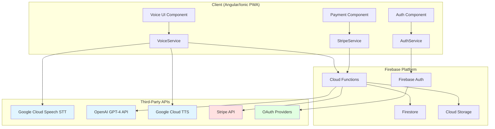
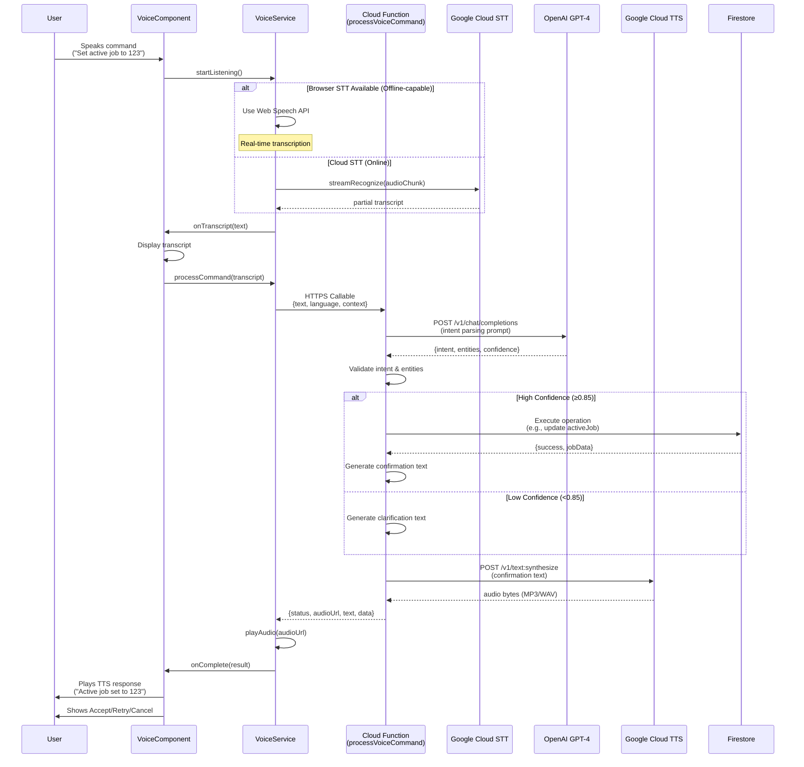
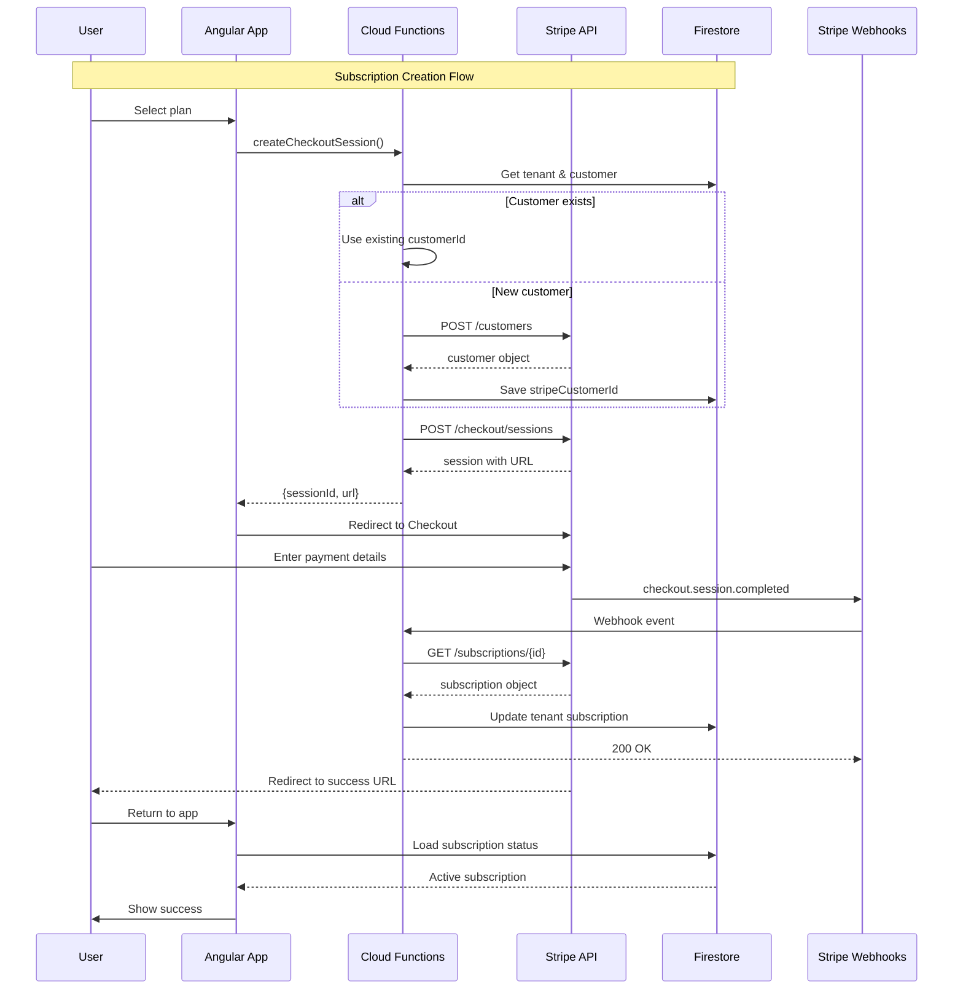
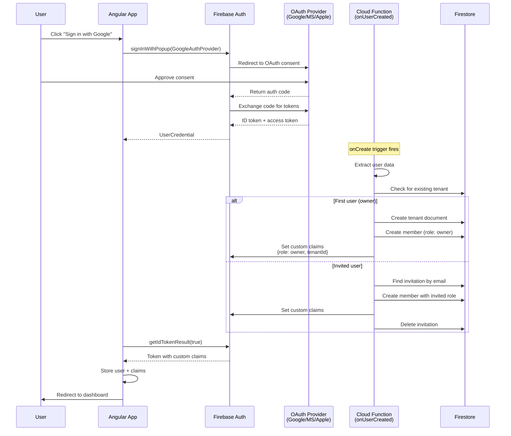

[Back to Index](./index.md) | [Previous: Data Models](./data-models.md) | [Next: API Specification](./api-specification.md)

# Third-Party Integrations Architecture

This document provides comprehensive architecture and implementation patterns for all third-party integrations in the FinDogAI system, addressing voice APIs, payment processing, authentication providers, and rate limiting strategies.

## Table of Contents

1. [Integration Overview](#integration-overview)
2. [Voice Pipeline Integration](#voice-pipeline-integration)
3. [Stripe Payment Integration](#stripe-payment-integration)
4. [Firebase Authentication & OAuth Providers](#firebase-authentication--oauth-providers)
5. [Rate Limiting & Quota Management](#rate-limiting--quota-management)
6. [Error Handling & Resilience](#error-handling--resilience)
7. [Monitoring & Observability](#monitoring--observability)

---

## Integration Overview

### Third-Party Service Inventory

| Service Category | Provider | Purpose | Criticality | Fallback Strategy |
|-----------------|----------|---------|-------------|-------------------|
| **STT (Online)** | Google Cloud Speech-to-Text | Primary voice-to-text | High | Web Speech API |
| **STT (Browser)** | Web Speech API | Browser-native STT | Medium | Manual entry |
| **LLM** | OpenAI GPT-4 / Anthropic Claude | Intent parsing & NLU | High | Cached patterns |
| **TTS (Online)** | Google Cloud Text-to-Speech | Primary text-to-speech | High | Web Speech Synthesis |
| **TTS (Browser)** | Web Speech Synthesis API | Browser-native TTS | Medium | Visual feedback only |
| **Payment Processing** | Stripe | Subscription billing | Critical | Manual invoicing |
| **Authentication** | Firebase Auth | Identity management | Critical | None (system dependency) |
| **OAuth Providers** | Google, Microsoft, Apple | Social login | Low | Email/password |
| **File Storage** | Cloud Storage for Firebase | PDF exports, attachments | Medium | Deferred upload |
| **Email** | SendGrid (via Cloud Functions) | Transactional emails | Low | In-app notifications |

### Integration Architecture Diagram



---

## Voice Pipeline Integration

### Architecture Overview

The voice pipeline integrates multiple third-party APIs in sequence: **STT → LLM → TTS**, with browser-native fallbacks and offline degradation.

### Voice Pipeline Sequence Diagram



### STT Integration (Google Cloud Speech-to-Text)

#### Configuration

**Location:** Cloud Function environment variables

```typescript
// functions/src/config/voice.config.ts
export const STT_CONFIG = {
  provider: 'google-cloud-stt',
  apiKey: process.env.GOOGLE_CLOUD_API_KEY,
  endpoint: 'https://speech.googleapis.com/v1/speech:recognize',
  fallback: 'web-speech-api',

  // Recognition settings
  config: {
    encoding: 'WEBM_OPUS',
    sampleRateHertz: 48000,
    languageCode: 'cs-CZ',
    alternativeLanguageCodes: ['en-US'],
    enableAutomaticPunctuation: true,
    model: 'latest_short',  // Optimized for voice commands
    useEnhanced: true,
  },

  // Quality thresholds (NFR5)
  quality: {
    maxWordErrorRate: 0.15,      // 15% WER median
    maxWordErrorRateP95: 0.25,   // 25% WER P95
    minNumericAccuracy: 0.90,    // 90% exact match for numbers
  },

  // Performance targets (NFR1)
  performance: {
    maxLatencyMedian: 3000,      // 3s median
    maxLatencyP95: 5000,         // 5s P95
  },
};
```

#### API Call Pattern

```typescript
// functions/src/services/stt.service.ts
import { SpeechClient } from '@google-cloud/speech';

export class STTService {
  private client: SpeechClient;

  constructor() {
    this.client = new SpeechClient({
      apiKey: STT_CONFIG.apiKey,
    });
  }

  async transcribe(audioBytes: Buffer, language: string): Promise<STTResult> {
    const startTime = Date.now();

    try {
      const [response] = await this.client.recognize({
        config: {
          ...STT_CONFIG.config,
          languageCode: language,
        },
        audio: { content: audioBytes.toString('base64') },
      });

      const latency = Date.now() - startTime;

      // Track performance metrics (NFR1)
      await this.trackMetric('stt_latency', latency);

      const transcript = response.results
        ?.map(result => result.alternatives?.[0]?.transcript)
        .join(' ') || '';

      const confidence = response.results?.[0]?.alternatives?.[0]?.confidence || 0;

      return {
        transcript,
        confidence,
        latency,
        language: response.results?.[0]?.languageCode || language,
      };

    } catch (error) {
      // Handle specific error types
      if (error.code === 'RESOURCE_EXHAUSTED') {
        throw new QuotaExceededError('STT quota exceeded', error);
      }
      if (error.code === 'DEADLINE_EXCEEDED') {
        throw new TimeoutError('STT timeout', error);
      }
      throw new STTError('STT transcription failed', error);
    }
  }
}
```

#### Browser Fallback (Web Speech API)

```typescript
// apps/findogai/src/app/core/services/voice.service.ts
export class VoiceService {
  private recognition: SpeechRecognition | null = null;

  initializeBrowserSTT(): void {
    const SpeechRecognition =
      (window as any).SpeechRecognition ||
      (window as any).webkitSpeechRecognition;

    if (!SpeechRecognition) {
      console.warn('Web Speech API not available');
      return;
    }

    this.recognition = new SpeechRecognition();
    this.recognition.continuous = false;
    this.recognition.interimResults = true;
    this.recognition.maxAlternatives = 1;

    this.recognition.onresult = (event) => {
      const last = event.results.length - 1;
      const transcript = event.results[last][0].transcript;
      const isFinal = event.results[last].isFinal;

      this.transcriptSubject.next({ transcript, isFinal });
    };

    this.recognition.onerror = (event) => {
      this.handleSTTError(event.error);
    };
  }

  startListening(language: string): Observable<string> {
    if (!this.recognition) {
      // Fallback to Cloud STT via Cloud Function
      return this.startCloudSTT(language);
    }

    this.recognition.lang = language;
    this.recognition.start();

    return this.transcriptSubject.pipe(
      filter(result => result.isFinal),
      map(result => result.transcript)
    );
  }
}
```

### LLM Integration (OpenAI GPT-4 / Anthropic Claude)

#### Configuration

```typescript
// functions/src/config/llm.config.ts
export const LLM_CONFIG = {
  provider: 'openai',  // or 'anthropic'
  apiKey: process.env.OPENAI_API_KEY,
  endpoint: 'https://api.openai.com/v1/chat/completions',
  fallback: 'pattern-matching',  // Cached intent patterns

  // Model settings
  model: 'gpt-4-turbo-preview',
  temperature: 0.2,  // Low for consistent parsing
  maxTokens: 500,

  // Quality thresholds (NFR6)
  quality: {
    minF1Score: 0.85,              // F1 ≥ 0.85 for intent recognition
    minNumericAccuracy: 0.90,      // 90% exact match for entities
  },

  // Retry configuration
  retry: {
    maxAttempts: 3,
    backoffMs: [1000, 2000, 4000],
  },
};
```

#### Intent Parsing Prompt

```typescript
// functions/src/services/llm.service.ts
export class LLMService {
  async parseIntent(
    text: string,
    language: string,
    context: VoiceContext
  ): Promise<IntentResult> {

    const systemPrompt = this.buildSystemPrompt(language);
    const userPrompt = this.buildUserPrompt(text, context);

    try {
      const response = await this.callLLM({
        messages: [
          { role: 'system', content: systemPrompt },
          { role: 'user', content: userPrompt },
        ],
        temperature: LLM_CONFIG.temperature,
        max_tokens: LLM_CONFIG.maxTokens,
        response_format: { type: 'json_object' },  // Enforce JSON
      });

      const parsed = JSON.parse(response.choices[0].message.content);

      // Validate against schema
      const validated = this.validateIntentSchema(parsed);

      // Track quality metrics (NFR6)
      await this.trackMetric('llm_confidence', validated.confidence);

      return validated;

    } catch (error) {
      if (error.code === 'rate_limit_exceeded') {
        throw new RateLimitError('LLM rate limit exceeded', error);
      }
      throw new LLMError('Intent parsing failed', error);
    }
  }

  private buildSystemPrompt(language: string): string {
    return `You are an intent parser for a field service cost tracking app.
Extract structured data from natural language voice commands.

Supported intents:
- SET_ACTIVE_JOB: Set the current active job
- START_JOURNEY: Log vehicle journey start
- ADD_COST: Create cost entry (transport/material/labor/machine/other)
- UPDATE_COST: Modify existing cost
- COMPLETE_JOURNEY: End vehicle journey

Extract entities:
- jobNumber (integer): Job reference number
- jobTitle (string): Job description for fuzzy matching
- vehicleId (integer): Vehicle number
- odometer (integer): Odometer reading in km
- destination (string): Journey destination
- costType (enum): transport|material|labor|machine|other
- amount (number): Cost amount
- description (string): Cost description

Language: ${language}

Respond in JSON:
{
  "intent": "INTENT_NAME",
  "confidence": 0.0-1.0,
  "entities": { /* extracted values */ },
  "clarification": "question if confidence < 0.85"
}`;
  }

  private buildUserPrompt(text: string, context: VoiceContext): string {
    return `User said: "${text}"

Context:
- Active job: ${context.activeJobNumber || 'none'}
- Language: ${context.language}
- Recent jobs: ${JSON.stringify(context.recentJobs)}

Parse this command.`;
  }
}
```

#### Fallback Pattern Matching

```typescript
// functions/src/services/pattern-matcher.service.ts
export class PatternMatcherService {
  private patterns = [
    {
      intent: 'SET_ACTIVE_JOB',
      regex: /(?:set|change|switch).*(?:job|active).*?(\d+)/i,
      extract: (match: RegExpMatchArray) => ({
        jobNumber: parseInt(match[1], 10),
      }),
    },
    {
      intent: 'START_JOURNEY',
      regex: /(?:going|traveling|heading).*?to\s+(\w+).*?(?:vehicle|car|van)\s+(\d+).*?odometer\s+(\d+)/i,
      extract: (match: RegExpMatchArray) => ({
        destination: match[1],
        vehicleNumber: parseInt(match[2], 10),
        odometer: parseInt(match[3], 10),
      }),
    },
    // ... more patterns
  ];

  match(text: string): IntentResult | null {
    for (const pattern of this.patterns) {
      const match = text.match(pattern.regex);
      if (match) {
        return {
          intent: pattern.intent,
          confidence: 0.75,  // Pattern matching has lower confidence
          entities: pattern.extract(match),
          fallback: true,
        };
      }
    }
    return null;
  }
}
```

### TTS Integration (Google Cloud Text-to-Speech)

#### Configuration

```typescript
// functions/src/config/tts.config.ts
export const TTS_CONFIG = {
  provider: 'google-cloud-tts',
  apiKey: process.env.GOOGLE_CLOUD_API_KEY,
  endpoint: 'https://texttospeech.googleapis.com/v1/text:synthesize',
  fallback: 'web-speech-synthesis',

  // Voice settings
  voices: {
    'cs-CZ': {
      languageCode: 'cs-CZ',
      name: 'cs-CZ-Wavenet-A',
      ssmlGender: 'FEMALE',
    },
    'en-US': {
      languageCode: 'en-US',
      name: 'en-US-Neural2-F',
      ssmlGender: 'FEMALE',
    },
  },

  // Audio format
  audioConfig: {
    audioEncoding: 'MP3',
    speakingRate: 1.0,
    pitch: 0.0,
    volumeGainDb: 0.0,
  },

  // Storage for audio files
  storage: {
    bucket: 'findogai-tts-audio',
    ttlDays: 1,  // Auto-delete after 1 day
  },
};
```

#### API Call Pattern

```typescript
// functions/src/services/tts.service.ts
import { TextToSpeechClient } from '@google-cloud/text-to-speech';
import { Storage } from '@google-cloud/storage';

export class TTSService {
  private client: TextToSpeechClient;
  private storage: Storage;

  async synthesize(text: string, language: string): Promise<TTSResult> {
    const voice = TTS_CONFIG.voices[language];

    try {
      const [response] = await this.client.synthesizeSpeech({
        input: { text },
        voice,
        audioConfig: TTS_CONFIG.audioConfig,
      });

      // Upload to Cloud Storage with signed URL
      const audioUrl = await this.uploadAudio(
        response.audioContent as Buffer,
        language
      );

      return {
        audioUrl,
        text,
        language,
        duration: this.estimateDuration(text),
      };

    } catch (error) {
      if (error.code === 'RESOURCE_EXHAUSTED') {
        throw new QuotaExceededError('TTS quota exceeded', error);
      }
      throw new TTSError('TTS synthesis failed', error);
    }
  }

  private async uploadAudio(buffer: Buffer, language: string): Promise<string> {
    const bucket = this.storage.bucket(TTS_CONFIG.storage.bucket);
    const fileName = `tts/${Date.now()}-${language}.mp3`;
    const file = bucket.file(fileName);

    await file.save(buffer, {
      contentType: 'audio/mpeg',
      metadata: {
        cacheControl: 'public, max-age=3600',
      },
    });

    // Generate signed URL (1 hour expiry)
    const [url] = await file.getSignedUrl({
      action: 'read',
      expires: Date.now() + 3600 * 1000,
    });

    // Schedule deletion after TTL
    await file.setMetadata({
      metadata: {
        deleteAt: Date.now() + TTS_CONFIG.storage.ttlDays * 86400 * 1000,
      },
    });

    return url;
  }
}
```

### Voice Pipeline Cloud Function

```typescript
// functions/src/voice/process-voice-command.function.ts
import { onCall, HttpsError } from 'firebase-functions/v2/https';
import { STTService } from '../services/stt.service';
import { LLMService } from '../services/llm.service';
import { TTSService } from '../services/tts.service';

interface VoiceCommandRequest {
  audioBase64?: string;  // For audio input
  text?: string;         // For pre-transcribed text
  language: string;
  context: VoiceContext;
}

export const processVoiceCommand = onCall(
  {
    region: 'europe-west1',
    timeoutSeconds: 30,
    memory: '512MiB',
  },
  async (request) => {
    const { audioBase64, text, language, context } = request.data as VoiceCommandRequest;

    const userId = request.auth?.uid;
    if (!userId) {
      throw new HttpsError('unauthenticated', 'User must be authenticated');
    }

    const startTime = Date.now();
    let transcript = text;

    try {
      // Step 1: STT (if audio provided)
      if (audioBase64 && !text) {
        const sttService = new STTService();
        const audioBuffer = Buffer.from(audioBase64, 'base64');
        const sttResult = await sttService.transcribe(audioBuffer, language);
        transcript = sttResult.transcript;

        // Check STT quality (NFR5)
        if (sttResult.confidence < 0.70) {
          return {
            status: 'low_confidence',
            transcript,
            confidence: sttResult.confidence,
            message: 'Please repeat your command',
          };
        }
      }

      if (!transcript) {
        throw new HttpsError('invalid-argument', 'No audio or text provided');
      }

      // Step 2: LLM Intent Parsing
      const llmService = new LLMService();
      const intentResult = await llmService.parseIntent(transcript, language, context);

      // Check intent confidence (NFR6)
      if (intentResult.confidence < 0.85) {
        // Request clarification via TTS
        const ttsService = new TTSService();
        const ttsResult = await ttsService.synthesize(
          intentResult.clarification || 'I did not understand. Please try again.',
          language
        );

        return {
          status: 'clarification_needed',
          transcript,
          confidence: intentResult.confidence,
          audioUrl: ttsResult.audioUrl,
          message: intentResult.clarification,
        };
      }

      // Step 3: Execute Operation
      const operationResult = await this.executeIntent(
        intentResult,
        userId,
        context.tenantId
      );

      // Step 4: Generate Confirmation TTS
      const confirmationText = this.generateConfirmation(intentResult, operationResult, language);
      const ttsService = new TTSService();
      const ttsResult = await ttsService.synthesize(confirmationText, language);

      const totalLatency = Date.now() - startTime;

      // Track performance (NFR2: ≤8s median)
      await this.trackMetric('voice_pipeline_latency', totalLatency);

      return {
        status: 'success',
        transcript,
        intent: intentResult.intent,
        data: operationResult,
        audioUrl: ttsResult.audioUrl,
        confirmationText,
        latency: totalLatency,
      };

    } catch (error) {
      console.error('Voice pipeline error:', error);

      // Return error with TTS feedback
      const errorMessage = this.getErrorMessage(error, language);
      const ttsService = new TTSService();

      try {
        const ttsResult = await ttsService.synthesize(errorMessage, language);
        return {
          status: 'error',
          transcript,
          error: error.message,
          audioUrl: ttsResult.audioUrl,
          message: errorMessage,
        };
      } catch (ttsError) {
        // Fallback without TTS
        return {
          status: 'error',
          transcript,
          error: error.message,
          message: errorMessage,
        };
      }
    }
  }
);
```

---

## Stripe Payment Integration

### Architecture Overview

Stripe integration handles subscription billing, payment methods, and webhook events for the FinDogAI SaaS model.

### Stripe Integration Diagram



### Stripe Configuration

```typescript
// functions/src/config/stripe.config.ts
export const STRIPE_CONFIG = {
  apiKey: process.env.STRIPE_SECRET_KEY,
  webhookSecret: process.env.STRIPE_WEBHOOK_SECRET,
  apiVersion: '2023-10-16' as const,

  // Product & Price IDs
  products: {
    starter: {
      priceId: 'price_starter_monthly',
      name: 'Starter Plan',
      features: ['Up to 5 team members', '100 jobs/month', 'Basic support'],
    },
    professional: {
      priceId: 'price_professional_monthly',
      name: 'Professional Plan',
      features: ['Up to 20 team members', 'Unlimited jobs', 'Priority support'],
    },
    enterprise: {
      priceId: 'price_enterprise_monthly',
      name: 'Enterprise Plan',
      features: ['Unlimited team members', 'Unlimited jobs', 'Dedicated support'],
    },
  },

  // Webhook events to handle
  webhookEvents: [
    'checkout.session.completed',
    'customer.subscription.created',
    'customer.subscription.updated',
    'customer.subscription.deleted',
    'invoice.payment_succeeded',
    'invoice.payment_failed',
    'payment_method.attached',
    'payment_method.detached',
  ],

  // Retry configuration
  retry: {
    maxAttempts: 3,
    backoffMs: [1000, 2000, 4000],
  },
};
```

### Stripe Service Implementation

```typescript
// functions/src/services/stripe.service.ts
import Stripe from 'stripe';
import { Firestore } from 'firebase-admin/firestore';

export class StripeService {
  private stripe: Stripe;
  private db: Firestore;

  constructor() {
    this.stripe = new Stripe(STRIPE_CONFIG.apiKey, {
      apiVersion: STRIPE_CONFIG.apiVersion,
      typescript: true,
    });
    this.db = admin.firestore();
  }

  /**
   * Create or retrieve Stripe customer for tenant
   */
  async getOrCreateCustomer(tenantId: string): Promise<string> {
    const tenantRef = this.db.collection('tenants').doc(tenantId);
    const tenantDoc = await tenantRef.get();

    if (!tenantDoc.exists) {
      throw new Error('Tenant not found');
    }

    const tenant = tenantDoc.data() as Tenant;

    // Return existing customer ID
    if (tenant.stripeCustomerId) {
      return tenant.stripeCustomerId;
    }

    // Get owner email for new customer
    const ownerRef = await this.db
      .collection('tenants').doc(tenantId)
      .collection('members')
      .where('role', '==', 'owner')
      .limit(1)
      .get();

    if (ownerRef.empty) {
      throw new Error('No owner found for tenant');
    }

    const owner = ownerRef.docs[0].data() as Member;

    // Create new Stripe customer
    const customer = await this.stripe.customers.create({
      email: owner.email,
      name: owner.displayName,
      metadata: {
        tenantId,
        ownerId: owner.uid,
      },
    });

    // Save customer ID to tenant
    await tenantRef.update({
      stripeCustomerId: customer.id,
      updatedAt: admin.firestore.FieldValue.serverTimestamp(),
    });

    return customer.id;
  }

  /**
   * Create Stripe Checkout session for subscription
   */
  async createCheckoutSession(
    tenantId: string,
    priceId: string,
    successUrl: string,
    cancelUrl: string
  ): Promise<Stripe.Checkout.Session> {
    const customerId = await this.getOrCreateCustomer(tenantId);

    const session = await this.stripe.checkout.sessions.create({
      customer: customerId,
      mode: 'subscription',
      payment_method_types: ['card'],
      line_items: [
        {
          price: priceId,
          quantity: 1,
        },
      ],
      success_url: successUrl,
      cancel_url: cancelUrl,
      metadata: {
        tenantId,
      },
      subscription_data: {
        metadata: {
          tenantId,
        },
      },
      allow_promotion_codes: true,
      billing_address_collection: 'required',
    });

    return session;
  }

  /**
   * Create Stripe Portal session for subscription management
   */
  async createPortalSession(
    tenantId: string,
    returnUrl: string
  ): Promise<Stripe.BillingPortal.Session> {
    const customerId = await this.getOrCreateCustomer(tenantId);

    const session = await this.stripe.billingPortal.sessions.create({
      customer: customerId,
      return_url: returnUrl,
    });

    return session;
  }

  /**
   * Get subscription details
   */
  async getSubscription(subscriptionId: string): Promise<Stripe.Subscription> {
    return await this.stripe.subscriptions.retrieve(subscriptionId);
  }

  /**
   * Cancel subscription at period end
   */
  async cancelSubscription(subscriptionId: string): Promise<Stripe.Subscription> {
    return await this.stripe.subscriptions.update(subscriptionId, {
      cancel_at_period_end: true,
    });
  }
}
```

### Stripe Cloud Functions

```typescript
// functions/src/stripe/create-checkout-session.function.ts
import { onCall, HttpsError } from 'firebase-functions/v2/https';
import { StripeService } from '../services/stripe.service';

interface CheckoutRequest {
  priceId: string;
  successUrl: string;
  cancelUrl: string;
}

export const createCheckoutSession = onCall(
  { region: 'europe-west1' },
  async (request) => {
    const userId = request.auth?.uid;
    if (!userId) {
      throw new HttpsError('unauthenticated', 'User must be authenticated');
    }

    const { priceId, successUrl, cancelUrl } = request.data as CheckoutRequest;

    // Verify user is owner
    const tenantId = await getTenantIdForUser(userId);
    const membership = await getMembership(tenantId, userId);

    if (membership.role !== 'owner') {
      throw new HttpsError('permission-denied', 'Only owner can manage subscription');
    }

    try {
      const stripeService = new StripeService();
      const session = await stripeService.createCheckoutSession(
        tenantId,
        priceId,
        successUrl,
        cancelUrl
      );

      return {
        sessionId: session.id,
        url: session.url,
      };

    } catch (error) {
      console.error('Checkout session creation failed:', error);
      throw new HttpsError('internal', 'Failed to create checkout session');
    }
  }
);
```

```typescript
// functions/src/stripe/create-portal-session.function.ts
import { onCall, HttpsError } from 'firebase-functions/v2/https';
import { StripeService } from '../services/stripe.service';

export const createPortalSession = onCall(
  { region: 'europe-west1' },
  async (request) => {
    const userId = request.auth?.uid;
    if (!userId) {
      throw new HttpsError('unauthenticated', 'User must be authenticated');
    }

    const { returnUrl } = request.data;

    const tenantId = await getTenantIdForUser(userId);
    const membership = await getMembership(tenantId, userId);

    if (membership.role !== 'owner') {
      throw new HttpsError('permission-denied', 'Only owner can manage subscription');
    }

    try {
      const stripeService = new StripeService();
      const session = await stripeService.createPortalSession(tenantId, returnUrl);

      return { url: session.url };

    } catch (error) {
      console.error('Portal session creation failed:', error);
      throw new HttpsError('internal', 'Failed to create portal session');
    }
  }
);
```

### Stripe Webhook Handler

```typescript
// functions/src/stripe/webhook-handler.function.ts
import { onRequest } from 'firebase-functions/v2/https';
import Stripe from 'stripe';
import { StripeService } from '../services/stripe.service';

export const stripeWebhook = onRequest(
  {
    region: 'europe-west1',
    timeoutSeconds: 60,
  },
  async (req, res) => {
    const signature = req.headers['stripe-signature'] as string;

    if (!signature) {
      res.status(400).send('No signature');
      return;
    }

    let event: Stripe.Event;

    try {
      // Verify webhook signature
      const stripe = new Stripe(STRIPE_CONFIG.apiKey, {
        apiVersion: STRIPE_CONFIG.apiVersion,
      });

      event = stripe.webhooks.constructEvent(
        req.rawBody,
        signature,
        STRIPE_CONFIG.webhookSecret
      );

    } catch (error) {
      console.error('Webhook signature verification failed:', error);
      res.status(400).send('Invalid signature');
      return;
    }

    console.log('Stripe webhook event:', event.type, event.id);

    try {
      await handleWebhookEvent(event);
      res.status(200).json({ received: true });

    } catch (error) {
      console.error('Webhook handler error:', error);
      res.status(500).send('Webhook handler failed');
    }
  }
);

async function handleWebhookEvent(event: Stripe.Event): Promise<void> {
  const db = admin.firestore();

  switch (event.type) {
    case 'checkout.session.completed': {
      const session = event.data.object as Stripe.Checkout.Session;
      const tenantId = session.metadata?.tenantId;

      if (!tenantId) {
        console.error('No tenantId in session metadata');
        return;
      }

      // Get subscription details
      const stripeService = new StripeService();
      const subscription = await stripeService.getSubscription(
        session.subscription as string
      );

      // Update tenant subscription
      await db.collection('tenants').doc(tenantId).update({
        subscription: {
          subscriptionId: subscription.id,
          status: subscription.status,
          currentPeriodStart: admin.firestore.Timestamp.fromDate(
            new Date(subscription.current_period_start * 1000)
          ),
          currentPeriodEnd: admin.firestore.Timestamp.fromDate(
            new Date(subscription.current_period_end * 1000)
          ),
          cancelAtPeriodEnd: subscription.cancel_at_period_end,
          priceId: subscription.items.data[0]?.price.id,
        },
        updatedAt: admin.firestore.FieldValue.serverTimestamp(),
      });

      break;
    }

    case 'customer.subscription.updated': {
      const subscription = event.data.object as Stripe.Subscription;
      const tenantId = subscription.metadata?.tenantId;

      if (!tenantId) {
        console.error('No tenantId in subscription metadata');
        return;
      }

      await db.collection('tenants').doc(tenantId).update({
        'subscription.status': subscription.status,
        'subscription.cancelAtPeriodEnd': subscription.cancel_at_period_end,
        'subscription.currentPeriodEnd': admin.firestore.Timestamp.fromDate(
          new Date(subscription.current_period_end * 1000)
        ),
        updatedAt: admin.firestore.FieldValue.serverTimestamp(),
      });

      break;
    }

    case 'customer.subscription.deleted': {
      const subscription = event.data.object as Stripe.Subscription;
      const tenantId = subscription.metadata?.tenantId;

      if (!tenantId) {
        console.error('No tenantId in subscription metadata');
        return;
      }

      await db.collection('tenants').doc(tenantId).update({
        'subscription.status': 'canceled',
        updatedAt: admin.firestore.FieldValue.serverTimestamp(),
      });

      break;
    }

    case 'invoice.payment_succeeded': {
      const invoice = event.data.object as Stripe.Invoice;
      const tenantId = invoice.subscription_details?.metadata?.tenantId;

      if (!tenantId) {
        console.error('No tenantId in invoice metadata');
        return;
      }

      // Log payment record
      await db
        .collection('tenants').doc(tenantId)
        .collection('payments').add({
          invoiceId: invoice.id,
          amount: invoice.amount_paid,
          currency: invoice.currency,
          status: 'succeeded',
          paidAt: admin.firestore.Timestamp.fromDate(
            new Date(invoice.status_transitions.paid_at! * 1000)
          ),
          createdAt: admin.firestore.FieldValue.serverTimestamp(),
        });

      break;
    }

    case 'invoice.payment_failed': {
      const invoice = event.data.object as Stripe.Invoice;
      const tenantId = invoice.subscription_details?.metadata?.tenantId;

      if (!tenantId) {
        console.error('No tenantId in invoice metadata');
        return;
      }

      // Log failed payment
      await db
        .collection('tenants').doc(tenantId)
        .collection('payments').add({
          invoiceId: invoice.id,
          amount: invoice.amount_due,
          currency: invoice.currency,
          status: 'failed',
          failureReason: invoice.last_finalization_error?.message,
          createdAt: admin.firestore.FieldValue.serverTimestamp(),
        });

      // Update subscription status
      await db.collection('tenants').doc(tenantId).update({
        'subscription.status': 'past_due',
        updatedAt: admin.firestore.FieldValue.serverTimestamp(),
      });

      break;
    }

    default:
      console.log('Unhandled webhook event:', event.type);
  }
}
```

### Firestore Data Model for Subscription

```typescript
// Tenant document update
interface Tenant {
  // ... existing fields
  stripeCustomerId?: string;
  subscription?: {
    subscriptionId: string;
    status: 'active' | 'past_due' | 'canceled' | 'incomplete' | 'trialing';
    priceId: string;
    currentPeriodStart: Timestamp;
    currentPeriodEnd: Timestamp;
    cancelAtPeriodEnd: boolean;
  };
}

// Payment record subcollection
interface PaymentRecord {
  invoiceId: string;
  amount: number;
  currency: string;
  status: 'succeeded' | 'failed' | 'pending';
  paidAt?: Timestamp;
  failureReason?: string;
  createdAt: Timestamp;
}
```

---

## Firebase Authentication & OAuth Providers

### OAuth Provider Configuration

```typescript
// functions/src/config/auth.config.ts
export const AUTH_CONFIG = {
  providers: {
    google: {
      enabled: true,
      clientId: process.env.GOOGLE_OAUTH_CLIENT_ID,
      scopes: ['email', 'profile'],
    },
    microsoft: {
      enabled: true,
      clientId: process.env.MICROSOFT_OAUTH_CLIENT_ID,
      tenantId: 'common',  // Multi-tenant
      scopes: ['email', 'profile', 'openid'],
    },
    apple: {
      enabled: true,
      serviceId: process.env.APPLE_SERVICE_ID,
      teamId: process.env.APPLE_TEAM_ID,
      keyId: process.env.APPLE_KEY_ID,
      scopes: ['email', 'name'],
    },
  },

  // Email/password settings
  emailPassword: {
    enabled: true,
    requireEmailVerification: true,
    passwordPolicy: {
      minLength: 8,
      requireUppercase: true,
      requireLowercase: true,
      requireNumbers: true,
      requireSpecialChars: true,
    },
  },

  // Custom claims for roles
  customClaims: {
    role: 'owner' | 'representative' | 'teamMember',
    tenantId: 'string',
  },
};
```

### OAuth Setup in Firebase Console

**Google OAuth:**
1. Enable Google provider in Firebase Console → Authentication
2. Configure OAuth consent screen in Google Cloud Console
3. Add authorized redirect URIs:
   - `https://findogai.firebaseapp.com/__/auth/handler`
   - `https://findogai.web.app/__/auth/handler`
   - Local: `http://localhost:4200/__/auth/handler`

**Microsoft OAuth:**
1. Register app in Azure Portal → App Registrations
2. Configure redirect URIs (same as Google)
3. Enable ID tokens in Authentication settings
4. Add client ID to Firebase Console

**Apple OAuth:**
1. Register Service ID in Apple Developer Portal
2. Configure Sign in with Apple
3. Generate private key (.p8 file)
4. Add Service ID and credentials to Firebase Console

### OAuth Authentication Flow



### Frontend OAuth Implementation

```typescript
// apps/findogai/src/app/core/services/auth.service.ts
import { Injectable } from '@angular/core';
import {
  Auth,
  signInWithPopup,
  GoogleAuthProvider,
  OAuthProvider,
  signInWithEmailAndPassword,
  createUserWithEmailAndPassword,
  UserCredential,
  User,
} from '@angular/fire/auth';

@Injectable({ providedIn: 'root' })
export class AuthService {
  constructor(private auth: Auth) {}

  /**
   * Sign in with Google OAuth
   */
  async signInWithGoogle(): Promise<UserCredential> {
    const provider = new GoogleAuthProvider();
    provider.addScope('email');
    provider.addScope('profile');

    try {
      const credential = await signInWithPopup(this.auth, provider);
      await this.refreshCustomClaims(credential.user);
      return credential;

    } catch (error) {
      console.error('Google sign-in failed:', error);
      throw new AuthError('Google sign-in failed', error);
    }
  }

  /**
   * Sign in with Microsoft OAuth
   */
  async signInWithMicrosoft(): Promise<UserCredential> {
    const provider = new OAuthProvider('microsoft.com');
    provider.setCustomParameters({
      tenant: 'common',  // Multi-tenant
    });
    provider.addScope('email');
    provider.addScope('profile');

    try {
      const credential = await signInWithPopup(this.auth, provider);
      await this.refreshCustomClaims(credential.user);
      return credential;

    } catch (error) {
      console.error('Microsoft sign-in failed:', error);
      throw new AuthError('Microsoft sign-in failed', error);
    }
  }

  /**
   * Sign in with Apple OAuth
   */
  async signInWithApple(): Promise<UserCredential> {
    const provider = new OAuthProvider('apple.com');
    provider.addScope('email');
    provider.addScope('name');

    try {
      const credential = await signInWithPopup(this.auth, provider);
      await this.refreshCustomClaims(credential.user);
      return credential;

    } catch (error) {
      console.error('Apple sign-in failed:', error);
      throw new AuthError('Apple sign-in failed', error);
    }
  }

  /**
   * Sign in with email/password
   */
  async signInWithEmailPassword(email: string, password: string): Promise<UserCredential> {
    try {
      const credential = await signInWithEmailAndPassword(this.auth, email, password);

      // Check email verification
      if (!credential.user.emailVerified) {
        throw new Error('Email not verified. Please check your inbox.');
      }

      await this.refreshCustomClaims(credential.user);
      return credential;

    } catch (error) {
      console.error('Email/password sign-in failed:', error);
      throw new AuthError('Email/password sign-in failed', error);
    }
  }

  /**
   * Create account with email/password
   */
  async createAccount(email: string, password: string, displayName: string): Promise<UserCredential> {
    try {
      const credential = await createUserWithEmailAndPassword(this.auth, email, password);

      // Update profile
      await updateProfile(credential.user, { displayName });

      // Send verification email
      await sendEmailVerification(credential.user);

      return credential;

    } catch (error) {
      console.error('Account creation failed:', error);
      throw new AuthError('Account creation failed', error);
    }
  }

  /**
   * Refresh custom claims after sign-in
   */
  private async refreshCustomClaims(user: User): Promise<void> {
    // Wait for Cloud Function to set custom claims
    await new Promise(resolve => setTimeout(resolve, 1000));

    // Force token refresh to get new claims
    await user.getIdToken(true);
  }
}
```

### Backend User Creation Handler

```typescript
// functions/src/auth/on-user-created.function.ts
import { onDocumentCreated } from 'firebase-functions/v2/firestore';
import { getAuth } from 'firebase-admin/auth';

export const onUserCreated = auth.user().onCreate(async (user) => {
  const db = admin.firestore();
  const email = user.email;
  const displayName = user.displayName || email?.split('@')[0] || 'User';

  if (!email) {
    console.error('User created without email:', user.uid);
    return;
  }

  try {
    // Check for pending invitation
    const invitationsRef = db.collectionGroup('invitations')
      .where('email', '==', email)
      .where('status', '==', 'pending')
      .limit(1);

    const invitationSnap = await invitationsRef.get();

    if (!invitationSnap.empty) {
      // User was invited - join existing tenant
      const invitation = invitationSnap.docs[0].data();
      const tenantId = invitation.tenantId;
      const role = invitation.role;

      // Create member document
      await db
        .collection('tenants').doc(tenantId)
        .collection('members').doc(user.uid)
        .set({
          uid: user.uid,
          tenantId,
          memberNumber: await allocateMemberNumber(tenantId),
          email,
          displayName,
          role,
          status: 'active',
          lastSeenAt: null,
          deletedAt: null,
          createdAt: admin.firestore.FieldValue.serverTimestamp(),
          updatedAt: admin.firestore.FieldValue.serverTimestamp(),
        });

      // Set custom claims
      await getAuth().setCustomUserClaims(user.uid, {
        role,
        tenantId,
      });

      // Delete invitation
      await invitationSnap.docs[0].ref.delete();

    } else {
      // New owner - create tenant
      const tenantId = db.collection('tenants').doc().id;

      // Create tenant document
      await db.collection('tenants').doc(tenantId).set({
        tenantId,
        schemaVersion: 1,
        migrations: {},
        createdAt: admin.firestore.FieldValue.serverTimestamp(),
        updatedAt: admin.firestore.FieldValue.serverTimestamp(),
      });

      // Create owner member
      await db
        .collection('tenants').doc(tenantId)
        .collection('members').doc(user.uid)
        .set({
          uid: user.uid,
          tenantId,
          memberNumber: 1,  // First member
          email,
          displayName,
          role: 'owner',
          status: 'active',
          lastSeenAt: null,
          deletedAt: null,
          createdAt: admin.firestore.FieldValue.serverTimestamp(),
          updatedAt: admin.firestore.FieldValue.serverTimestamp(),
        });

      // Set custom claims
      await getAuth().setCustomUserClaims(user.uid, {
        role: 'owner',
        tenantId,
      });
    }

    console.log('User setup completed:', user.uid);

  } catch (error) {
    console.error('User creation handler failed:', error);
    throw error;
  }
});
```

---

## Rate Limiting & Quota Management

### Rate Limit Strategy by Service

| Service | Rate Limit | Quota | Cost per Request | Strategy |
|---------|-----------|-------|------------------|----------|
| **Google Cloud STT** | 480 requests/min | 60 min/day free | $0.006/15s | Client-side throttle + queue |
| **Google Cloud TTS** | 100 requests/min | 4M chars/month free | $4.00/1M chars | Cache responses + throttle |
| **OpenAI GPT-4** | 10,000 TPM (tokens/min) | Pay-as-you-go | $0.03/1K input tokens | Token counting + queue |
| **Anthropic Claude** | 4,000 TPM | Pay-as-you-go | $0.015/1K input tokens | Token counting + queue |
| **Stripe API** | 100 requests/sec | Unlimited | Free | Exponential backoff |
| **Firestore Writes** | 10,000/sec | 20K writes/day free | $0.18/100K writes | Batch writes + offline queue |
| **Cloud Functions** | 1,000 concurrent | 2M invocations/month free | $0.40/1M invocations | Auto-scaling |

### Rate Limiter Implementation

```typescript
// functions/src/services/rate-limiter.service.ts
import { Firestore } from 'firebase-admin/firestore';

interface RateLimitConfig {
  maxRequests: number;
  windowMs: number;
  identifier: 'user' | 'tenant' | 'global';
}

export class RateLimiterService {
  private db: Firestore;

  constructor() {
    this.db = admin.firestore();
  }

  /**
   * Check and enforce rate limit
   */
  async checkRateLimit(
    service: string,
    userId: string,
    tenantId: string,
    config: RateLimitConfig
  ): Promise<{ allowed: boolean; retryAfter?: number }> {

    const identifier = this.getIdentifier(config.identifier, userId, tenantId);
    const rateLimitKey = `${service}:${identifier}`;
    const now = Date.now();
    const windowStart = now - config.windowMs;

    const rateLimitRef = this.db
      .collection('rate_limits')
      .doc(rateLimitKey);

    try {
      const result = await this.db.runTransaction(async (transaction) => {
        const doc = await transaction.get(rateLimitRef);

        if (!doc.exists) {
          // First request in window
          transaction.set(rateLimitRef, {
            requests: [now],
            expiresAt: new Date(now + config.windowMs),
          });
          return { allowed: true };
        }

        const data = doc.data()!;
        const requests = data.requests as number[];

        // Filter requests within current window
        const recentRequests = requests.filter(ts => ts > windowStart);

        if (recentRequests.length >= config.maxRequests) {
          // Rate limit exceeded
          const oldestRequest = Math.min(...recentRequests);
          const retryAfter = oldestRequest + config.windowMs - now;

          return { allowed: false, retryAfter };
        }

        // Add current request
        recentRequests.push(now);

        transaction.update(rateLimitRef, {
          requests: recentRequests,
          expiresAt: new Date(now + config.windowMs),
        });

        return { allowed: true };
      });

      return result;

    } catch (error) {
      console.error('Rate limit check failed:', error);
      // Fail open - allow request on error
      return { allowed: true };
    }
  }

  private getIdentifier(type: string, userId: string, tenantId: string): string {
    switch (type) {
      case 'user': return userId;
      case 'tenant': return tenantId;
      case 'global': return 'global';
      default: return userId;
    }
  }
}
```

### Voice API Rate Limiting

```typescript
// functions/src/services/voice-rate-limiter.ts
export const VOICE_RATE_LIMITS = {
  stt: {
    maxRequests: 480,    // 480 requests/min
    windowMs: 60000,     // 1 minute
    identifier: 'tenant' as const,
  },
  llm: {
    maxRequests: 100,    // Conservative limit
    windowMs: 60000,
    identifier: 'tenant' as const,
  },
  tts: {
    maxRequests: 100,    // 100 requests/min
    windowMs: 60000,
    identifier: 'tenant' as const,
  },
};

export class VoiceRateLimiter {
  private limiter: RateLimiterService;

  constructor() {
    this.limiter = new RateLimiterService();
  }

  async checkVoiceCommand(userId: string, tenantId: string): Promise<void> {
    // Check all three API rate limits
    const [sttCheck, llmCheck, ttsCheck] = await Promise.all([
      this.limiter.checkRateLimit('stt', userId, tenantId, VOICE_RATE_LIMITS.stt),
      this.limiter.checkRateLimit('llm', userId, tenantId, VOICE_RATE_LIMITS.llm),
      this.limiter.checkRateLimit('tts', userId, tenantId, VOICE_RATE_LIMITS.tts),
    ]);

    if (!sttCheck.allowed) {
      throw new RateLimitError(
        'STT rate limit exceeded',
        sttCheck.retryAfter
      );
    }

    if (!llmCheck.allowed) {
      throw new RateLimitError(
        'LLM rate limit exceeded',
        llmCheck.retryAfter
      );
    }

    if (!ttsCheck.allowed) {
      throw new RateLimitError(
        'TTS rate limit exceeded',
        ttsCheck.retryAfter
      );
    }
  }
}
```

### Quota Monitoring

```typescript
// functions/src/services/quota-monitor.service.ts
export class QuotaMonitorService {
  private db: Firestore;

  /**
   * Track API usage for quota monitoring
   */
  async trackUsage(
    service: string,
    tenantId: string,
    usage: {
      requests?: number;
      tokens?: number;
      characters?: number;
      cost?: number;
    }
  ): Promise<void> {

    const date = new Date().toISOString().split('T')[0]; // YYYY-MM-DD
    const usageRef = this.db
      .collection('tenants').doc(tenantId)
      .collection('usage').doc(`${service}-${date}`);

    await usageRef.set({
      service,
      date,
      requests: admin.firestore.FieldValue.increment(usage.requests || 0),
      tokens: admin.firestore.FieldValue.increment(usage.tokens || 0),
      characters: admin.firestore.FieldValue.increment(usage.characters || 0),
      cost: admin.firestore.FieldValue.increment(usage.cost || 0),
      updatedAt: admin.firestore.FieldValue.serverTimestamp(),
    }, { merge: true });
  }

  /**
   * Get usage stats for billing/monitoring
   */
  async getUsageStats(
    tenantId: string,
    startDate: string,
    endDate: string
  ): Promise<UsageStats[]> {

    const usageRef = this.db
      .collection('tenants').doc(tenantId)
      .collection('usage')
      .where('date', '>=', startDate)
      .where('date', '<=', endDate)
      .orderBy('date', 'desc');

    const snapshot = await usageRef.get();
    return snapshot.docs.map(doc => doc.data() as UsageStats);
  }

  /**
   * Check if tenant is approaching quota limits
   */
  async checkQuotaWarnings(tenantId: string): Promise<QuotaWarning[]> {
    const warnings: QuotaWarning[] = [];
    const today = new Date().toISOString().split('T')[0];

    const todayUsage = await this.db
      .collection('tenants').doc(tenantId)
      .collection('usage')
      .where('date', '==', today)
      .get();

    const usageByService = new Map<string, UsageStats>();
    todayUsage.docs.forEach(doc => {
      const data = doc.data() as UsageStats;
      usageByService.set(data.service, data);
    });

    // Check STT quota (60 min/day free tier)
    const sttUsage = usageByService.get('stt');
    if (sttUsage && sttUsage.requests > 240) { // 50% of free tier
      warnings.push({
        service: 'stt',
        level: sttUsage.requests > 288 ? 'critical' : 'warning',
        message: `STT usage at ${Math.round(sttUsage.requests / 480 * 100)}% of daily quota`,
        usage: sttUsage.requests,
        limit: 480,
      });
    }

    // Check LLM cost (target $0.30/user/day per NFR10)
    const llmUsage = usageByService.get('llm');
    if (llmUsage && llmUsage.cost > 0.20) {
      warnings.push({
        service: 'llm',
        level: llmUsage.cost > 0.30 ? 'critical' : 'warning',
        message: `LLM cost at $${llmUsage.cost.toFixed(2)}/day`,
        usage: llmUsage.cost,
        limit: 0.30,
      });
    }

    return warnings;
  }
}
```

### Cost Optimization Strategies

```typescript
// functions/src/config/cost-optimization.config.ts
export const COST_OPTIMIZATION = {
  // Use cheaper models for simple intents
  llmTiers: {
    simple: {
      model: 'gpt-3.5-turbo',
      cost: '$0.0015/1K tokens',
      useFor: ['SET_ACTIVE_JOB', 'simple confirmations'],
    },
    complex: {
      model: 'gpt-4-turbo',
      cost: '$0.03/1K tokens',
      useFor: ['ADD_COST', 'complex parsing'],
    },
  },

  // Cache TTS responses for common phrases
  ttsCache: {
    enabled: true,
    ttl: 86400 * 7, // 7 days
    commonPhrases: [
      'Active job set to {jobNumber}',
      'Journey started',
      'Cost added successfully',
      'Please repeat your command',
    ],
  },

  // Use browser APIs when possible
  browserFallback: {
    stt: 'Web Speech API',
    tts: 'Web Speech Synthesis',
    cost: '$0.00',
  },
};
```

---

## Error Handling & Resilience

### Error Types & Recovery Strategies

```typescript
// functions/src/errors/integration-errors.ts
export class IntegrationError extends Error {
  constructor(
    public service: string,
    public code: string,
    message: string,
    public originalError?: any,
    public retryable: boolean = false
  ) {
    super(message);
    this.name = 'IntegrationError';
  }
}

export class RateLimitError extends IntegrationError {
  constructor(
    service: string,
    public retryAfter?: number,
    originalError?: any
  ) {
    super(
      service,
      'RATE_LIMIT_EXCEEDED',
      `Rate limit exceeded for ${service}`,
      originalError,
      true
    );
    this.name = 'RateLimitError';
  }
}

export class QuotaExceededError extends IntegrationError {
  constructor(service: string, originalError?: any) {
    super(
      service,
      'QUOTA_EXCEEDED',
      `Quota exceeded for ${service}`,
      originalError,
      false
    );
    this.name = 'QuotaExceededError';
  }
}

export class TimeoutError extends IntegrationError {
  constructor(service: string, originalError?: any) {
    super(
      service,
      'TIMEOUT',
      `Request timeout for ${service}`,
      originalError,
      true
    );
    this.name = 'TimeoutError';
  }
}

export class AuthenticationError extends IntegrationError {
  constructor(service: string, originalError?: any) {
    super(
      service,
      'AUTHENTICATION_FAILED',
      `Authentication failed for ${service}`,
      originalError,
      false
    );
    this.name = 'AuthenticationError';
  }
}
```

### Retry Strategy with Exponential Backoff

```typescript
// functions/src/utils/retry.util.ts
interface RetryConfig {
  maxAttempts: number;
  backoffMs: number[];
  retryableErrors: string[];
}

export async function retryWithBackoff<T>(
  fn: () => Promise<T>,
  config: RetryConfig,
  context: string
): Promise<T> {

  let lastError: Error;

  for (let attempt = 0; attempt < config.maxAttempts; attempt++) {
    try {
      return await fn();

    } catch (error) {
      lastError = error;

      // Check if error is retryable
      const isRetryable =
        error instanceof IntegrationError && error.retryable ||
        config.retryableErrors.includes(error.code);

      if (!isRetryable) {
        throw error;
      }

      // Last attempt - don't wait
      if (attempt === config.maxAttempts - 1) {
        break;
      }

      // Wait with exponential backoff
      const backoffTime = config.backoffMs[attempt] ||
        config.backoffMs[config.backoffMs.length - 1];

      console.log(
        `Retry attempt ${attempt + 1}/${config.maxAttempts} for ${context} ` +
        `after ${backoffTime}ms delay`
      );

      await new Promise(resolve => setTimeout(resolve, backoffTime));
    }
  }

  throw new Error(
    `${context} failed after ${config.maxAttempts} attempts: ${lastError!.message}`
  );
}
```

### Circuit Breaker Pattern

```typescript
// functions/src/utils/circuit-breaker.util.ts
export class CircuitBreaker {
  private failureCount = 0;
  private lastFailureTime = 0;
  private state: 'CLOSED' | 'OPEN' | 'HALF_OPEN' = 'CLOSED';

  constructor(
    private readonly threshold: number = 5,
    private readonly timeout: number = 60000, // 1 minute
    private readonly resetTimeout: number = 30000 // 30 seconds
  ) {}

  async execute<T>(fn: () => Promise<T>, fallback?: () => Promise<T>): Promise<T> {
    if (this.state === 'OPEN') {
      if (Date.now() - this.lastFailureTime > this.resetTimeout) {
        this.state = 'HALF_OPEN';
      } else {
        if (fallback) {
          return await fallback();
        }
        throw new Error('Circuit breaker is OPEN');
      }
    }

    try {
      const result = await fn();
      this.onSuccess();
      return result;

    } catch (error) {
      this.onFailure();

      if (fallback && this.state === 'OPEN') {
        return await fallback();
      }

      throw error;
    }
  }

  private onSuccess(): void {
    this.failureCount = 0;
    this.state = 'CLOSED';
  }

  private onFailure(): void {
    this.failureCount++;
    this.lastFailureTime = Date.now();

    if (this.failureCount >= this.threshold) {
      this.state = 'OPEN';
    }
  }

  getState(): string {
    return this.state;
  }
}
```

### Integration Error Monitoring

```typescript
// functions/src/services/error-monitor.service.ts
export class ErrorMonitorService {
  async trackIntegrationError(
    service: string,
    error: IntegrationError,
    context: Record<string, any>
  ): Promise<void> {

    // Log to Cloud Logging
    console.error('Integration error:', {
      service,
      code: error.code,
      message: error.message,
      retryable: error.retryable,
      context,
      stack: error.stack,
    });

    // Send to Sentry
    if (Sentry) {
      Sentry.captureException(error, {
        tags: {
          service,
          errorCode: error.code,
          retryable: error.retryable,
        },
        extra: context,
      });
    }

    // Track metrics
    await this.trackMetric('integration_error', {
      service,
      code: error.code,
      retryable: error.retryable,
    });

    // Alert on critical errors
    if (!error.retryable || error.code === 'QUOTA_EXCEEDED') {
      await this.sendAlert({
        severity: 'critical',
        service,
        error: error.message,
        context,
      });
    }
  }
}
```

---

## Monitoring & Observability

### Integration Metrics

```typescript
// functions/src/services/metrics.service.ts
export class MetricsService {
  private db: Firestore;

  /**
   * Track integration performance metrics
   */
  async trackIntegrationMetric(
    service: string,
    metric: string,
    value: number,
    labels?: Record<string, string>
  ): Promise<void> {

    const timestamp = Date.now();
    const date = new Date().toISOString().split('T')[0];

    // Store in Firestore for custom dashboards
    await this.db.collection('metrics').add({
      service,
      metric,
      value,
      labels: labels || {},
      timestamp,
      date,
    });

    // Send to Cloud Monitoring
    if (process.env.FUNCTIONS_EMULATOR !== 'true') {
      await this.sendToCloudMonitoring(service, metric, value, labels);
    }
  }

  /**
   * Key metrics to track
   */
  async trackVoicePipelineMetrics(
    sttLatency: number,
    llmLatency: number,
    ttsLatency: number,
    totalLatency: number,
    success: boolean
  ): Promise<void> {

    await Promise.all([
      this.trackIntegrationMetric('stt', 'latency', sttLatency),
      this.trackIntegrationMetric('llm', 'latency', llmLatency),
      this.trackIntegrationMetric('tts', 'latency', ttsLatency),
      this.trackIntegrationMetric('voice_pipeline', 'total_latency', totalLatency),
      this.trackIntegrationMetric('voice_pipeline', 'success', success ? 1 : 0),
    ]);

    // Check against NFR targets
    if (totalLatency > 8000) {
      console.warn('Voice pipeline latency exceeded NFR2 target:', totalLatency);
    }
  }
}
```

### Health Check Endpoints

```typescript
// functions/src/health/integration-health.function.ts
import { onRequest } from 'firebase-functions/v2/https';

export const integrationHealth = onRequest(
  { region: 'europe-west1' },
  async (req, res) => {
    const health = {
      timestamp: new Date().toISOString(),
      services: {
        stt: await checkSTTHealth(),
        llm: await checkLLMHealth(),
        tts: await checkTTSHealth(),
        stripe: await checkStripeHealth(),
        firestore: await checkFirestoreHealth(),
      },
    };

    const allHealthy = Object.values(health.services).every(s => s.status === 'healthy');
    const statusCode = allHealthy ? 200 : 503;

    res.status(statusCode).json(health);
  }
);

async function checkSTTHealth(): Promise<ServiceHealth> {
  try {
    const sttService = new STTService();
    // Perform lightweight health check
    const startTime = Date.now();
    await sttService.healthCheck();
    const latency = Date.now() - startTime;

    return {
      status: 'healthy',
      latency,
      message: 'STT service operational',
    };
  } catch (error) {
    return {
      status: 'unhealthy',
      message: error.message,
    };
  }
}

// Similar health checks for other services...
```

---

**Next Steps:**

1. Implement rate limiting in Cloud Functions
2. Set up Stripe webhook endpoint in Firebase Hosting
3. Configure OAuth providers in Firebase Console
4. Create monitoring dashboards in Cloud Console
5. Test voice pipeline error scenarios
6. Validate Stripe subscription flows
7. Document API keys and credentials management

---

*Next: [Deployment Strategy](./deployment.md)*
