[Back to Index](./index.md) | [Previous: Security](./security.md) | [Next: Monitoring](./monitoring.md)

# Voice Architecture

This document details the voice-first interaction system, including the complete pipeline from speech input to audio response, online/offline modes, and integration patterns.

## Voice Pipeline Overview

### Architecture Diagram

```mermaid
graph LR
    subgraph "User Input"
        MIC[Microphone] --> VAD[Voice Activity Detection]
    end

    subgraph "Speech Recognition"
        VAD --> STT{STT Mode}
        STT -->|Online| CloudSTT[Cloud STT<br/>Google/Azure]
        STT -->|Offline| LocalSTT[Device STT<br/>Web Speech API]
    end

    subgraph "Language Processing"
        CloudSTT --> LLM{LLM Mode}
        LocalSTT --> LLM
        LLM -->|Online| CloudLLM[Cloud LLM<br/>GPT-4/Claude]
        LLM -->|Offline| LocalCmd[Local Commands<br/>Pattern Matching]
    end

    subgraph "Action Execution"
        CloudLLM --> Intent[Intent Parser]
        LocalCmd --> Intent
        Intent --> Action[Execute Action]
        Action --> Response[Generate Response]
    end

    subgraph "Speech Synthesis"
        Response --> TTS{TTS Mode}
        TTS -->|Online| CloudTTS[Cloud TTS<br/>Google/Azure]
        TTS -->|Offline| LocalTTS[Device TTS<br/>Web Speech Synthesis]
    end

    subgraph "Audio Output"
        CloudTTS --> Speaker[Speaker Output]
        LocalTTS --> Speaker
    end
```



## Voice Pipeline Components

### Voice Pipeline Component (Frontend)

**Responsibility:** Orchestrate the complete voice interaction flow from speech input to audio response

**Key Interfaces:**
```typescript
interface VoicePipeline {
  // Core methods
  startListening(): Promise<void>;
  stopListening(): void;
  processCommand(transcript: string): Promise<VoiceResponse>;
  speak(text: string, options?: SpeakOptions): Promise<void>;

  // State management
  getState(): Observable<VoiceState>;
  setMode(mode: VoiceMode): void;
  isAvailable(): boolean;

  // Configuration
  configure(config: VoiceConfig): void;
  calibrate(): Promise<CalibrationResult>;
}

interface VoiceState {
  isListening: boolean;
  isProcessing: boolean;
  isSpeaking: boolean;
  mode: 'online' | 'offline' | 'disabled';
  lastTranscript?: string;
  lastError?: VoiceError;
}

interface VoiceConfig {
  language: 'en' | 'cs' | 'de';
  sttProvider: 'webSpeech' | 'google' | 'azure';
  llmProvider: 'openai' | 'anthropic' | 'offline';
  ttsProvider: 'webSpeech' | 'google' | 'azure';
  wakeWord?: string;
  continuousListening: boolean;
  noiseSuppressionLevel: 'low' | 'medium' | 'high';
}
```

**Technology Stack:** Angular service with RxJS streams, Web Workers for audio processing

### Voice Pipeline Implementation

```typescript
@Injectable({ providedIn: 'root' })
export class VoicePipelineService implements VoicePipeline {
  private state$ = new BehaviorSubject<VoiceState>({
    isListening: false,
    isProcessing: false,
    isSpeaking: false,
    mode: 'online'
  });

  private recognition: SpeechRecognition;
  private synthesis: SpeechSynthesis;
  private audioContext: AudioContext;
  private mediaStream: MediaStream;

  constructor(
    private sttService: SpeechToTextService,
    private llmService: LanguageModelService,
    private ttsService: TextToSpeechService,
    private networkService: NetworkService
  ) {
    this.initializeVoicePipeline();
    this.monitorNetworkStatus();
  }

  async startListening(): Promise<void> {
    try {
      // Request microphone permission
      this.mediaStream = await navigator.mediaDevices.getUserMedia({
        audio: {
          echoCancellation: true,
          noiseSuppression: true,
          autoGainControl: true
        }
      });

      // Initialize audio context for processing
      this.audioContext = new AudioContext();
      const source = this.audioContext.createMediaStreamSource(this.mediaStream);

      // Apply noise gate
      const noiseGate = this.createNoiseGate();
      source.connect(noiseGate);

      // Start recognition based on mode
      if (this.state$.value.mode === 'online') {
        await this.startCloudRecognition();
      } else {
        await this.startLocalRecognition();
      }

      this.updateState({ isListening: true });
    } catch (error) {
      this.handleVoiceError(error);
    }
  }

  private async startCloudRecognition(): Promise<void> {
    const config: CloudSTTConfig = {
      encoding: 'WEBM_OPUS',
      sampleRateHertz: 48000,
      languageCode: this.config.language,
      enableAutomaticPunctuation: true,
      model: 'latest_long',
      useEnhanced: true
    };

    this.sttService.startStreaming(this.mediaStream, config)
      .subscribe(transcript => this.handleTranscript(transcript));
  }

  private async processCommand(transcript: string): Promise<VoiceResponse> {
    this.updateState({ isProcessing: true });

    try {
      // Determine processing mode
      const mode = await this.determineProcessingMode();

      let response: VoiceResponse;
      if (mode === 'online') {
        response = await this.processOnline(transcript);
      } else {
        response = await this.processOffline(transcript);
      }

      // Execute action if needed
      if (response.action) {
        await this.executeAction(response.action);
      }

      return response;
    } finally {
      this.updateState({ isProcessing: false });
    }
  }

  private async processOnline(transcript: string): Promise<VoiceResponse> {
    // Send to Cloud Function for LLM processing
    const callable = httpsCallable<ProcessVoiceRequest, ProcessVoiceResponse>(
      this.functions,
      'processVoiceCommand'
    );

    const result = await callable({
      transcript,
      context: this.gatherContext(),
      language: this.config.language
    });

    return {
      intent: result.data.intent,
      action: result.data.action,
      response: result.data.suggestedResponse,
      confidence: result.data.confidence
    };
  }

  private async processOffline(transcript: string): Promise<VoiceResponse> {
    // Local pattern matching for basic commands
    const patterns = this.loadOfflinePatterns();
    const match = this.matchPattern(transcript, patterns);

    if (match) {
      return {
        intent: match.intent,
        action: match.action,
        response: match.response,
        confidence: match.confidence
      };
    }

    return {
      intent: 'unknown',
      response: 'I couldn\'t understand that command offline. Please try again when connected.',
      confidence: 0
    };
  }
}
```

## Online/Offline Mode Strategy

### Mode Detection and Switching

```typescript
class VoiceModeManager {
  private mode$ = new BehaviorSubject<VoiceMode>('online');

  constructor(private network: NetworkService) {
    this.monitorConnectivity();
  }

  private monitorConnectivity(): void {
    // Monitor network status
    this.network.status$.subscribe(status => {
      if (!status.isOnline) {
        this.switchToOffline();
      } else {
        this.testOnlineServices();
      }
    });

    // Periodic health checks
    interval(30000).pipe(
      switchMap(() => this.healthCheck())
    ).subscribe();
  }

  private async testOnlineServices(): Promise<void> {
    const checks = await Promise.allSettled([
      this.checkSTTAvailability(),
      this.checkLLMAvailability(),
      this.checkTTSAvailability()
    ]);

    const allAvailable = checks.every(c => c.status === 'fulfilled');
    this.mode$.next(allAvailable ? 'online' : 'offline');
  }

  async checkSTTAvailability(): Promise<boolean> {
    try {
      const response = await fetch('https://speech.googleapis.com/v1/operations', {
        method: 'HEAD',
        mode: 'no-cors'
      });
      return true;
    } catch {
      return false;
    }
  }
}
```

### Graceful Degradation Strategy

```typescript
enum DegradationLevel {
  FULL = 'full',          // All voice features available
  PARTIAL = 'partial',    // Some features offline
  BASIC = 'basic',        // Only essential commands
  DISABLED = 'disabled'   // Voice completely unavailable
}

class GracefulDegradation {
  private level$ = new BehaviorSubject<DegradationLevel>(DegradationLevel.FULL);

  async determineLevel(): Promise<DegradationLevel> {
    const features = {
      stt: await this.checkFeature('stt'),
      llm: await this.checkFeature('llm'),
      tts: await this.checkFeature('tts'),
      network: navigator.onLine
    };

    if (features.stt && features.llm && features.tts && features.network) {
      return DegradationLevel.FULL;
    }

    if (features.stt && features.network) {
      return DegradationLevel.PARTIAL; // Can transcribe and send to server
    }

    if (features.stt || this.hasWebSpeechAPI()) {
      return DegradationLevel.BASIC; // Local commands only
    }

    return DegradationLevel.DISABLED;
  }

  getAvailableCommands(level: DegradationLevel): VoiceCommand[] {
    switch (level) {
      case DegradationLevel.FULL:
        return [...FULL_COMMANDS];
      case DegradationLevel.PARTIAL:
        return [...NAVIGATION_COMMANDS, ...BASIC_CRUD_COMMANDS];
      case DegradationLevel.BASIC:
        return [...NAVIGATION_COMMANDS];
      default:
        return [];
    }
  }
}
```

## Speech-to-Text (STT) Architecture

### Multi-Provider STT Strategy

```typescript
interface STTProvider {
  name: string;
  isAvailable(): Promise<boolean>;
  startRecognition(config: STTConfig): Observable<STTResult>;
  stopRecognition(): void;
}

class MultiProviderSTT {
  private providers: Map<string, STTProvider> = new Map([
    ['webSpeech', new WebSpeechSTTProvider()],
    ['google', new GoogleCloudSTTProvider()],
    ['azure', new AzureSTTProvider()]
  ]);

  async selectBestProvider(): Promise<STTProvider> {
    // Priority order based on quality and availability
    const priorityOrder = ['google', 'azure', 'webSpeech'];

    for (const providerName of priorityOrder) {
      const provider = this.providers.get(providerName);
      if (provider && await provider.isAvailable()) {
        return provider;
      }
    }

    throw new Error('No STT provider available');
  }

  async recognizeWithFallback(audio: AudioBuffer): Promise<string> {
    const provider = await this.selectBestProvider();

    try {
      return await provider.recognize(audio);
    } catch (error) {
      // Try fallback provider
      const fallback = await this.getFallbackProvider(provider.name);
      return await fallback.recognize(audio);
    }
  }
}
```

### Offline STT Implementation

```typescript
class OfflineSTTProvider implements STTProvider {
  private recognition: SpeechRecognition;

  constructor() {
    const SpeechRecognition = window.SpeechRecognition || window.webkitSpeechRecognition;
    this.recognition = new SpeechRecognition();
    this.configure();
  }

  private configure(): void {
    this.recognition.continuous = true;
    this.recognition.interimResults = true;
    this.recognition.maxAlternatives = 3;
    this.recognition.lang = 'en-US';
  }

  startRecognition(config: STTConfig): Observable<STTResult> {
    return new Observable(observer => {
      this.recognition.onresult = (event) => {
        const result = event.results[event.resultIndex];
        const transcript = result[0].transcript;
        const isFinal = result.isFinal;

        observer.next({
          transcript,
          isFinal,
          confidence: result[0].confidence,
          alternatives: Array.from(result).map(alt => ({
            transcript: alt.transcript,
            confidence: alt.confidence
          }))
        });
      };

      this.recognition.onerror = (error) => observer.error(error);
      this.recognition.start();

      return () => this.recognition.stop();
    });
  }
}
```

## Language Model Integration

### LLM Processing Architecture

```typescript
interface LLMProcessor {
  processCommand(input: LLMInput): Promise<LLMOutput>;
  getContextWindow(): number;
  supportsStreaming(): boolean;
}

interface LLMInput {
  transcript: string;
  context: CommandContext;
  history?: ConversationHistory;
  constraints?: ProcessingConstraints;
}

interface LLMOutput {
  intent: Intent;
  entities: Entity[];
  action?: Action;
  response: string;
  confidence: number;
  reasoning?: string; // For debugging
}

class CloudLLMProcessor implements LLMProcessor {
  async processCommand(input: LLMInput): Promise<LLMOutput> {
    const prompt = this.constructPrompt(input);

    const completion = await this.openai.chat.completions.create({
      model: 'gpt-4-turbo-preview',
      messages: [
        {
          role: 'system',
          content: VOICE_ASSISTANT_SYSTEM_PROMPT
        },
        {
          role: 'user',
          content: prompt
        }
      ],
      temperature: 0.3,
      max_tokens: 500,
      response_format: { type: 'json_object' }
    });

    return this.parseResponse(completion.choices[0].message.content);
  }

  private constructPrompt(input: LLMInput): string {
    return `
      User said: "${input.transcript}"

      Current context:
      - Active job: ${input.context.activeJobId || 'None'}
      - Current view: ${input.context.currentView}
      - Recent actions: ${input.context.recentActions.join(', ')}

      Determine the user's intent and required action.
      Respond in JSON format with: intent, entities, action, response, confidence
    `;
  }
}
```

### Offline Command Processing

```typescript
class OfflineCommandProcessor {
  private patterns: CommandPattern[] = [
    {
      pattern: /(?:go|navigate|open|show)\s+(?:to\s+)?(.+)/i,
      intent: 'navigate',
      extract: (matches) => ({ destination: matches[1] })
    },
    {
      pattern: /(?:create|add|new)\s+(?:a\s+)?job\s+(?:called\s+)?(.+)/i,
      intent: 'create_job',
      extract: (matches) => ({ title: matches[1] })
    },
    {
      pattern: /(?:add|record)\s+(?:a\s+)?cost\s+(?:of\s+)?(\d+)\s+(?:for\s+)?(.+)/i,
      intent: 'add_cost',
      extract: (matches) => ({ amount: matches[1], description: matches[2] })
    },
    {
      pattern: /(?:set|make)\s+(.+)\s+(?:as\s+)?active/i,
      intent: 'set_active',
      extract: (matches) => ({ jobTitle: matches[1] })
    }
  ];

  processOffline(transcript: string): CommandResult | null {
    for (const pattern of this.patterns) {
      const matches = transcript.match(pattern.pattern);
      if (matches) {
        const entities = pattern.extract(matches);
        return {
          intent: pattern.intent,
          entities,
          confidence: 0.7, // Lower confidence for offline
          response: this.generateResponse(pattern.intent, entities)
        };
      }
    }

    return null;
  }

  private generateResponse(intent: string, entities: any): string {
    const responses = {
      navigate: `Navigating to ${entities.destination}`,
      create_job: `Creating job "${entities.title}"`,
      add_cost: `Adding cost of ${entities.amount} for ${entities.description}`,
      set_active: `Setting "${entities.jobTitle}" as active job`
    };

    return responses[intent] || 'Command processed';
  }
}
```

## Text-to-Speech (TTS) Architecture

### Multi-Voice TTS System

```typescript
interface TTSProvider {
  speak(text: string, options: TTSOptions): Promise<void>;
  getAvailableVoices(): Promise<Voice[]>;
  preload(texts: string[]): Promise<void>;
}

interface TTSOptions {
  voice?: string;
  rate?: number;
  pitch?: number;
  volume?: number;
  language?: string;
  emotion?: 'neutral' | 'happy' | 'serious';
}

class AdaptiveTTS {
  private currentProvider: TTSProvider;
  private voiceCache = new Map<string, ArrayBuffer>();

  async speak(text: string, options?: TTSOptions): Promise<void> {
    // Check cache first
    const cacheKey = this.getCacheKey(text, options);
    if (this.voiceCache.has(cacheKey)) {
      return this.playFromCache(cacheKey);
    }

    // Select provider based on availability
    this.currentProvider = await this.selectProvider();

    // Generate and play speech
    const audio = await this.currentProvider.synthesize(text, options);
    this.voiceCache.set(cacheKey, audio);
    await this.playAudio(audio);
  }

  private async selectProvider(): Promise<TTSProvider> {
    if (navigator.onLine && await this.cloudTTSAvailable()) {
      return new CloudTTSProvider();
    }
    return new LocalTTSProvider();
  }
}
```

### Offline TTS with Caching

```typescript
class OfflineTTSCache {
  private db: IDBDatabase;
  private commonPhrases = [
    'Job created successfully',
    'Cost added',
    'I didn\'t understand that',
    'Please try again',
    'Navigating to',
    'Active job set'
  ];

  async initialize(): Promise<void> {
    // Pre-cache common phrases
    for (const phrase of this.commonPhrases) {
      await this.cachePhrase(phrase);
    }
  }

  async cachePhrase(text: string): Promise<void> {
    const utterance = new SpeechSynthesisUtterance(text);
    const audio = await this.recordUtterance(utterance);

    const transaction = this.db.transaction(['tts_cache'], 'readwrite');
    const store = transaction.objectStore('tts_cache');

    await store.put({
      text,
      audio,
      timestamp: Date.now()
    });
  }

  async getCachedAudio(text: string): Promise<ArrayBuffer | null> {
    const transaction = this.db.transaction(['tts_cache'], 'readonly');
    const store = transaction.objectStore('tts_cache');
    const result = await store.get(text);

    return result?.audio || null;
  }
}
```

## Voice UX Patterns

### Visual Feedback System

```typescript
@Component({
  selector: 'app-voice-indicator',
  template: `
    <div class="voice-indicator" [class.active]="isActive$ | async">
      <div class="ripple" *ngIf="isListening$ | async"></div>
      <ion-icon
        [name]="iconName$ | async"
        [color]="iconColor$ | async">
      </ion-icon>
      <div class="voice-level" [style.height.%]="audioLevel$ | async"></div>
      <ion-spinner *ngIf="isProcessing$ | async"></ion-spinner>
    </div>
    <ion-text class="voice-status">{{ statusText$ | async }}</ion-text>
  `
})
export class VoiceIndicatorComponent {
  isActive$ = this.voice.state$.pipe(
    map(state => state.isListening || state.isProcessing || state.isSpeaking)
  );

  iconName$ = this.voice.state$.pipe(
    map(state => {
      if (state.isListening) return 'mic';
      if (state.isProcessing) return 'cloud';
      if (state.isSpeaking) return 'volume-high';
      return 'mic-off';
    })
  );

  audioLevel$ = this.voice.audioLevel$;

  statusText$ = this.voice.state$.pipe(
    map(state => {
      if (state.isListening) return 'Listening...';
      if (state.isProcessing) return 'Processing...';
      if (state.isSpeaking) return 'Speaking...';
      if (state.mode === 'offline') return 'Offline mode';
      return 'Tap to speak';
    })
  );
}
```

### Error Recovery Patterns

```typescript
class VoiceErrorRecovery {
  private retryStrategies = {
    NETWORK_ERROR: {
      maxRetries: 3,
      backoff: 'exponential',
      fallback: 'offline_mode'
    },
    RECOGNITION_ERROR: {
      maxRetries: 2,
      userPrompt: 'Could you repeat that?',
      fallback: 'text_input'
    },
    PROCESSING_ERROR: {
      maxRetries: 1,
      fallback: 'show_suggestions'
    }
  };

  async handleError(error: VoiceError): Promise<RecoveryAction> {
    const strategy = this.retryStrategies[error.type];

    if (strategy.retryCount < strategy.maxRetries) {
      return this.retry(error, strategy);
    }

    return this.fallback(error, strategy);
  }

  private async retry(error: VoiceError, strategy: RetryStrategy): Promise<RecoveryAction> {
    const delay = this.calculateBackoff(strategy.retryCount, strategy.backoff);
    await this.wait(delay);

    return {
      type: 'retry',
      message: strategy.userPrompt
    };
  }

  private async fallback(error: VoiceError, strategy: RetryStrategy): Promise<RecoveryAction> {
    switch (strategy.fallback) {
      case 'offline_mode':
        return { type: 'switch_mode', mode: 'offline' };
      case 'text_input':
        return { type: 'show_text_input' };
      case 'show_suggestions':
        return { type: 'show_command_suggestions' };
    }
  }
}
```

## Performance Optimization

### Audio Processing Optimization

```typescript
class AudioOptimizer {
  private workletProcessor: AudioWorkletNode;

  async initialize(): Promise<void> {
    // Load audio worklet for real-time processing
    await this.audioContext.audioWorklet.addModule('/audio-processor.js');
    this.workletProcessor = new AudioWorkletNode(
      this.audioContext,
      'voice-processor'
    );
  }

  optimizeForVoice(stream: MediaStream): MediaStream {
    const source = this.audioContext.createMediaStreamSource(stream);

    // Apply voice-optimized filters
    const filters = [
      this.createHighPassFilter(80),   // Remove low frequency noise
      this.createBandPassFilter(300, 3400), // Voice frequency range
      this.createCompressor(),         // Dynamic range compression
      this.createNoiseGate(-40)        // Remove background noise
    ];

    // Chain filters
    let current = source;
    for (const filter of filters) {
      current.connect(filter);
      current = filter;
    }

    // Connect to worklet for real-time processing
    current.connect(this.workletProcessor);

    // Create optimized stream
    const destination = this.audioContext.createMediaStreamDestination();
    this.workletProcessor.connect(destination);

    return destination.stream;
  }
}
```

### Response Time Optimization

```typescript
class VoiceResponseOptimizer {
  // Pre-process common intents while user is speaking
  async speculativeProcessing(partialTranscript: string): Promise<void> {
    const likelyIntents = this.predictIntents(partialTranscript);

    // Pre-warm likely actions
    for (const intent of likelyIntents) {
      this.preloadAction(intent);
    }
  }

  // Stream TTS response as it's generated
  async streamResponse(text: string): Promise<void> {
    const chunks = this.splitIntoChunks(text);

    for (const chunk of chunks) {
      // Start speaking immediately
      const audioPromise = this.tts.synthesize(chunk);

      // Process next chunk while current is playing
      if (chunks.indexOf(chunk) < chunks.length - 1) {
        this.tts.preload(chunks[chunks.indexOf(chunk) + 1]);
      }

      await audioPromise;
    }
  }
}
```

---

*Next: [Monitoring](./monitoring.md)*