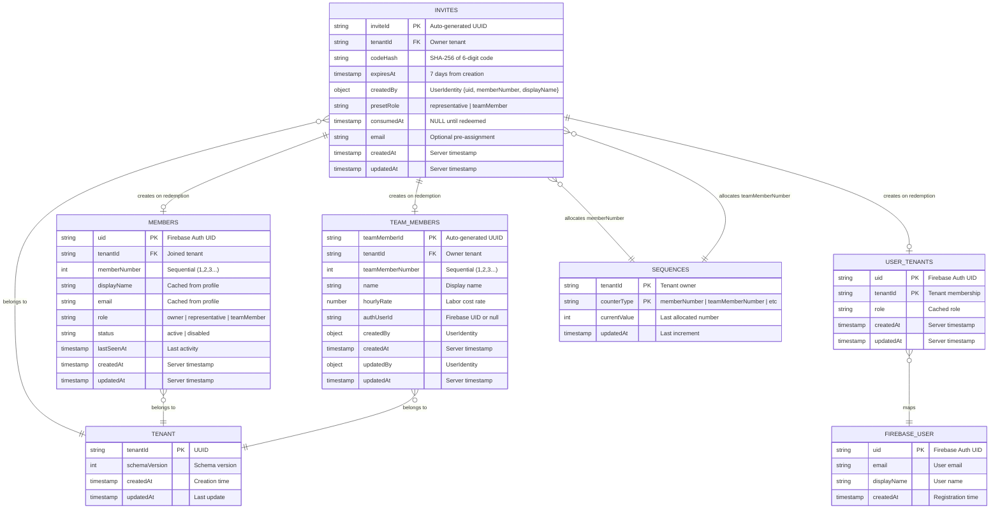

# Member Invitation Mechanism - Database & Flow Diagrams

## 1. Complete Invitation Flow Sequence Diagram


## 2. Database Schema for Invitation Mechanism



## 3. Invite States and Lifecycle


## 4. Database Collections Modified During Invitation Flow


## 5. Invite Code Security Flow


## 6. Data Structure: Invites Collection Detail

### Collection Path

```text
/tenants/{tenantId}/invites/{inviteId}
```

### Document Schema

```yaml
inviteId: "auto-generated-uuid"
tenantId: "owner-tenant-uuid"

# Security - Code never stored in plaintext
codeHash: "e3b0c44298fc1c149afbf4c8996fb92427ae41e4649b934ca495991b7852b855"  # SHA-256

# Expiration
expiresAt: Timestamp  # now + 7 days (604,800 seconds)
createdAt: Timestamp  # Server timestamp
updatedAt: Timestamp  # Server timestamp

# Creator Information (Compound Identity)
createdBy:
  uid: "firebase-auth-uid"
  memberNumber: 1  # Tenant-specific ID
  displayName: "John Doe"

# Invite Configuration
presetRole: "representative"  # or "teamMember"

# Optional Pre-assignment
email: "newmember@example.com"  # Optional - binds invite to specific email

# Redemption Tracking
consumedAt: null  # or Timestamp when redeemed (for single-use enforcement)
```

### Indexes

```yaml
# Single field indexes
- field: expiresAt
  order: ASC
  purpose: Cleanup queries for expired invites

- field: consumedAt
  order: ASC
  purpose: Filter pending vs consumed invites

# Composite indexes
- fields:
    - codeHash: ASC
    - consumedAt: ASC
  purpose: Fast lookup during redemption validation
```

## 7. Database State Changes Timeline


## 8. Security Rules for Invites Collection

```javascript
// Firestore Security Rules
match /tenants/{tenantId}/invites/{inviteId} {

  // READ: All active members can see pending/consumed invites
  allow read: if isActiveMember(tenantId);

  // CREATE: Only owner or representative can create invites
  allow create: if isOwnerOrRepresentative(tenantId)
    && documentHasTenantId(tenantId)
    && auditMetadataValid()
    && canWriteToTenant(tenantId);

  // UPDATE: Immutable after creation (only Cloud Function can mark consumed)
  allow update: if false;

  // DELETE: Only owner can revoke (delete) pending invites
  allow delete: if isOwner(tenantId)
    && canWriteToTenant(tenantId);
}

// Helper functions
function isActiveMember(tenantId) {
  return exists(/databases/$(database)/documents/tenants/$(tenantId)/members/$(request.auth.uid))
    && get(/databases/$(database)/documents/tenants/$(tenantId)/members/$(request.auth.uid)).data.status == 'active';
}

function isOwnerOrRepresentative(tenantId) {
  let memberDoc = get(/databases/$(database)/documents/tenants/$(tenantId)/members/$(request.auth.uid));
  return memberDoc.data.status == 'active'
    && (memberDoc.data.role == 'owner' || memberDoc.data.role == 'representative');
}

function isOwner(tenantId) {
  let memberDoc = get(/databases/$(database)/documents/tenants/$(tenantId)/members/$(request.auth.uid));
  return memberDoc.data.status == 'active' && memberDoc.data.role == 'owner';
}
```

## 9. Cloud Functions for Invitation Mechanism

### Function 1: createInvite

```typescript
// HTTPS Callable Function
exports.createInvite = functions
  .region('europe-west1')
  .https.onCall(async (data, context) => {
    // Validate authentication
    if (!context.auth) {
      throw new functions.https.HttpsError('unauthenticated', 'User must be authenticated');
    }

    const { tenantId, presetRole, email } = data;
    const uid = context.auth.uid;

    // Validate caller is owner or representative
    const memberDoc = await admin.firestore()
      .doc(`tenants/${tenantId}/members/${uid}`)
      .get();

    if (!memberDoc.exists || !['owner', 'representative'].includes(memberDoc.data().role)) {
      throw new functions.https.HttpsError('permission-denied', 'Insufficient permissions');
    }

    // Generate 6-digit code
    const code = Math.floor(100000 + Math.random() * 900000).toString();

    // Hash the code
    const codeHash = crypto.createHash('sha256').update(code).digest('hex');

    // Create invite document
    const inviteRef = admin.firestore()
      .collection(`tenants/${tenantId}/invites`)
      .doc();

    const inviteData = {
      tenantId,
      codeHash,
      expiresAt: admin.firestore.Timestamp.fromDate(
        new Date(Date.now() + 7 * 24 * 60 * 60 * 1000) // 7 days
      ),
      createdBy: {
        uid,
        memberNumber: memberDoc.data().memberNumber,
        displayName: memberDoc.data().displayName
      },
      presetRole,
      email: email || null,
      consumedAt: null,
      createdAt: admin.firestore.FieldValue.serverTimestamp(),
      updatedAt: admin.firestore.FieldValue.serverTimestamp()
    };

    await inviteRef.set(inviteData);

    // Return code (one-time display)
    return {
      inviteId: inviteRef.id,
      code,  // Original code returned ONCE
      expiresAt: inviteData.expiresAt.toDate().toISOString()
    };
  });
```

### Function 2: redeemInvite

```typescript
// HTTPS Callable Function
exports.redeemInvite = functions
  .region('europe-west1')
  .https.onCall(async (data, context) => {
    // Validate authentication
    if (!context.auth) {
      throw new functions.https.HttpsError('unauthenticated', 'User must be authenticated');
    }

    const { code } = data;
    const uid = context.auth.uid;
    const userEmail = context.auth.token.email;
    const displayName = context.auth.token.name || userEmail;

    // Hash provided code
    const codeHash = crypto.createHash('sha256').update(code).digest('hex');

    // Query for matching invite
    const invitesQuery = await admin.firestore()
      .collectionGroup('invites')
      .where('codeHash', '==', codeHash)
      .where('consumedAt', '==', null)
      .limit(1)
      .get();

    if (invitesQuery.empty) {
      throw new functions.https.HttpsError('not-found', 'Invalid or expired invitation');
    }

    const inviteDoc = invitesQuery.docs[0];
    const inviteData = inviteDoc.data();
    const tenantId = inviteData.tenantId;

    // Validate expiration
    if (inviteData.expiresAt.toDate() < new Date()) {
      throw new functions.https.HttpsError('failed-precondition', 'Invitation has expired');
    }

    // Validate email binding (if set)
    if (inviteData.email && inviteData.email !== userEmail) {
      throw new functions.https.HttpsError('permission-denied', 'Invitation is for a different email');
    }

    // Check if user is already a member
    const existingMember = await admin.firestore()
      .doc(`tenants/${tenantId}/members/${uid}`)
      .get();

    if (existingMember.exists) {
      throw new functions.https.HttpsError('already-exists', 'You are already a member of this team');
    }

    // Atomic transaction to create memberships
    await admin.firestore().runTransaction(async (transaction) => {
      // Allocate memberNumber
      const memberNumber = await allocateSequence(transaction, tenantId, 'memberNumber');

      // Allocate teamMemberNumber
      const teamMemberNumber = await allocateSequence(transaction, tenantId, 'teamMemberNumber');

      // Create member document
      const memberRef = admin.firestore().doc(`tenants/${tenantId}/members/${uid}`);
      transaction.set(memberRef, {
        tenantId,
        memberNumber,
        displayName,
        email: userEmail,
        role: inviteData.presetRole,
        status: 'active',
        lastSeenAt: null,
        createdAt: admin.firestore.FieldValue.serverTimestamp(),
        updatedAt: admin.firestore.FieldValue.serverTimestamp()
      });

      // Create user-tenant mapping
      const mappingRef = admin.firestore().doc(`user_tenants/${uid}/memberships/${tenantId}`);
      transaction.set(mappingRef, {
        tenantId,
        role: inviteData.presetRole,
        createdAt: admin.firestore.FieldValue.serverTimestamp(),
        updatedAt: admin.firestore.FieldValue.serverTimestamp()
      });

      // Create team member resource
      const teamMemberRef = admin.firestore()
        .collection(`tenants/${tenantId}/teamMembers`)
        .doc();
      transaction.set(teamMemberRef, {
        tenantId,
        teamMemberNumber,
        name: displayName,
        hourlyRate: 0,
        authUserId: uid,
        createdBy: inviteData.createdBy,
        createdAt: admin.firestore.FieldValue.serverTimestamp(),
        updatedBy: inviteData.createdBy,
        updatedAt: admin.firestore.FieldValue.serverTimestamp()
      });

      // Mark invite as consumed
      transaction.update(inviteDoc.ref, {
        consumedAt: admin.firestore.FieldValue.serverTimestamp(),
        updatedAt: admin.firestore.FieldValue.serverTimestamp()
      });
    });

    // Set custom claim for tenant
    await admin.auth().setCustomUserClaims(uid, {
      tenant_id: tenantId
    });

    return {
      success: true,
      tenantId,
      role: inviteData.presetRole
    };
  });
```

## 10. Summary: Key Database Collections in Invitation Flow

| Collection | Action | When | Data Stored |
|------------|--------|------|-------------|
| `"/tenants/{tid}/invites/{id}"` | **CREATE** | Owner creates invite | codeHash, expiresAt, presetRole, createdBy, email? |
| `"/tenants/{tid}/invites/{id}"` | **UPDATE** | Member redeems invite | consumedAt = now |
| `/sequences/{tid}/counters/memberNumber` | **INCREMENT** | During redemption | currentValue++ |
| `/sequences/{tid}/counters/teamMemberNumber` | **INCREMENT** | During redemption | currentValue++ |
| `/tenants/{tid}/members/{uid}` | **CREATE** | Member redeems invite | memberNumber, role, status, displayName, email |
| `/user_tenants/{uid}/memberships/{tid}` | **CREATE** | Member redeems invite | tenantId, role |
| `/tenants/{tid}/teamMembers/{id}` | **CREATE** | Member redeems invite | teamMemberNumber, name, hourlyRate, authUserId |
| `/tenants/{tid}/audit_logs/{id}` | **CREATE** | After each operation | operation, collection, documentId, author, before/after |

### Total Database Operations Per Redemption: 8 writes

1. Read invite document (validate)
2. Increment memberNumber counter
3. Increment teamMemberNumber counter
4. Create member document
5. Create user-tenant mapping
6. Create team member resource
7. Update invite (set consumedAt)
8. Audit log entries (automatic triggers)
