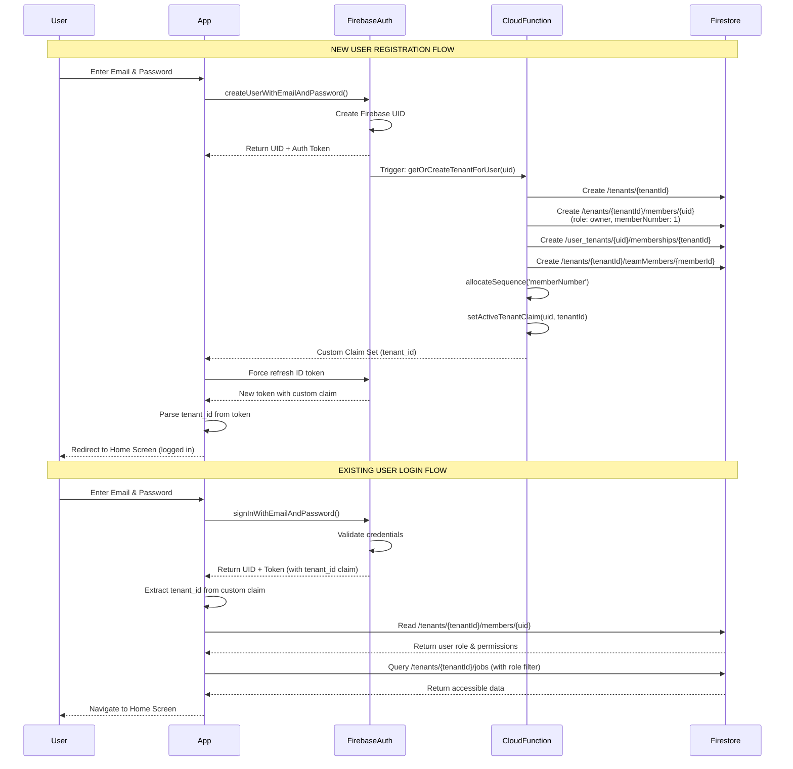
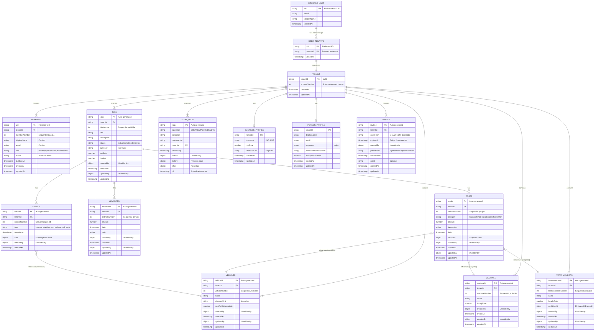

# User Login Flow and Database Structure

## 1. Complete Login Flow



## 2. Database Structure After Login



## 3. Data Stored After Successful Login

### Global Collections
```
/user_tenants/{uid}/
  └── memberships/{tenantId}/
      ├── tenantId: string
      ├── joinedAt: Timestamp
```

### Tenant-Scoped Collections
```
/tenants/{tenantId}/
  ├── schemaVersion: number
  ├── createdAt: Timestamp
  ├── updatedAt: Timestamp
  │
  ├── members/{uid}/
  │   ├── tenantId: string
  │   ├── memberNumber: number (1, 2, 3...)
  │   ├── displayName: string
  │   ├── email: string
  │   ├── role: "owner" | "representative" | "teamMember"
  │   ├── status: "active" | "disabled"
  │   ├── lastSeenAt: Timestamp
  │   ├── createdAt: Timestamp
  │   └── updatedAt: Timestamp
  │
  ├── jobs/{jobId}/
  │   ├── tenantId: string
  │   ├── jobNumber: number | null
  │   ├── title: string
  │   ├── description: string
  │   ├── status: "active" | "completed" | "archived"
  │   ├── currency: string (ISO 4217)
  │   ├── vatRate: number
  │   ├── budget: number
  │   ├── createdBy: UserIdentity {uid, memberNumber, displayName}
  │   ├── createdAt: Timestamp
  │   ├── updatedBy: UserIdentity
  │   ├── updatedAt: Timestamp
  │   │
  │   ├── costs/{costId}/
  │   │   ├── tenantId: string
  │   │   ├── ordinalNumber: number | null
  │   │   ├── category: "transport" | "material" | "labor" | "machine" | "other"
  │   │   ├── amount: number
  │   │   ├── description: string
  │   │   ├── date: Timestamp
  │   │   ├── resource: object (snapshot)
  │   │   ├── createdBy: UserIdentity
  │   │   ├── createdAt: Timestamp
  │   │   ├── updatedBy: UserIdentity
  │   │   └── updatedAt: Timestamp
  │   │
  │   ├── advances/{advanceId}/
  │   │   ├── tenantId: string
  │   │   ├── ordinalNumber: number | null
  │   │   ├── amount: number
  │   │   ├── date: Timestamp
  │   │   ├── note: string
  │   │   ├── createdBy: UserIdentity
  │   │   ├── createdAt: Timestamp
  │   │   ├── updatedBy: UserIdentity
  │   │   └── updatedAt: Timestamp
  │   │
  │   └── events/{eventId}/
  │       ├── tenantId: string
  │       ├── ordinalNumber: number | null
  │       ├── type: "journey_start" | "journey_end" | "manual_entry"
  │       ├── timestamp: Timestamp
  │       ├── data: object (event-specific)
  │       ├── createdBy: UserIdentity
  │       └── createdAt: Timestamp
  │
  ├── vehicles/{vehicleId}/
  │   ├── tenantId: string
  │   ├── vehicleNumber: number | null
  │   ├── name: string
  │   ├── distanceUnit: "km" | "miles"
  │   ├── ratePerDistanceUnit: number
  │   ├── createdBy: UserIdentity
  │   ├── createdAt: Timestamp
  │   ├── updatedBy: UserIdentity
  │   └── updatedAt: Timestamp
  │
  ├── machines/{machineId}/
  │   ├── (Similar structure to vehicles)
  │
  ├── teamMembers/{teamMemberId}/
  │   ├── tenantId: string
  │   ├── teamMemberNumber: number | null
  │   ├── name: string
  │   ├── hourlyRate: number
  │   ├── authUserId: string | null (Firebase UID)
  │   ├── createdBy: UserIdentity
  │   ├── createdAt: Timestamp
  │   ├── updatedBy: UserIdentity
  │   └── updatedAt: Timestamp
  │
  ├── audit_logs/{logId}/
  │   ├── operation: "CREATE" | "UPDATE" | "DELETE"
  │   ├── collection: string
  │   ├── documentId: string
  │   ├── tenantId: string
  │   ├── timestamp: Timestamp
  │   ├── author: UserIdentity
  │   ├── before: object (for UPDATE)
  │   ├── after: object (for CREATE/UPDATE)
  │   └── ttl: Timestamp (1 year retention)
  │
  ├── businessProfile/ (single document)
  │   ├── tenantId: string
  │   ├── currency: string (ISO 4217)
  │   ├── vatRate: number
  │   ├── distanceUnit: "km" | "miles"
  │   ├── createdAt: Timestamp
  │   └── updatedAt: Timestamp
  │
  ├── personProfile/ (single document)
  │   ├── tenantId: string
  │   ├── displayName: string
  │   ├── email: string
  │   ├── language: "cs" | "en"
  │   ├── preferredVoiceProvider: string
  │   ├── aiSupportEnabled: boolean
  │   ├── createdAt: Timestamp
  │   └── updatedAt: Timestamp
  │
  └── invites/{inviteId}/
      ├── tenantId: string
      ├── codeHash: string (SHA-256)
      ├── expiresAt: Timestamp
      ├── createdBy: UserIdentity
      ├── presetRole: "representative" | "teamMember"
      ├── consumedAt: Timestamp
      ├── email: string (optional)
      ├── createdAt: Timestamp
      └── updatedAt: Timestamp
```

## 4. Security & Access Control

### Role-Based Permissions

| Collection | Owner | Representative | Team Member |
|------------|-------|----------------|-------------|
| members | R/W | R | R (own only) |
| jobs | R/W | R/W | R (public view) |
| costs | R/W | R/W | R/W |
| advances | R/W | R/W | R |
| events | R/W | R/W | R |
| vehicles | R/W | R/W | R |
| machines | R/W | R/W | R |
| teamMembers | R/W | R/W | R |
| audit_logs | R | ❌ | ❌ |
| businessProfile | R/W | R | ❌ |
| personProfile | R/W | R/W | R/W |
| invites | R/W | ❌ | ❌ |

### Authentication Token Structure
```
Firebase ID Token:
{
  "iss": "https://securetoken.google.com/{project-id}",
  "aud": "{project-id}",
  "auth_time": 1234567890,
  "user_id": "{firebase-uid}",
  "sub": "{firebase-uid}",
  "iat": 1234567890,
  "exp": 1234571490,
  "email": "user@example.com",
  "email_verified": true,
  "firebase": {
    "identities": {
      "email": ["user@example.com"]
    },
    "sign_in_provider": "password"
  },
  "tenant_id": "{tenantId}"  ← Custom Claim Set After Login
}
```

## 5. Key Implementation Details

### UserIdentity Object (used throughout database)
```typescript
interface UserIdentity {
  uid: string;              // Firebase Auth UID (for security)
  memberNumber: number;     // Tenant-specific ID (for display)
  displayName: string;      // Cached display name
}
```

### Sequential Number Allocation
- **Online**: Cloud Function `allocateSequence(tenantId, counterType)` atomically increments
- **Offline**: Documents created with `null`, server assigns on sync via onCreate trigger
- **Counter Types**: jobNumber, vehicleNumber, machineNumber, teamMemberNumber, memberNumber, job_{jobId}_ordinalNumber

### Multi-Tenant Isolation
- All data scoped under `/tenants/{tenantId}/`
- Custom claim `tenant_id` in JWT for efficient access control
- Firestore Security Rules enforce tenant boundaries
- All documents include `tenantId` field for validation

### Offline Support
- IndexedDB persistence enabled on web clients
- Automatic sync when connection restored
- Nullable sequential numbers for offline-created documents
- Client-side pending write queue management
